**РОССИЙСКИЙ УНИВЕРСИТЕТ ДРУЖБЫ НАРОДОВ** 

**Факультет физико-математических и естественных наук Кафедра теории вероятностей и кибербезопасности** 

**ОТЧЁТ** 

**ПО ЛАБОРАТОРНОЙ РАБОТЕ №10** 
*дисциплина: Администрирование локальных сетей* 

Студент: Исаев Булат Абубакарович Студ. билет № 1132227131 

Группа: НПИбд-01-22

**МОСКВА** 2025 г.

**Цель работы:** 
Освоить настройку прав доступа пользователей к ресурсам сети.

**Выполнение работы:** 
Откроем проект с названием lab_PT-09.pkt и сохраним под названием lab_PT-10.pkt. После чего откроем его для дальнейшего редактирования (Рис. 1.1):

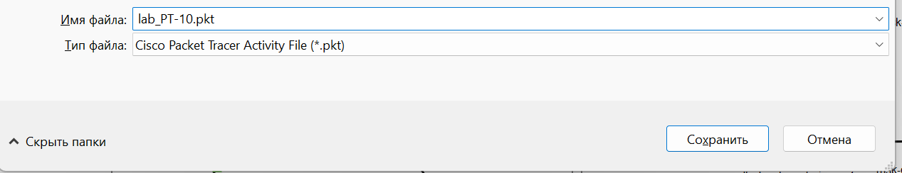
**Рис. 1.1.** Открытие проекта lab_PT-10.pkt.

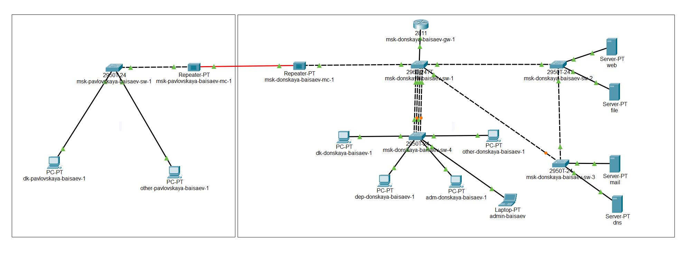
**Рис. 1.2.** 1.2. Подсоединение ноутбука к порту 24 коммутатора msk-donskaya-baisaev-sw-4 и изменение названия.

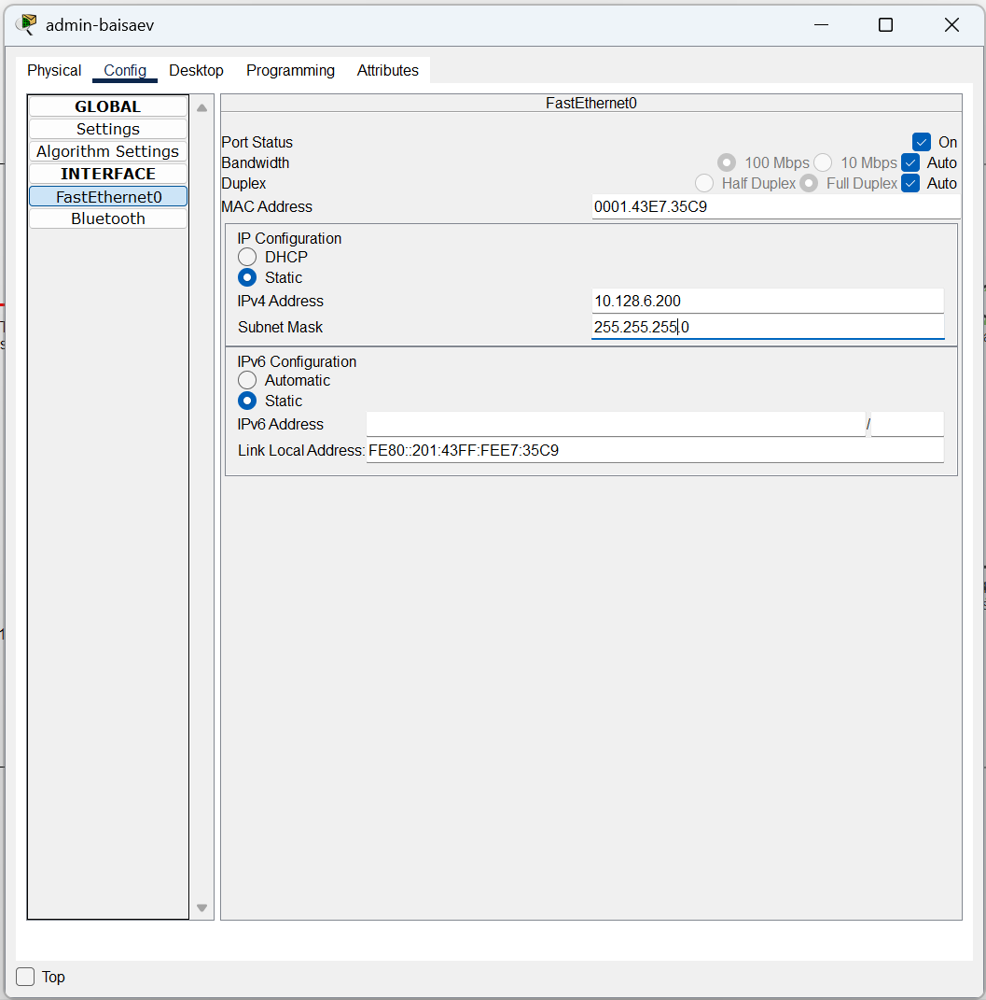
**Рис. 1.3.** Присвоение оконечному устройству статического адреса 10.128.6.200, gateway-адреса 10.128.6.1 и адреса DNS-сервера 10.128.0.5.

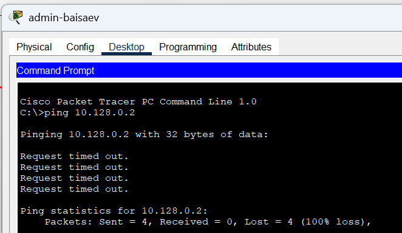
**Рис. 1.4.** Проверка (пингуем с admin-baisaev 10.128.0.2 и 10.128.0.5).

Далее настроим доступ к web-серверу по порту tcp 80. Здесь (Рис. 1.5):
1.	Создадим список контроля доступа с названием servers-out (так как предполагается ограничить доступ в конкретные подсети и по отношению к маршрутизатору это будет исходящий трафик); 
2.	Укажем (в качестве комментария-напоминания remark web), что ограничения предназначены для работы с web-сервером; 
3.	Дадим разрешение доступа (permit) по протоколу TCP всем (any) пользователям сети (host) на доступ к web-серверу, имеющему адрес 10.128.0.2, через порт 80.

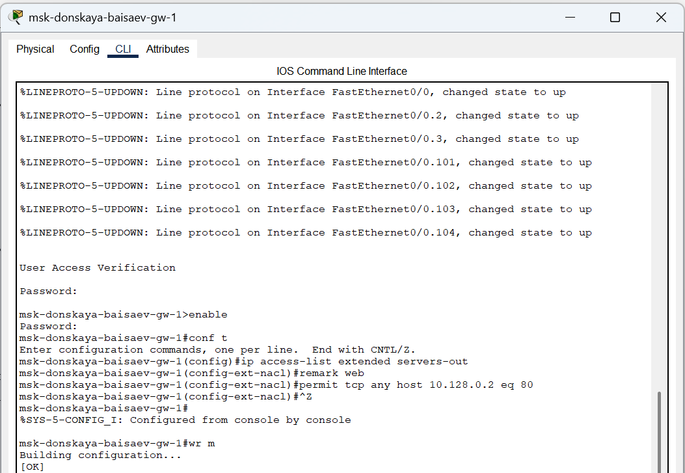
**Рис. 1.5.** 1.5. Настройка доступа к web-серверу по порту tcp 80 (создан список контроля доступа с названием servers-out; указано, что ограничения предназначены для работы с web-сервером; дано разрешение доступа по протоколу TCP всем пользователям сети на доступ к web-серверу, имеющему адрес 10.128.0.2, через порт 80).

Добавим список управления доступом к интерфейсу. Здесь (Рис. 1.6): 
•	К интерфейсу f0/0.3 подключаем список прав доступа serversout и применяем к исходящему трафику (out). (Проверим, что доступ к web-серверу есть через протокол HTTP (введя в строке браузера хоста ip-адрес web-сервера). При этом команда ping будет демонстрировать недоступность web-сервера как по имени, так и по ip-адресу web-сервера) (Рис. 1.7 – 1.8):

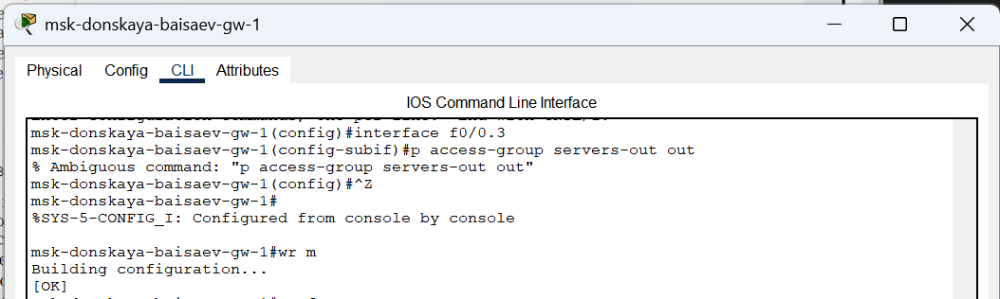
**Рис. 1.6.** Добавление списка управления доступом к интерфейсу (к интерфейсу f0/0.3 подключается список прав доступа serversout и применяется к исходящему трафику). 

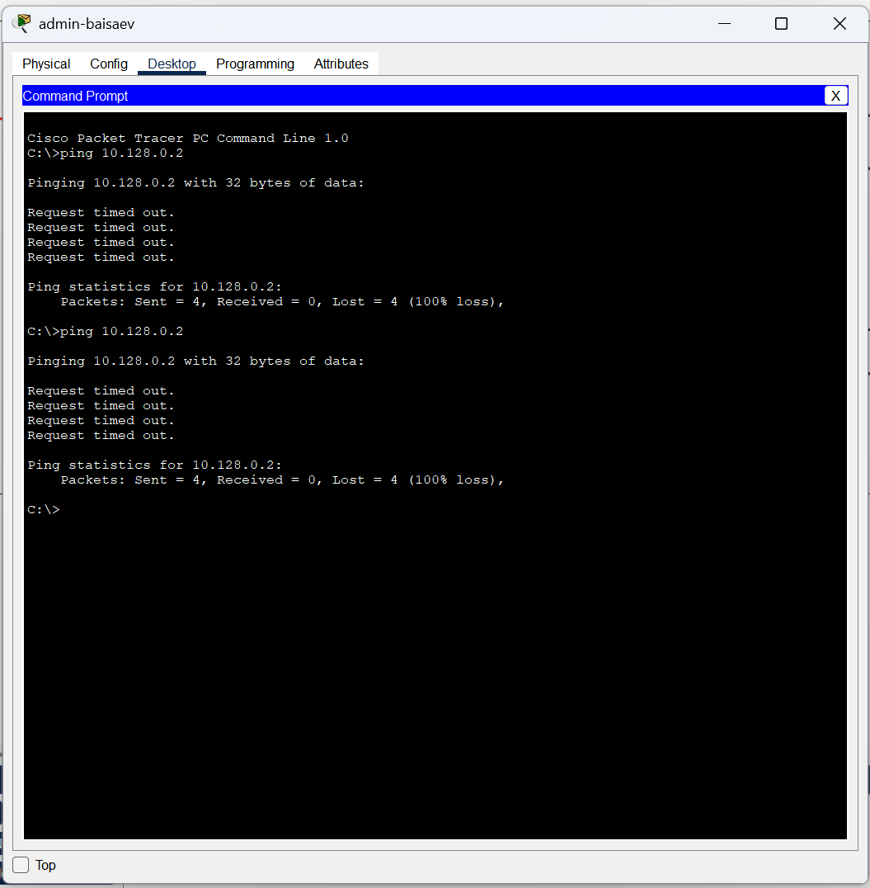
**Рис. 1.7.** Проверка демонстрации недоступности web-сервера при использовании команды ping по ip-адресу web-сервера.

**Рис. 1.8.** Проверка доступа к web-серверу через протокол HTTP (ввод в строке браузера хоста ip-адреса web-сервера).

Настроим дополнительный доступ для администратора по протоколам Telnet и FTP. Здесь (Рис. 1.9): 
•	В список контроля доступа servers-out добавим правило, разрешающее устройству администратора с ip-адресом 10.128.6.200 доступ на web-сервер (10.128.0.2) по протоколам FTP и telnet. Убедимся, что с узла с ip-адресом 10.128.6.200 есть доступ по протоколу FTP. Для этого в командной строке устройства администратора введём ftp 10.128.0.2, а затем по запросу имя пользователя cisco и пароль cisco (Рис. 1.10). Попробуем провести аналогичную процедуру с другого устройства сети и убедимся, что доступ будет запрещён (Рис. 1.11):

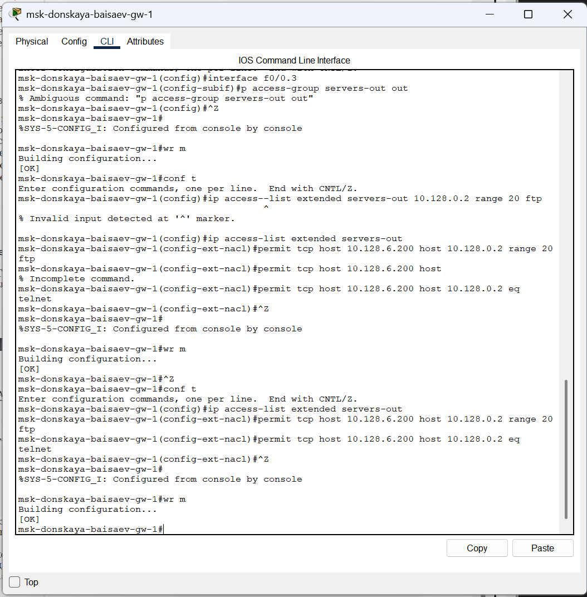
**Рис. 1.9.** Настройка дополнительного доступа для администратора по протоколам Telnet и FTP (в список контроля доступа servers-out добавлено правило, разрешающее устройству администратора с ip-адресом 10.128.6.200 доступ на web-сервер (10.128.0.2) по протоколам FTP и telnet). 

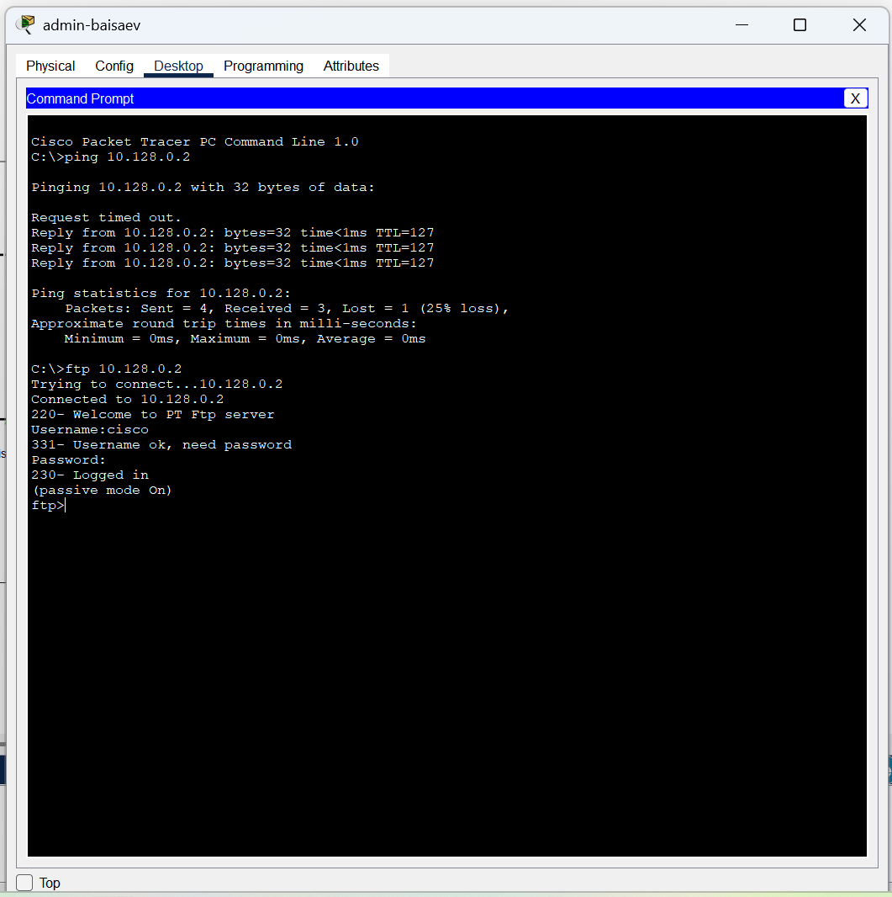
**Рис. 1.10.** Проверка доступа с узла с ip-адресом 10.128.6.200 по протоколу FTP.

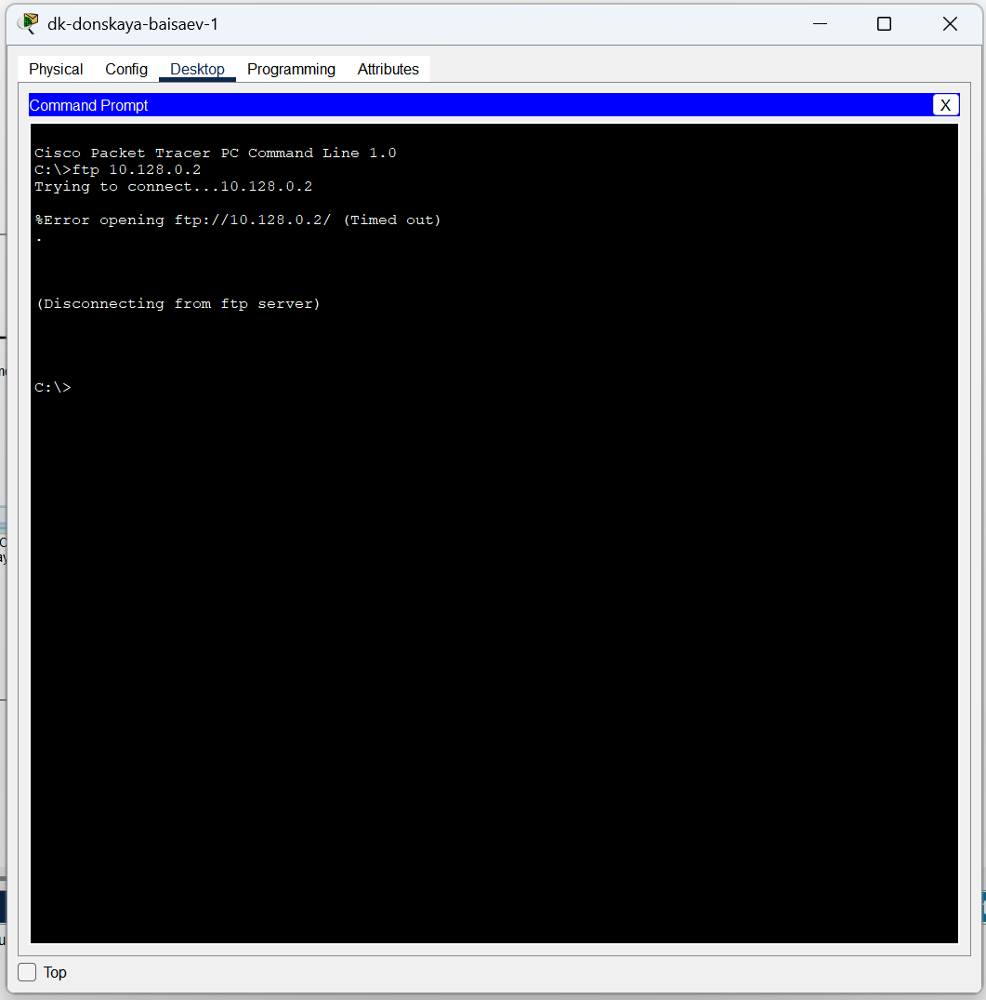
**Рис. 1.11.** Проверка доступа с устройства dk-donskaya-baisaev-1 по протоколу FTP (доступ запрещён).

Настроим доступ к файловому серверу. Здесь (Рис. 1.12): 
1.	В списке контроля доступа servers-out укажем (в качестве комментария-напоминания remark file), что следующие ограничения предназначены для работы с file-сервером; 
2.	Всем узлам внутренней сети (10.128.0.0) разрешим доступ по протоколу SMB (работает через порт 445 протокола TCP) к каталогам общего пользования; 
3.	Любым узлам разрешим доступ к file-серверу по протоколу FTP. Запись 0.0.255.255 — обратная маска (wildcard mask). 

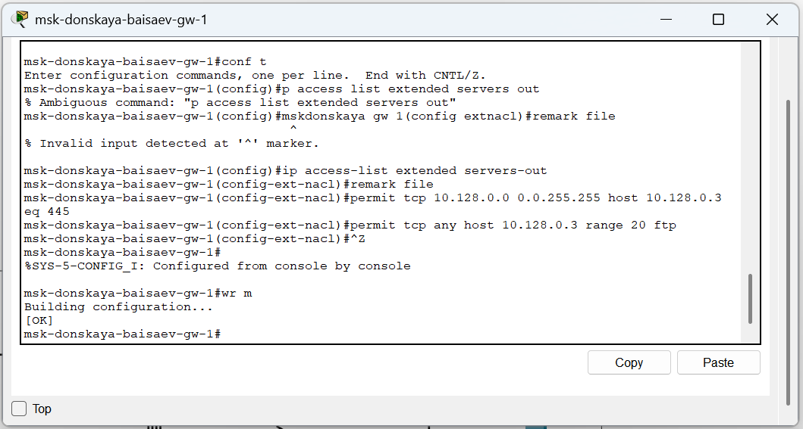
**Рис. 1.12.** Настройка доступа к файловому серверу (в списке контроля доступа servers-out указано, что следующие ограничения предназначены для работы с file-сервером; всем узлам внутренней сети (10.128.0.0) разрешён доступ по протоколу SMB к каталогам общего пользования; любым узлам разрешён доступ к file-серверу по протоколу FTP (запись 0.0.255.255 — обратная маска).

Затем настроим доступ к почтовому серверу. Здесь (Рис. 1.13): 
1.	В списке контроля доступа servers-out укажем (в качестве комментария-напоминания remark mail), что следующие ограничения предназначены для работы с почтовым сервером; 
2.	Всем разрешим доступ к почтовому серверу по протоколам POP3 и SMTP. 

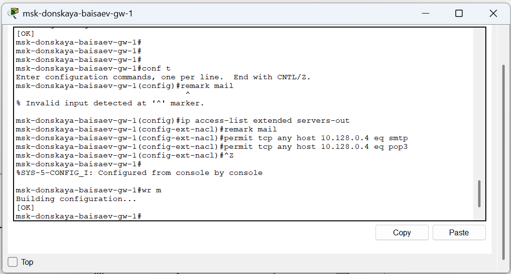
**Рис. 1.13.** Настройка доступа к почтовому серверу (в списке контроля доступа servers-out указано, что следующие ограничения предназначены для работы с почтовым сервером; всем разрешён доступ к почтовому серверу по протоколам POP3 и SMTP).

Настроим доступ к DNS-серверу. Здесь (Рис. 1.14): 
1.	В списке контроля доступа servers-out укажем (в качестве комментария-напоминания remark dns), что следующие ограничения предназначены для работы с DNS-сервером; 
2.	Всем узлам внутренней сети разрешим доступ к DNS-серверу через UDP-порт 53. 
Проверим доступность web-сервера (через браузер) не только по ip-адресу, но и по имени (Рис. 1.15):

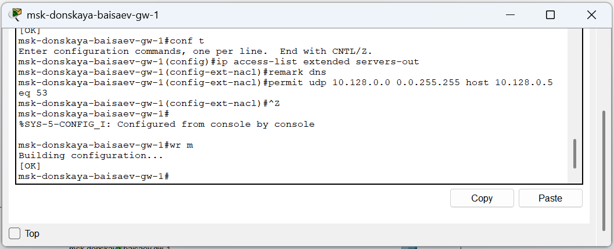
**Рис. 1.14.** Настройка доступа к DNS-серверу (в списке контроля доступа servers-out указано, что следующие ограничения предназначены для работы с DNS-сервером; всем узлам внутренней сети разрешён доступ к DNS-серверу через UDP-порт 53)

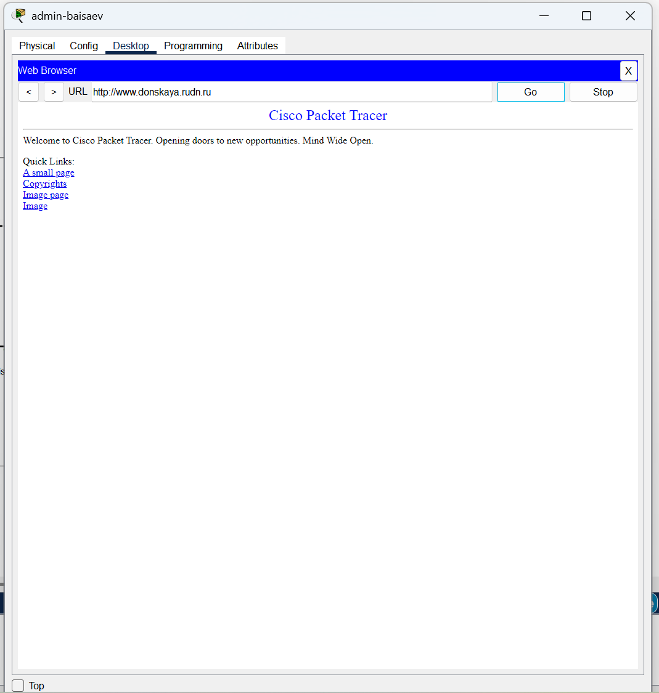
**Рис. 1.15.** Проверка доступности web-сервера (через браузер) по имени.

Разрешим icmp-запросы. Здесь (Рис. 1.16): 
•	Демонстрируем явное управление порядком размещения правил — правило разрешения для icmp-запросов добавляется в начало списка контроля доступа. 
Номера строк правил в списке контроля доступа можно посмотреть с помощью команды show access −lists (Рис. 1.17):

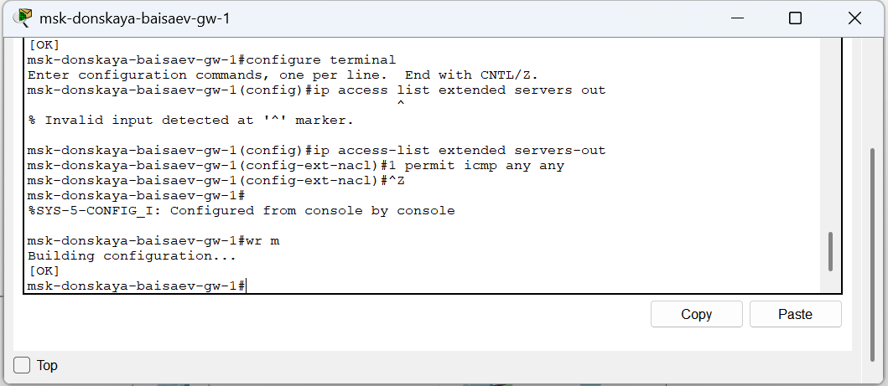
**Рис. 1.16.** Разрешение icmp-запросов (демонстрируется явное управление порядком размещения правил — правило разрешения для icmp-запросов добавляется в начало списка контроля доступ).

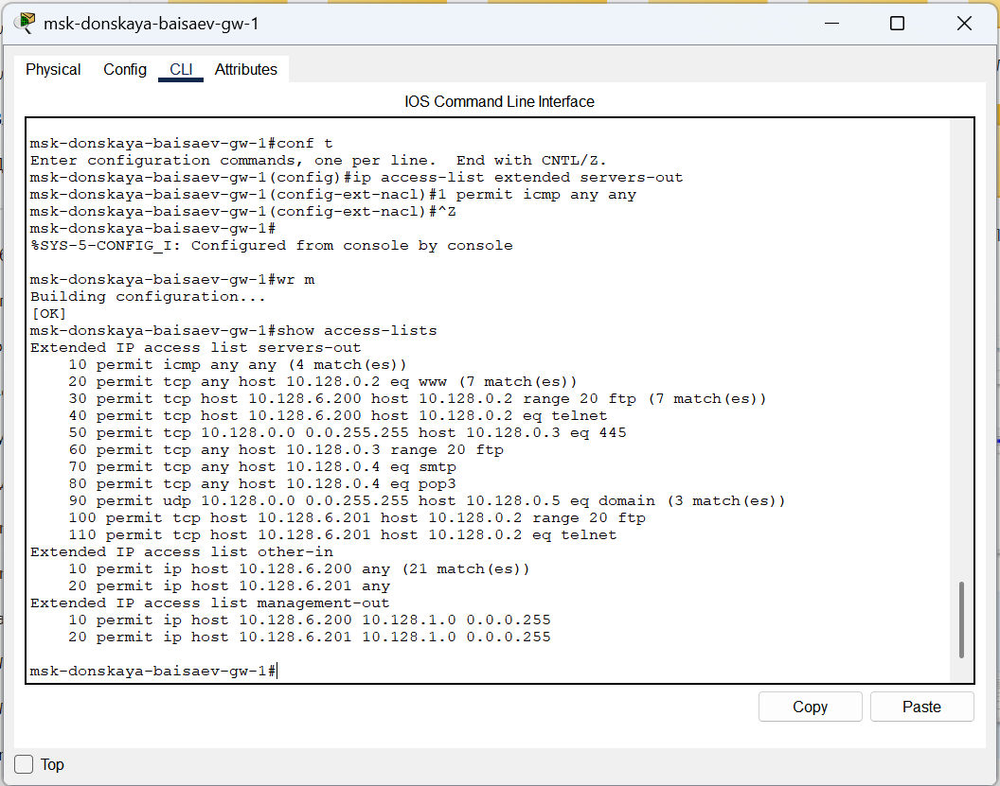
**Рис. 1.17.** Просмотр номеров строк правил в списке контроля доступа.

Теперь настроим доступ для сети Other (требуется наложить ограничение на исходящий из сети Other трафик, который по отношению к маршрутизатору msk-donskaya-baisaev-gw-1 является входящим трафиком). Здесь (Рис. 1.18): 
1.	В списке контроля доступа other-in укажем, что следующие правила относятся к администратору сети; 
2.	Даём разрешение устройству с адресом 10.128.6.200 на любые действия (any); 
3.	К интерфейсу f0/0.104 подключаем список прав доступа other-in и применяем к входящему трафику (in). 

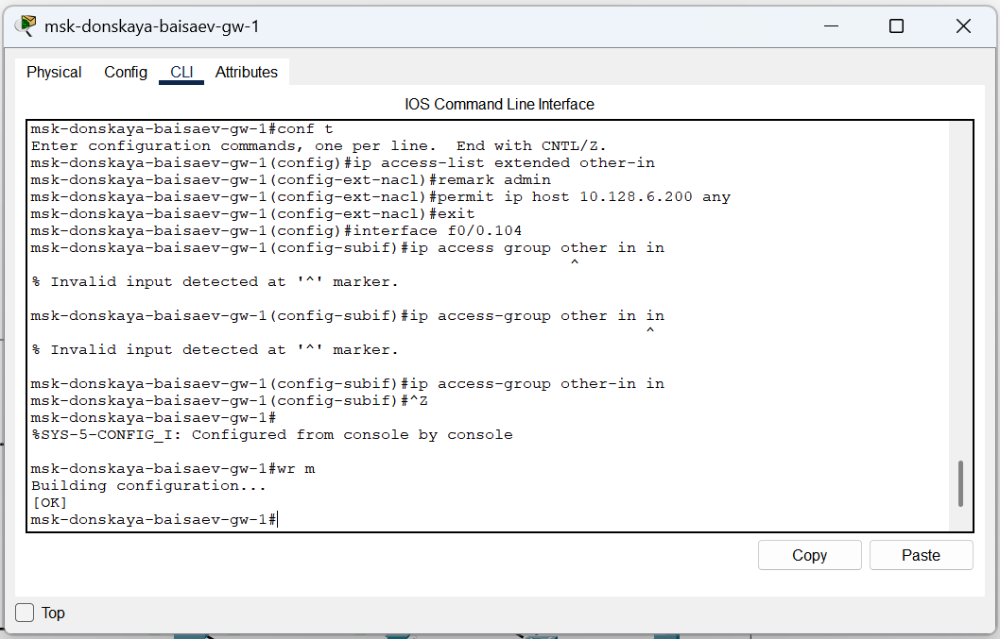
**Рис. 1.18.** Настройка доступа для сети Other (в списке контроля доступа other-in указано, что следующие правила относятся к администратору сети; разрешение устройству с адресом 10.128.6.200 на любые действия; подключение к интерфейсу f0/0.104 списка прав доступа other-in и применение к входящему трафику).

Настроим доступ администратора к сети сетевого оборудования. Здесь (Рис. 1.19): 
1.	В списке контроля доступа management-out укажем (в качестве комментария-напоминания remark admin), что устройству администратора с адресом 10.128.6.200 разрешён доступ к сети сетевого оборудования (10.128.1.0); 
2.	К интерфейсу f0/0.2 подключаем список прав доступа management-out и применяем к исходящему трафику (out).

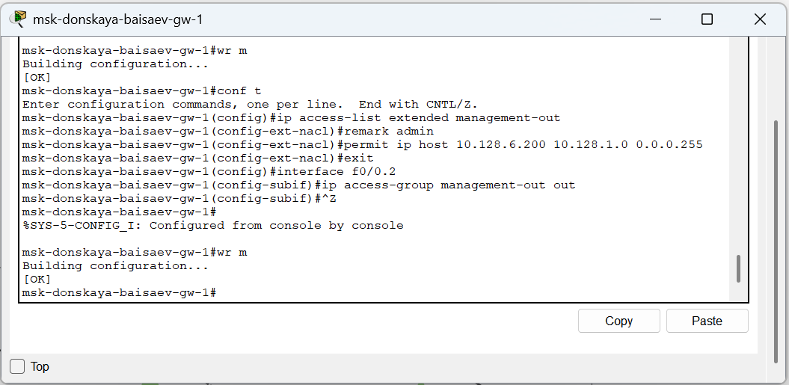
**Рис. 1.19.** Настройка доступа администратора к сети сетевого оборудования (в списке контроля доступа management-out указано, что устройству администратора с адресом 10.128.6.200 разрешён доступ к сети сетевого оборудования (10.128.1.0); к интерфейсу f0/0.2 подключён список прав доступа management-out и применено к исходящему трафику).

Проверим корректность установленных правил доступа, попытавшись получить доступ по различным протоколам с разных устройств сети к подсети серверов и подсети сетевого оборудования (Рис. 1.20 – Рис. 1.21):

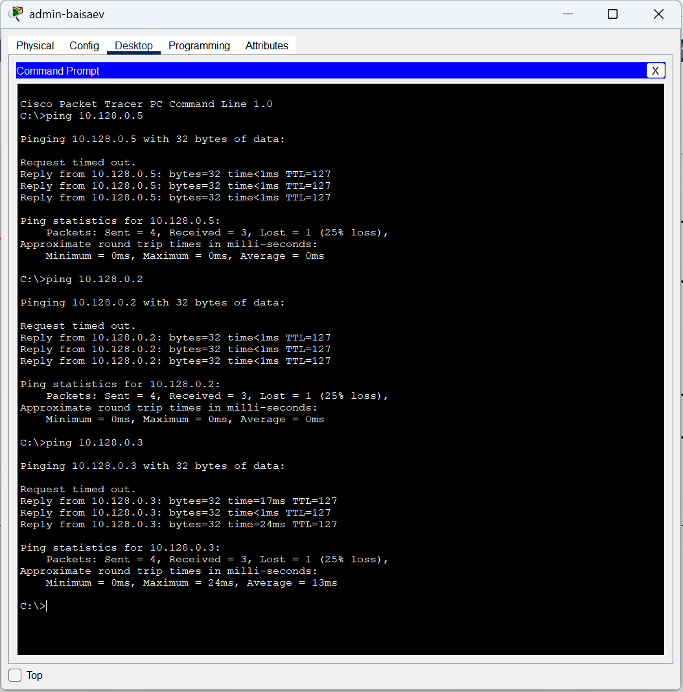
**Рис. 1.20.** Проверка корректности установленных правил доступа с оконечного устройства admin-baisaev.

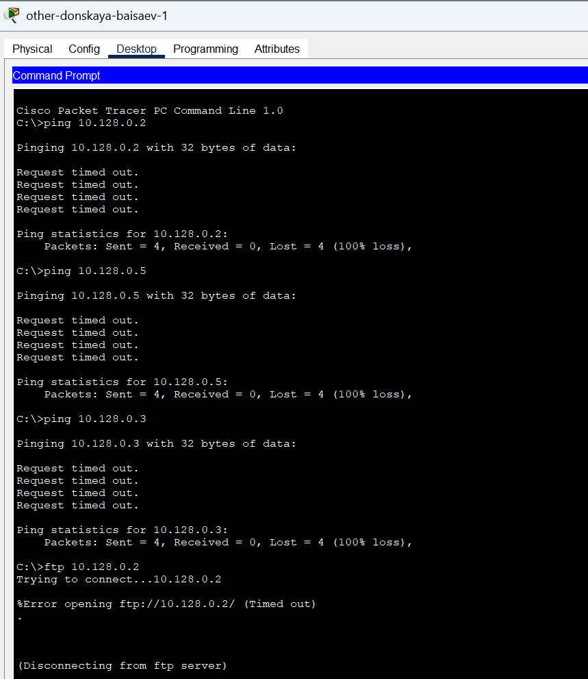
**Рис. 1.21.** Проверка корректности установленных правил доступа с оконечного устройства other-donskaya-baisaev-1.

Разрешим администратору из сети Other на Павловской действия, аналогичные действиям администратора сети Other на Донской (Рис. 1.22 – 1.23): 

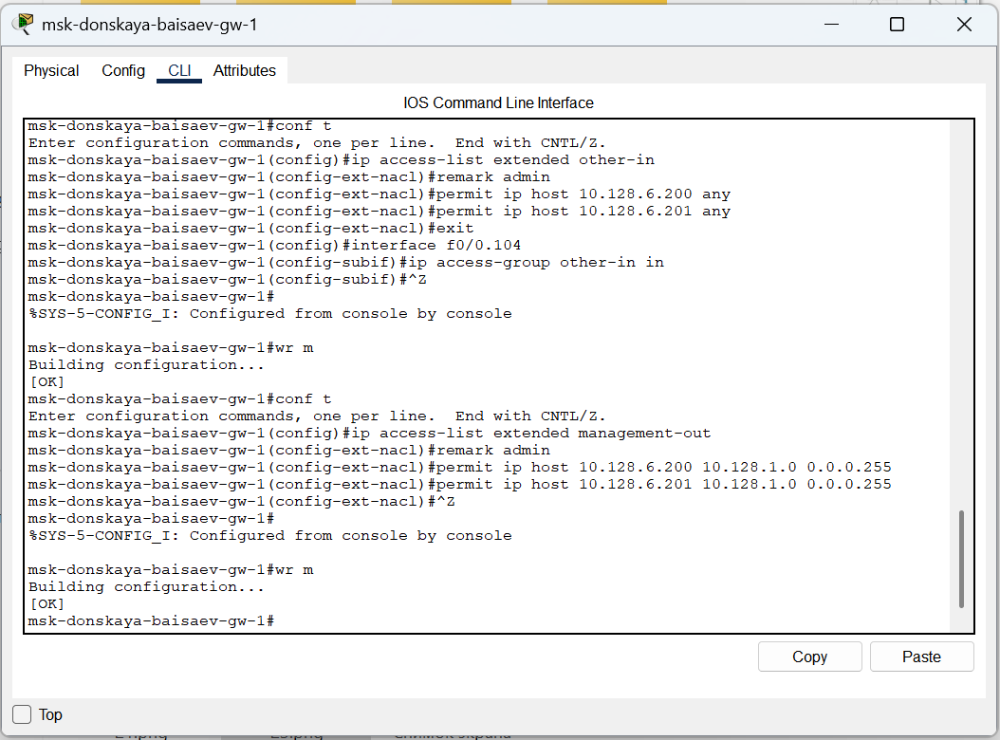
**Рис. 1.22.** Разрешение администратору из сети Other на Павловской действия, аналогичные действиям администратора сети Other на Донской.

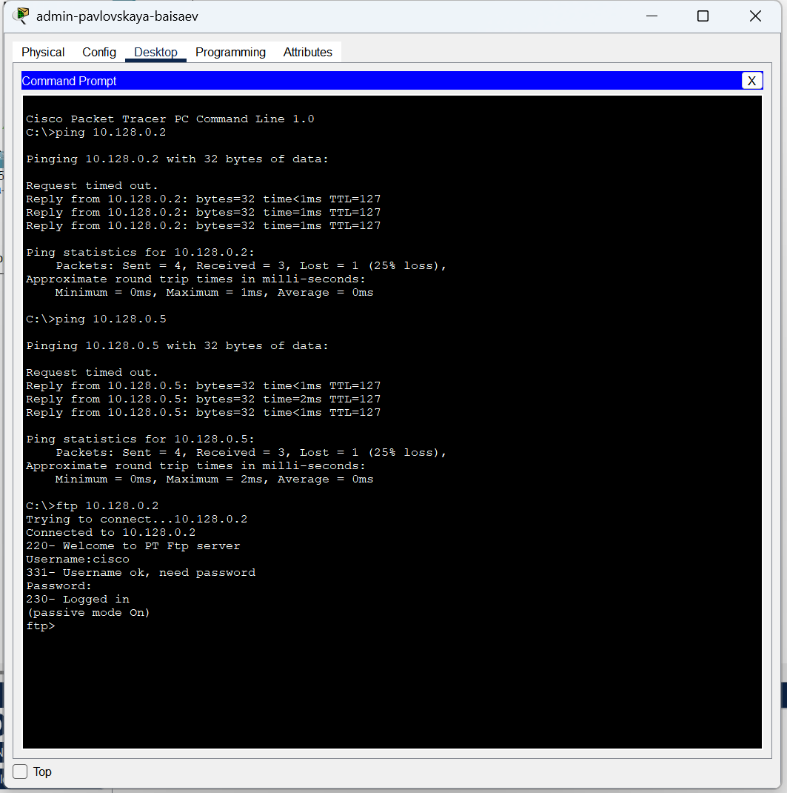
**Рис. 1.23.** Проверка разрешений администратора из сети Other на Павловской.

**Вывод:** 
В ходе выполнения лабораторной работы мы освоили настройку прав доступа пользователей к ресурсам сети.

**Ответы на контрольные вопросы:** 

1.	Как задать действие правила для конкретного протокола?  - **permit...**

2.	Как задать действие правила сразу для нескольких портов?  - **...range...**

3.	Как узнать номер правила в списке прав доступа?AAAAA - **show access-lists**

4.	Каким образом можно изменить порядок применения правил в списке контроля доступа?  - **ip access-list resequence…**
