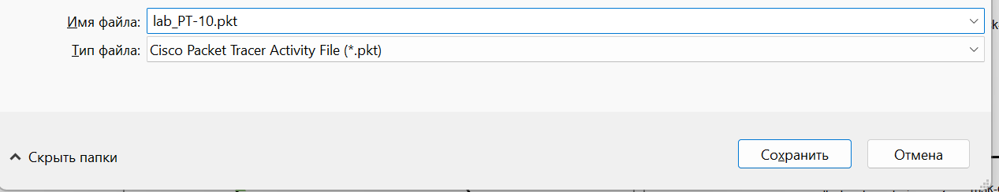
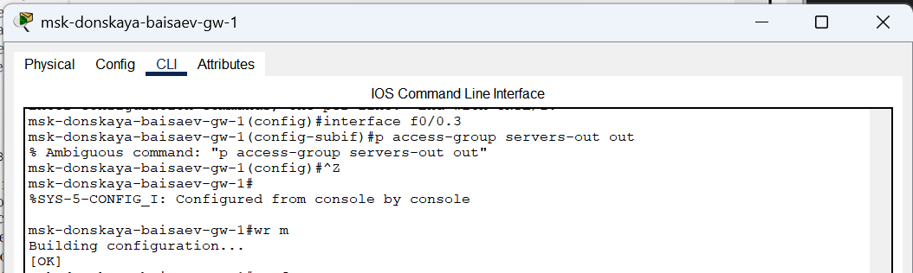
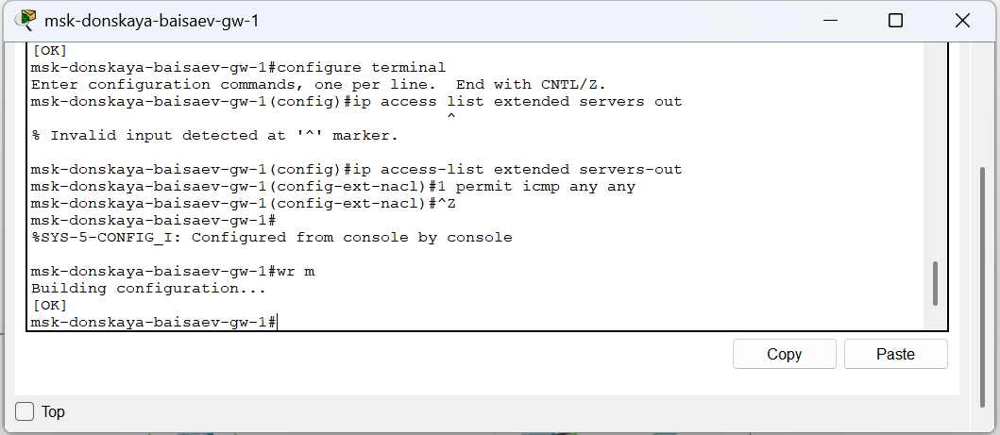
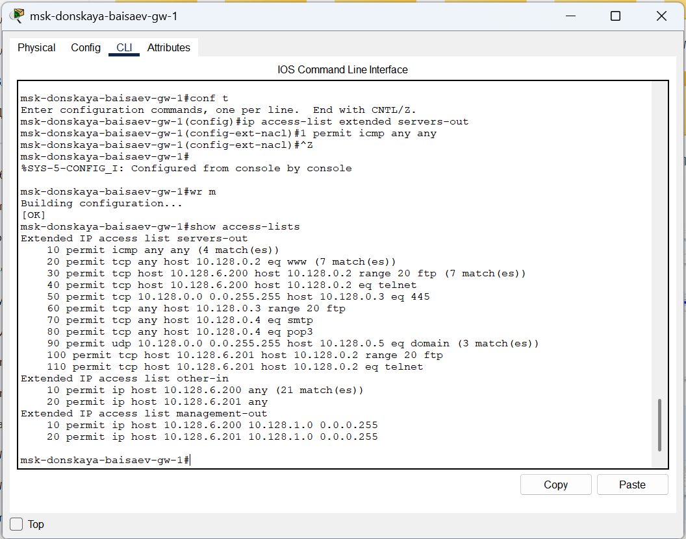

---
## Front matter
title: "Отчёт по лабораторной работе №10"
subtitle: "Дисциплина: Администрирование локальных сетей"
author: "Исаев Булат Абубакарович НПИбд-01-22"

## Generic otions
lang: ru-RU
toc-title: "Содержание"

## Bibliography
bibliography: bib/cite.bib
csl: pandoc/csl/gost-r-7-0-5-2008-numeric.csl

## Pdf output format
toc: true # Table of contents
toc-depth: 2
lof: true # List of figures
lot: true # List of tables
fontsize: 12pt
linestretch: 1.5
papersize: a4
documentclass: scrreprt
## I18n polyglossia
polyglossia-lang:
  name: russian
polyglossia-otherlangs:
  name: english
## I18n babel
babel-lang: russian
babel-otherlangs: english
## Fonts
mainfont: Arial
romanfont: Arial
sansfont: Arial
monofont: Arial
mainfontoptions: Ligatures=TeX
romanfontoptions: Ligatures=TeX
sansfontoptions: Ligatures=TeX,Scale=MatchLowercase
monofontoptions: Scale=MatchLowercase,Scale=0.9
## Biblatex
biblatex: true
biblio-style: "gost-numeric"
biblatexoptions:
  - parentracker=true
  - backend=biber
  - hyperref=auto
  - language=auto
  - autolang=other*
  - citestyle=gost-numeric
## Pandoc-crossref LaTeX customization
figureTitle: "Рис."
tableTitle: "Таблица"
listingTitle: "Листинг"
lofTitle: "Список иллюстраций"
lotTitle: "Список таблиц"
lolTitle: "Листинги"
## Misc options
indent: true
header-includes:
  - \usepackage{indentfirst}
  - \usepackage{float} # keep figures where there are in the text
  - \floatplacement{figure}{H} # keep figures where there are in the text
---

# Цель работы
Освоить настройку прав доступа пользователей к ресурсам сети.

# Выполнение лабораторной работы
Откроем проект с названием lab_PT-09.pkt и сохраним под названием lab_PT-10.pkt. После чего откроем его для дальнейшего редактирования (рис. [-@fig:001]) 

{ #fig:001 width=70% }

{ #fig:002 width=70% }

{ #fig:003 width=70% }

{ #fig:004 width=70% }

Далее настроим доступ к web-серверу по порту tcp 80. Здесь  (рис. [-@fig:005]) 
1.	Создадим список контроля доступа с названием servers-out (так как предполагается ограничить доступ в конкретные подсети и по отношению к маршрутизатору это будет исходящий трафик); 
2.	Укажем (в качестве комментария-напоминания remark web), что ограничения предназначены для работы с web-сервером; 
3.	Дадим разрешение доступа (permit) по протоколу TCP всем (any) пользователям сети (host) на доступ к web-серверу, имеющему адрес 10.128.0.2, через порт 80.

{ #fig:005 width=70% }

Добавим список управления доступом к интерфейсу. Здесь  (рис. [-@fig:006]) 
•	К интерфейсу f0/0.3 подключаем список прав доступа serversout и применяем к исходящему трафику (out). (Проверим, что доступ к web-серверу есть через протокол HTTP (введя в строке браузера хоста ip-адрес web-сервера). При этом команда ping будет демонстрировать недоступность web-сервера как по имени, так и по ip-адресу web-сервера) (рис. [-@fig:007]), (рис. [-@fig:008])

{ #fig:006 width=70% }

{ #fig:007 width=70% }

{ #fig:008 width=70% }

Настроим дополнительный доступ для администратора по протоколам Telnet и FTP. Здесь  (рис. [-@fig:009]) 
•	В список контроля доступа servers-out добавим правило, разрешающее устройству администратора с ip-адресом 10.128.6.200 доступ на web-сервер (10.128.0.2) по протоколам FTP и telnet. Убедимся, что с узла с ip-адресом 10.128.6.200 есть доступ по протоколу FTP. Для этого в командной строке устройства администратора введём ftp 10.128.0.2, а затем по запросу имя пользователя cisco и пароль cisco (рис. [-@fig:010]).  Попробуем провести аналогичную процедуру с другого устройства сети и убедимся, что доступ будет запрещён (рис. [-@fig:011])

{ #fig:009 width=70% }

{ #fig:010 width=70% }

{ #fig:011 width=70% }

Настроим доступ к файловому серверу. Здесь  (рис. [-@fig:012]) 
1.	В списке контроля доступа servers-out укажем (в качестве комментария-напоминания remark file), что следующие ограничения предназначены для работы с file-сервером; 
2.	Всем узлам внутренней сети (10.128.0.0) разрешим доступ по протоколу SMB (работает через порт 445 протокола TCP) к каталогам общего пользования; 
3.	Любым узлам разрешим доступ к file-серверу по протоколу FTP. Запись 0.0.255.255 — обратная маска (wildcard mask). 

{ #fig:012 width=70% }

Затем настроим доступ к почтовому серверу. Здесь  (рис. [-@fig:013]) 
1.	В списке контроля доступа servers-out укажем (в качестве комментария-напоминания remark mail), что следующие ограничения предназначены для работы с почтовым сервером; 
2.	Всем разрешим доступ к почтовому серверу по протоколам POP3 и SMTP. 

{ #fig:013 width=70% }

Настроим доступ к DNS-серверу. Здесь  (рис. [-@fig:014]) 
1.	В списке контроля доступа servers-out укажем (в качестве комментария-напоминания remark dns), что следующие ограничения предназначены для работы с DNS-сервером; 
2.	Всем узлам внутренней сети разрешим доступ к DNS-серверу через UDP-порт 53. 
Проверим доступность web-сервера (через браузер) не только по ip-адресу, но и по имени (рис. [-@fig:015]) 

{ #fig:014 width=70% }

{ #fig:015 width=70% }

Разрешим icmp-запросы. Здесь  (рис. [-@fig:016]) 
•	Демонстрируем явное управление порядком размещения правил — правило разрешения для icmp-запросов добавляется в начало списка контроля доступа. 
Номера строк правил в списке контроля доступа можно посмотреть с помощью команды show access −lists (рис. [-@fig:017]) 

{ #fig:016 width=70% }

{ #fig:017 width=70% }

Теперь настроим доступ для сети Other (требуется наложить ограничение на исходящий из сети Other трафик, который по отношению к маршрутизатору msk-donskaya-baisaev-gw-1 является входящим трафиком). Здесь  (рис. [-@fig:018]) 
1.	В списке контроля доступа other-in укажем, что следующие правила относятся к администратору сети; 
2.	Даём разрешение устройству с адресом 10.128.6.200 на любые действия (any); 
3.	К интерфейсу f0/0.104 подключаем список прав доступа other-in и применяем к входящему трафику (in). 

{ #fig:018 width=70% }

Настроим доступ администратора к сети сетевого оборудования. Здесь  (рис. [-@fig:019]) 
1.	В списке контроля доступа management-out укажем (в качестве комментария-напоминания remark admin), что устройству администратора с адресом 10.128.6.200 разрешён доступ к сети сетевого оборудования (10.128.1.0); 
2.	К интерфейсу f0/0.2 подключаем список прав доступа management-out и применяем к исходящему трафику (out).

{ #fig:019 width=70% }

Проверим корректность установленных правил доступа, попытавшись получить доступ по различным протоколам с разных устройств сети к подсети серверов и подсети сетевого оборудования  (рис. [-@fig:020]), (рис. [-@fig:021]) 

{ #fig:020 width=70% }

{ #fig:021 width=70% }

AAAAAAAAAAAAAAAAAA  (рис. [-@fig:022]), (рис. [-@fig:023]) 

{ #fig:022 width=70% }

{ #fig:023 width=70% }

# Вывод

В ходе выполнения лабораторной работы мы освоили настройку прав доступа пользователей к ресурсам сети.

##  Контрольные вопросы

1. Как задать действие правила для конкретного протокола?  - 
  
   **permit...**

2. Как задать действие правила сразу для нескольких портов?  - 
  
   **...range...**

3. Как узнать номер правила в списке прав доступа?AAAAA - 
  
    **show access-lists**

4. Каким образом можно изменить порядок применения правил в списке контроля доступа?  - 
  
    **ip access-list resequence…**
