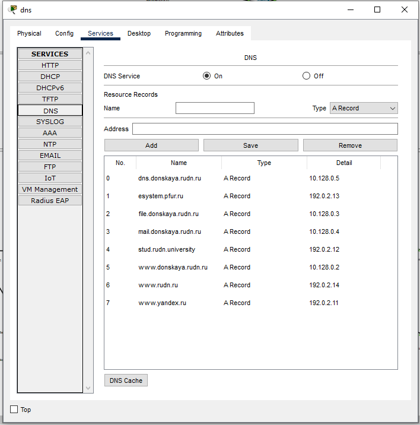

---
## Front matter
lang: ru-RU
title: Лабораторная Работа №11. Настройка сетевых сервисов. DHCP.
subtitle: Администрирование локальных сетей
author:
  - Исаев Б.А.
institute:
  - Российский университет дружбы народов им. Патриса Лумумбы, Москва, Россия

## i18n babel
babel-lang: russian
babel-otherlangs: english

## Formatting pdf
toc: false
toc-title: Содержание
slide_level: 2
aspectratio: 169
section-titles: true
theme: metropolis
header-includes:
 - \metroset{progressbar=frametitle,sectionpage=progressbar,numbering=fraction}
 - '\makeatletter'
 - '\beamer@ignorenonframefalse'
 - '\makeatother'

## Fonts
mainfont: Arial
romanfont: Arial
sansfont: Arial
monofont: Arial
---

## Докладчик

  * Исаев Булат Абубакарович
  * НПИбд-01-22
  * Российский университет дружбы народов
  * [1132227131@pfur.ru]

## Новый проект
{#fig:001 width=70%}
**Рис. 1.1.** Открытие проекта lab_PT-11.pkt.

## Размещение оборудования
{#fig:001 width=70%}
**Рис. 1.2.** Размещение согласно заданию лабораторной работы необходимого оборудования для сети провайдера и сети модельного Интернета (4 медиаконвертера (Repeater-PT), 2 коммутатора типа Cisco 2960-24TT, маршрутизатор типа Cisco 2811, 4 сервера). Присвоение названий размещённым в сети провайдера и в сети модельного Интернета объектам.

## Физическая рабочая область
{#fig:001 width=70%}
**Рис. 1.3.** Добавление в физической рабочей области здания провайдера и здания, имитирующего расположение серверов модельного Интернета. Присвоение им соответствующих названий.

## Перенос оборудования
{#fig:001 width=70%}
**Рис. 1.4.** Перенос оборудования из сети «Донская».

## Размещение оборудования
{#fig:001 width=70%}
**Рис. 1.5.** Размещение оборудования в здании “Provider”.

## Размещение оборудования
{#fig:001 width=70%}
**Рис. 1.6.** Размещение оборудования в здании “Internet”. 

## Замена модулей
{#fig:001 width=70%}
**Рис. 1.7.** Замена на медиаконвертерах имеющихся модулей на PT-REPEATERNM-1FFE и PT-REPEATER-NM-1CFE для подключения витой пары по технологии Fast Ethernet и оптоволокна соответственно.

## Присвоение IP-адресов
{#fig:001 width=70%}
**Рис. 1.8.** Присвоение IP-адресов серверам согласно таблице в лабораторной работе.

## Добавление сведений
{#fig:001 width=70%}
**Рис. 1.9.** Добавление сведений о серверах на DNS-сервере сети «Донская». 

## Вывод
В ходе выполнения лабораторной работы мы освоили настройку прав доступа пользователей к ресурсам сети.

## Спасибо за внимание!