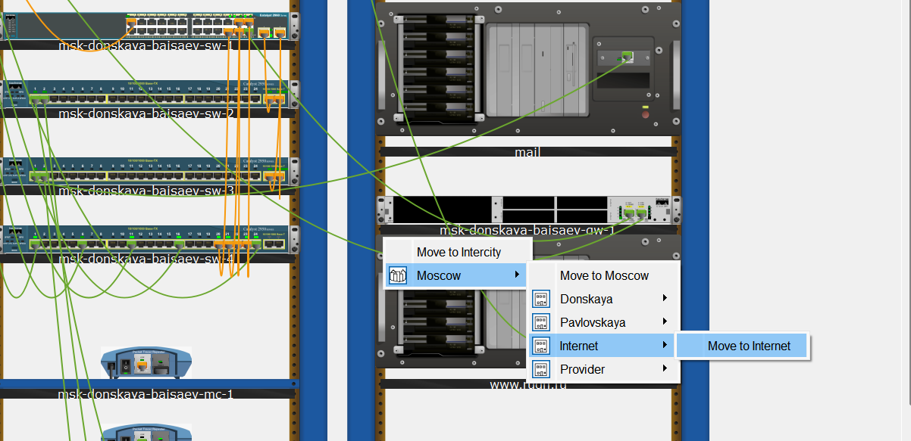

**РОССИЙСКИЙ УНИВЕРСИТЕТ ДРУЖБЫ НАРОДОВ** 

**Факультет физико-математических и естественных наук Кафедра теории вероятностей и кибербезопасности** 

**ОТЧЁТ** 

**ПО ЛАБОРАТОРНОЙ РАБОТЕ №11** 
*дисциплина: Администрирование локальных сетей* 

Студент: Исаев Булат Абубакарович Студ. билет № 1132227131 

Группа: НПИбд-01-22

**МОСКВА** 2025 г.

**Цель работы:** 
Провести подготовительные мероприятия по подключению локальной сети организации к Интернету.

**Выполнение работы:** 
Откроем проект с названием lab_PT-10.pkt и сохраним под названием lab_PT-11.pkt. После чего откроем его для дальнейшего редактирования (Рис. 1.1):

**Рис. 1.1.** Открытие проекта lab_PT-11.pkt.

На схеме нашего проекта разместим согласно заданию лабораторной работы необходимое оборудование для сети провайдера и сети модельного Интернета (4 медиаконвертера (Repeater-PT), 2 коммутатора типа Cisco 2960-24TT, маршрутизатор типа Cisco 2811, 4 сервера). После чего присвоим названия размещённым в сети провайдера и в сети модельного Интернета объектам согласно правилам наименования (Рис. 1.2).

**Рис. 1.2.** Размещение согласно заданию лабораторной работы необходимого оборудования для сети провайдера и сети модельного Интернета (4 медиаконвертера (Repeater-PT), 2 коммутатора типа Cisco 2960-24TT, маршрутизатор типа Cisco 2811, 4 сервера). Присвоение названий размещённым в сети провайдера и в сети модельного Интернета объектам.

В физической рабочей области добавим здание провайдера и здание, имитирующее расположение серверов модельного Интернета. Присвоим им соответствующие названия (Рис. 1.3):

**Рис. 1.3.** Добавление в физической рабочей области здания провайдера и здания, имитирующего расположение серверов модельного Интернета. Присвоение им соответствующих названий.

Перенесём из сети «Донская» оборудование провайдера и модельной сети Интернета в соответствующие здания (Рис. 1.4 – 1.6):

**Рис. 1.4.** Перенос оборудования из сети «Донская».

**Рис. 1.5.** Размещение оборудования в здании “Provider”.

**Рис. 1.6.** Размещение оборудования в здании “Internet”. 

На медиаконвертерах заменим имеющиеся модули на PT-REPEATERNM-1FFE и PT-REPEATER-NM-1CFE для подключения витой пары по технологии Fast Ethernet и оптоволокна соответственно (Рис. 1.7): 

**Рис. 1.7.** Замена на медиаконвертерах имеющихся модулей на PT-REPEATERNM-1FFE и PT-REPEATER-NM-1CFE для подключения витой пары по технологии Fast Ethernet и оптоволокна соответственно.

Пропишем IP-адреса серверам согласно таблице в лабораторной работе (Рис. 1.8): 

**Рис. 1.8.** Присвоение IP-адресов серверам согласно таблице в лабораторной работе.

После чего пропишем сведения о серверах на DNS-сервере сети «Донская» (Рис. 1.9): 

**Рис. 1.9.** Добавление сведений о серверах на DNS-сервере сети «Донская». 

**Вывод:** 
В ходе выполнения лабораторной работы мы освоили настройку прав доступа пользователей к ресурсам сети.

**Ответы на контрольные вопросы:** 

1. Что такое Network Address Translation (NAT)?  - **Network Address Translation (NAT) — механизм преобразования IP-адресов транзитных пакетов.**

2. Как определить, находится ли узел сети за NAT? –  - **•	Просмотр сетевой конфигурации: если узел имеет локальный IP-адрес из диапазона 192.168.x.x, 10.x.x.x или 172.16.x.x, вероятно, он находится за NAT.**
**•	Проверка маршрутизации: при использовании traceroute (tracert в Windows) можно увидеть IP-адреса маршрута. Если он проходит через общедоступные IP-адреса, узел, скорее всего, за NAT.**
**•	Проверка портов: если администратор сети настроил порты NAT для перенаправления трафика на устройства внутри локальной сети, подключение к определенному порту на общедоступном IP-адресе может указывать на использование NAT.**
**•	Использование онлайн-инструментов: некоторые онлайн-сервисы могут анализировать IP-адрес узла и определить, используется ли NAT.**

3. Какое оборудование отвечает за преобразование адреса методом NAT?  - **Оборудование, отвечающее за преобразование адресов методом NAT, включает в себя маршрутизаторы (роутеры), межсетевые экраны (firewalls) и прокси-серверы**

4. В чём отличие статического, динамического и перегруженного NAT?  - **•	Статический NAT (SNAT): каждый локальный IP-адрес отображается на соответствующий общедоступный IP-адрес.**
**•	Динамический NAT (DNAT): локальные IP-адреса отображаются на общедоступные IP-адреса из пула, с временным выделением адресов.**
**•	NAT с перегрузкой (Overloaded NAT или PAT): в этом случае, помимо изменения IP-адресов, также происходит изменение портов, позволяя множеству устройств использовать один общедоступный IP-адрес.**

5. Охарактеризуйте типы NAT. - **•	Cтатический NAT (Static NAT, SNAT) — осуществляет преобразование адресов по принципу 1:1 (в частности, один локальный IP-адрес преобразуется во внешний адрес, выделенный, например, провайдером);**
**•	Динамический NAT (Dynamic NAT, DNAT) — осуществляет преобразование адресов по принципу 1:N (например, один адрес устройства локальной сети преобразуется в один из адресов диапазона внешних адресов);**
**•	NAT Overload (или NAT Masquerading, или Port Address Translation, PAT) — осуществляет преобразование адресов по принципу N:1 (например, адреса группы устройств локальной подсети преобразуются в один внешний адрес, при этом дополнительно используется механизм адресации через номера портов).**
