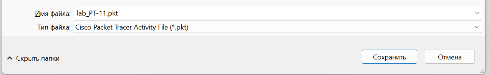
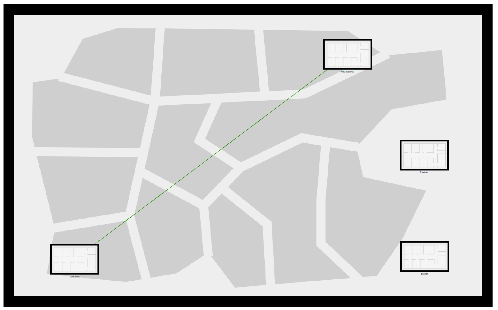
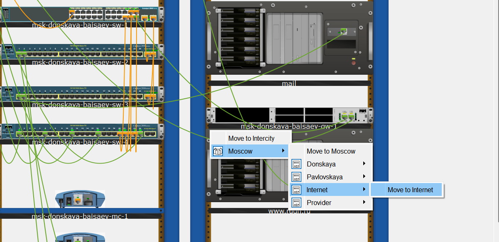
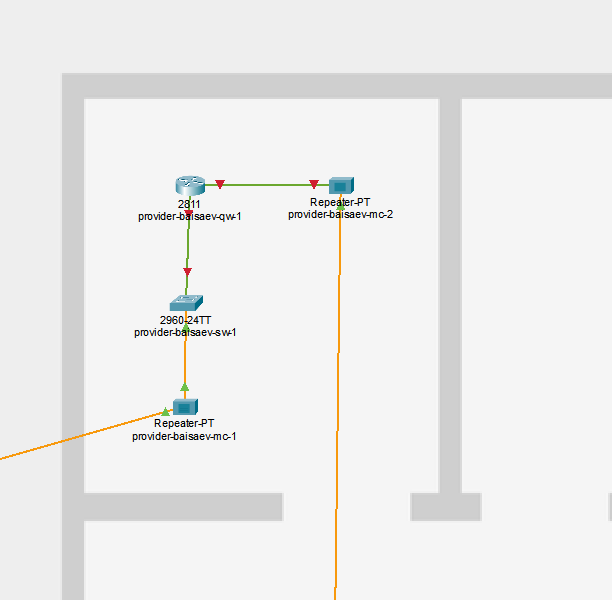
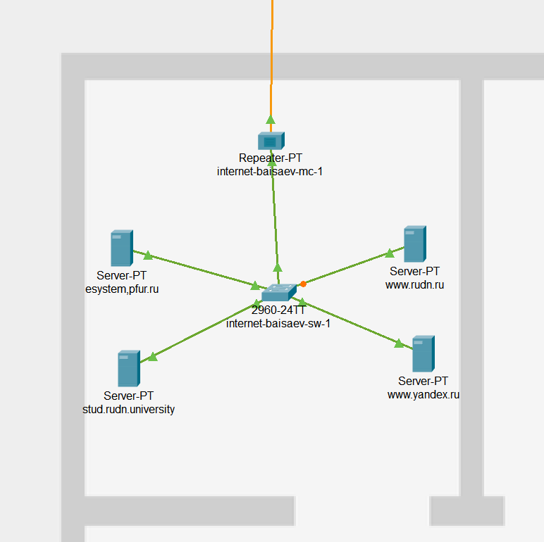
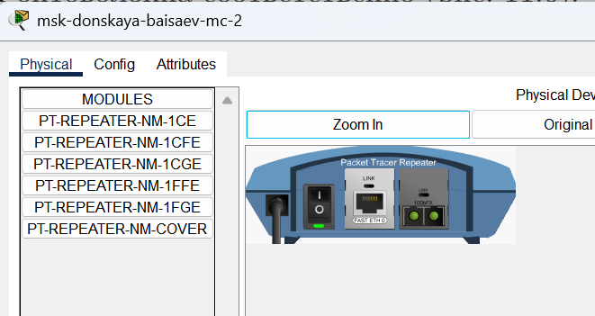
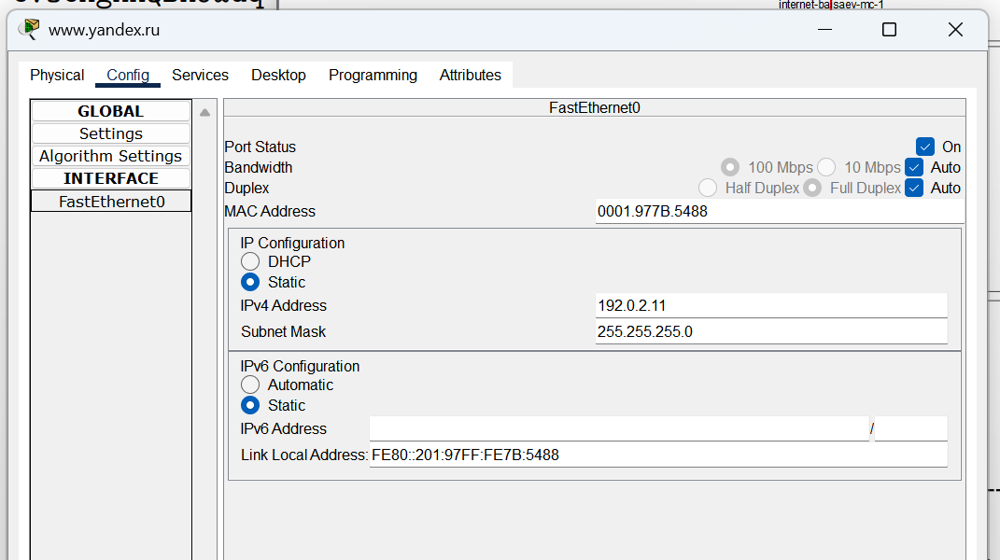
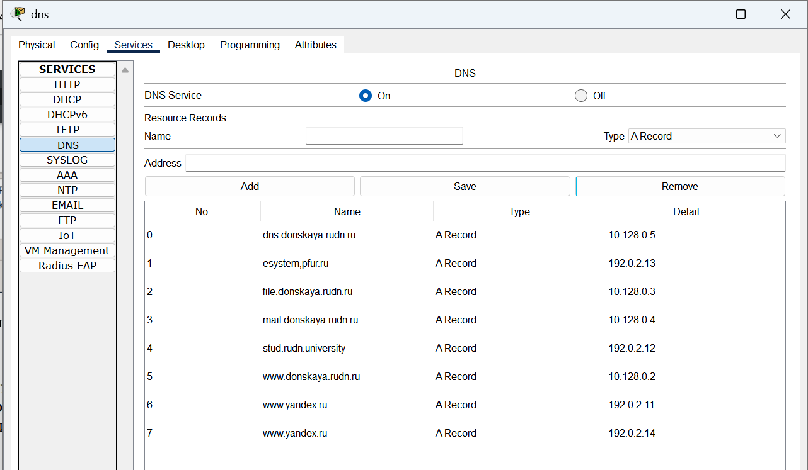

---
## Front matter
title: "Отчёт по лабораторной работе №11"
subtitle: "Дисциплина: Администрирование локальных сетей"
author: "Исаев Булат Абубакарович НПИбд-01-22"

## Generic otions
lang: ru-RU
toc-title: "Содержание"

## Bibliography
bibliography: bib/cite.bib
csl: pandoc/csl/gost-r-7-0-5-2008-numeric.csl

## Pdf output format
toc: true # Table of contents
toc-depth: 2
lof: true # List of figures
lot: true # List of tables
fontsize: 12pt
linestretch: 1.5
papersize: a4
documentclass: scrreprt
## I18n polyglossia
polyglossia-lang:
  name: russian
polyglossia-otherlangs:
  name: english
## I18n babel
babel-lang: russian
babel-otherlangs: english
## Fonts
mainfont: Arial
romanfont: Arial
sansfont: Arial
monofont: Arial
mainfontoptions: Ligatures=TeX
romanfontoptions: Ligatures=TeX
sansfontoptions: Ligatures=TeX,Scale=MatchLowercase
monofontoptions: Scale=MatchLowercase,Scale=0.9
## Biblatex
biblatex: true
biblio-style: "gost-numeric"
biblatexoptions:
  - parentracker=true
  - backend=biber
  - hyperref=auto
  - language=auto
  - autolang=other*
  - citestyle=gost-numeric
## Pandoc-crossref LaTeX customization
figureTitle: "Рис."
tableTitle: "Таблица"
listingTitle: "Листинг"
lofTitle: "Список иллюстраций"
lotTitle: "Список таблиц"
lolTitle: "Листинги"
## Misc options
indent: true
header-includes:
  - \usepackage{indentfirst}
  - \usepackage{float} # keep figures where there are in the text
  - \floatplacement{figure}{H} # keep figures where there are in the text
---

# Цель работы
Откроем проект с названием lab_PT-10.pkt и сохраним под названием lab_PT-11.pkt. После чего откроем его для дальнейшего редактирования (Рис. 1.1):

# Выполнение лабораторной работы
Открытие проекта lab_PT-11.pkt. (рис. [-@fig:001]) 

{ #fig:001 width=70% }

На схеме нашего проекта разместим согласно заданию лабораторной работы необходимое оборудование для сети провайдера и сети модельного Интернета (4 медиаконвертера (Repeater-PT), 2 коммутатора типа Cisco 2960-24TT, маршрутизатор типа Cisco 2811, 4 сервера). После чего присвоим названия размещённым в сети провайдера и в сети модельного Интернета объектам согласно правилам наименования  (рис. [-@fig:002]) 

{ #fig:002 width=70% }

В физической рабочей области добавим здание провайдера и здание, имитирующее расположение серверов модельного Интернета. Присвоим им соответствующие названия  (рис. [-@fig:003]) 

{ #fig:003 width=70% }

Перенесём из сети «Донская» оборудование провайдера и модельной сети Интернета в соответствующие здания  (рис. [-@fig:004]), (рис. [-@fig:005]), (рис. [-@fig:006])

{ #fig:004 width=70% }

{ #fig:005 width=70% }

{ #fig:006 width=70% }

На медиаконвертерах заменим имеющиеся модули на PT-REPEATERNM-1FFE и PT-REPEATER-NM-1CFE для подключения витой пары по технологии Fast Ethernet и оптоволокна соответственно  (рис. [-@fig:007]) 

{ #fig:007 width=70% }

Пропишем IP-адреса серверам согласно таблице в лабораторной работе  (рис. [-@fig:008]) 

{ #fig:008 width=70% }

После чего пропишем сведения о серверах на DNS-сервере сети «Донская»  (рис. [-@fig:009]) 

{ #fig:009 width=70% }

# Вывод

В ходе выполнения лабораторной работы мы освоили настройку прав доступа пользователей к ресурсам сети.

##  Контрольные вопросы

1. AAAAAAAAAAAAAAAAAAAAAAA
  
   **AAAAAAAAAAAAAAAAAAAAAAA**

2. AAAAAAAAAAAAAAAAAAAAAAA
  
   **AAAAAAAAAAAAAAAAAAAAAAA**

3. AAAAAAAAAAAAAAAAAAAAAAA
  
    **AAAAAAAAAAAAAAAAAAAAAAA**

4. AAAAAAAAAAAAAAAAAAAAAAA
  
    **AAAAAAAAAAAAAAAAAAAAAAA**

5. AAAAAAAAAAAAAAAAAAAAAAA
  
    **AAAAAAAAAAAAAAAAAAAAAAA**

