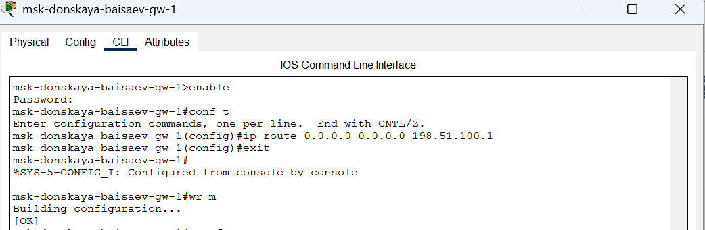
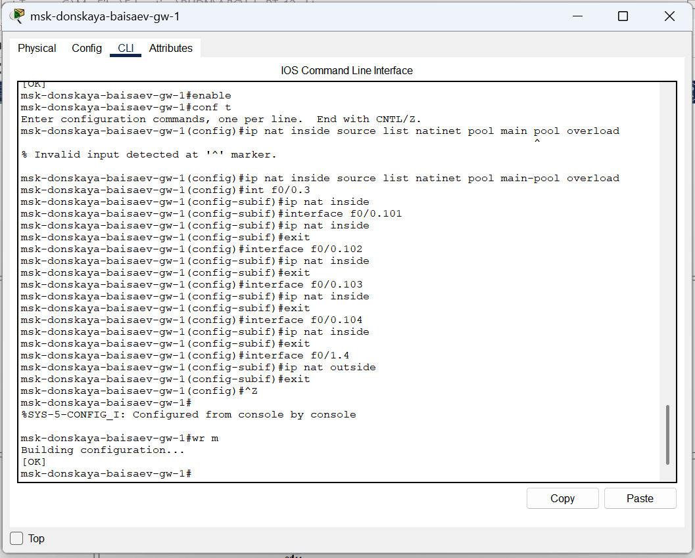

---
## Front matter
lang: ru-RU
title: Лабораторная Работа №12. Настройка NAT.
subtitle: Администрирование локальных сетей
author:
  - Исаев Б.А.
institute:
  - Российский университет дружбы народов им. Патриса Лумумбы, Москва, Россия

## i18n babel
babel-lang: russian
babel-otherlangs: english

## Formatting pdf
toc: false
toc-title: Содержание
slide_level: 2
aspectratio: 169
section-titles: true
theme: metropolis
header-includes:
 - \metroset{progressbar=frametitle,sectionpage=progressbar,numbering=fraction}
 - '\makeatletter'
 - '\beamer@ignorenonframefalse'
 - '\makeatother'

## Fonts
mainfont: Arial
romanfont: Arial
sansfont: Arial
monofont: Arial
---

## Докладчик

  * Исаев Булат Абубакарович
  * НПИбд-01-22
  * Российский университет дружбы народов
  * [1132227131@pfur.ru]

## Новый проект
{#fig:001 width=70%}
**Рис. 1.1.** Открытие проекта lab_PT-12.pkt.

## Первоначальная настройка
{#fig:001 width=70%}
**Рис. 1.2.** Первоначальная настройка маршрутизатора provider-baisaev-gw-1 (присвоение имени, настройка доступа по паролю и др.).

## Первоначальная настройка
{#fig:001 width=70%}
**Рис. 1.3.** Первоначальная настройка коммутатора provider-baisaev-sw-1 (присвоение имени, настройка доступа по паролю и др.).

## Настройка интерфейсов
{#fig:001 width=70%}
**Рис. 1.4.** Настройка интерфейсов маршрутизатора provider-baisaev-gw-1.

## Настройка интерфейсов
{#fig:001 width=70%}
**Рис. 1.5.** Настройка интерфейсов коммутатора provider-baisaev-sw-1.

## Проверка
{#fig:001 width=70%}
**Рис. 1.6.** Проверка командой ping с сервера www.rudn.ru на роутер провайдера.

## Настройка интерфейсов
{#fig:001 width=70%}
**Рис. 1.7.** Настройка интерфейсов маршрутизатора msk-donskaya-baisaev-gw-1 для доступа к сети провайдера.

## Проверка
{#fig:001 width=70%}
**Рис. 1.8.** Проверка

## Настройка пула адресов
{#fig:001 width=70%}
**Рис. 1.9.** Настройка пула адресов для NAT. 

## Настройка списка доступа
{#fig:001 width=70%}
**Рис. 1.10.** Настройка списка доступа для NAT

## Сеть
{#fig:001 width=70%}
**Рис. 1.11.** Сеть дисплейных классов (имеют доступ только к сайтам, необходимым для учёбы (www.yandex.ru (192.0.2.11), stud.rudn.university (192.0.2.12)).

## Сеть
{#fig:001 width=70%}
**Рис. 1.12.** Сеть кафедр (работает только с образовательными сайтами (esystem.pfur.ru (192.0.2.13))).

## Сеть
{#fig:001 width=70%}
**Рис. 1.13.** Сеть администрации (имеет возможность работать только с сайтом университета (www.rudn.ru (192.0.2.14))).

## Сеть
{#fig:001 width=70%}
**Рис. 1.14.** Доступ для компьютера администратора (в сети для других пользователей компьютер администратора имеет полный доступ в Интернет. Другие не имеют доступа.).

## Настройка
{#fig:001 width=70%}
**Рис. 1.15.** Настройка NAT (Port Address Translation и интерфейсов для NAT).

## Проверка
{#fig:001 width=70%}
**Рис. 1.16.** Проверка

## Проверка
{#fig:001 width=70%}
**Рис. 1.17.** Проверка

## Настройка доступа из Интернета
{#fig:001 width=70%}
**Рис. 1.18.** Настройка доступа из Интернета (WWW-сервер).

## Настройка доступа из Интернета
{#fig:001 width=70%}
**Рис. 1.19.** Настройка доступа из Интернета (файловый сервер).

## Настройка доступа из Интернета
{#fig:001 width=70%}
**Рис. 1.20.** Настройка доступа из Интернета (почтовый сервер).

## Настройка доступа из Интернета
{#fig:001 width=70%}
**Рис. 1.21.** Настройка доступа из Интернета (доступ по RDP).

## Проверка
{#fig:001 width=70%}
**Рис. 1.22.** Проверка

## Вывод
В ходе выполнения лабораторной работы мы приобрели практические навыки по настройке доступа локальной сети к внешней сети посредством NAT.

## Спасибо за внимание!