---
## Front matter
lang: ru-RU
title: Лабораторная Работа №12. Настройка NAT.
subtitle: Администрирование локальных сетей
author:
  - Исаев Б.А.
institute:
  - Российский университет дружбы народов им. Патриса Лумумбы, Москва, Россия

## i18n babel
babel-lang: russian
babel-otherlangs: english

## Formatting pdf
toc: false
toc-title: Содержание
slide_level: 2
aspectratio: 169
section-titles: true
theme: metropolis
header-includes:
 - \metroset{progressbar=frametitle,sectionpage=progressbar,numbering=fraction}
 - '\makeatletter'
 - '\beamer@ignorenonframefalse'
 - '\makeatother'

## Fonts
mainfont: Arial
romanfont: Arial
sansfont: Arial
monofont: Arial
---

## Докладчик

  * Исаев Булат Абубакарович
  * НПИбд-01-22
  * Российский университет дружбы народов
  * [1132227131@pfur.ru]

## Новый проект

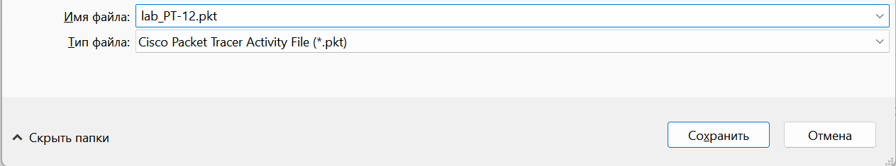{ #fig:001 width=70% }

## Первоначальная настройка

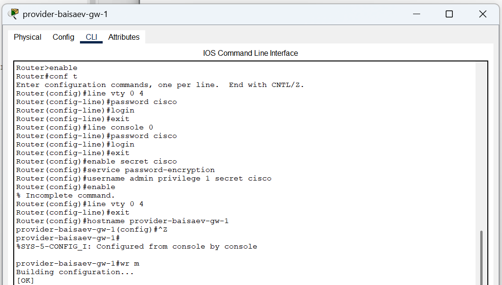{ #fig:002 width=70% }

## Первоначальная настройка

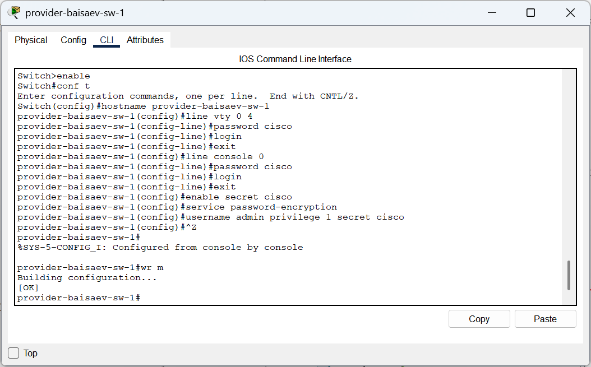{ #fig:003 width=70% }

## Настройка интерфейсов

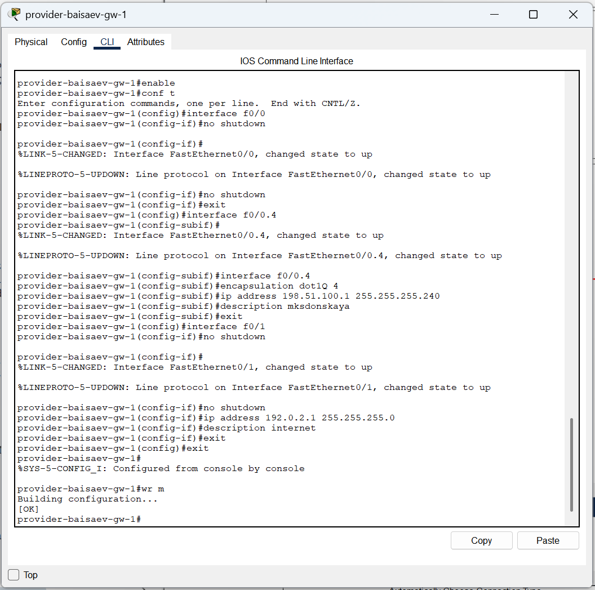{ #fig:004 width=70% }

## Настройка интерфейсов

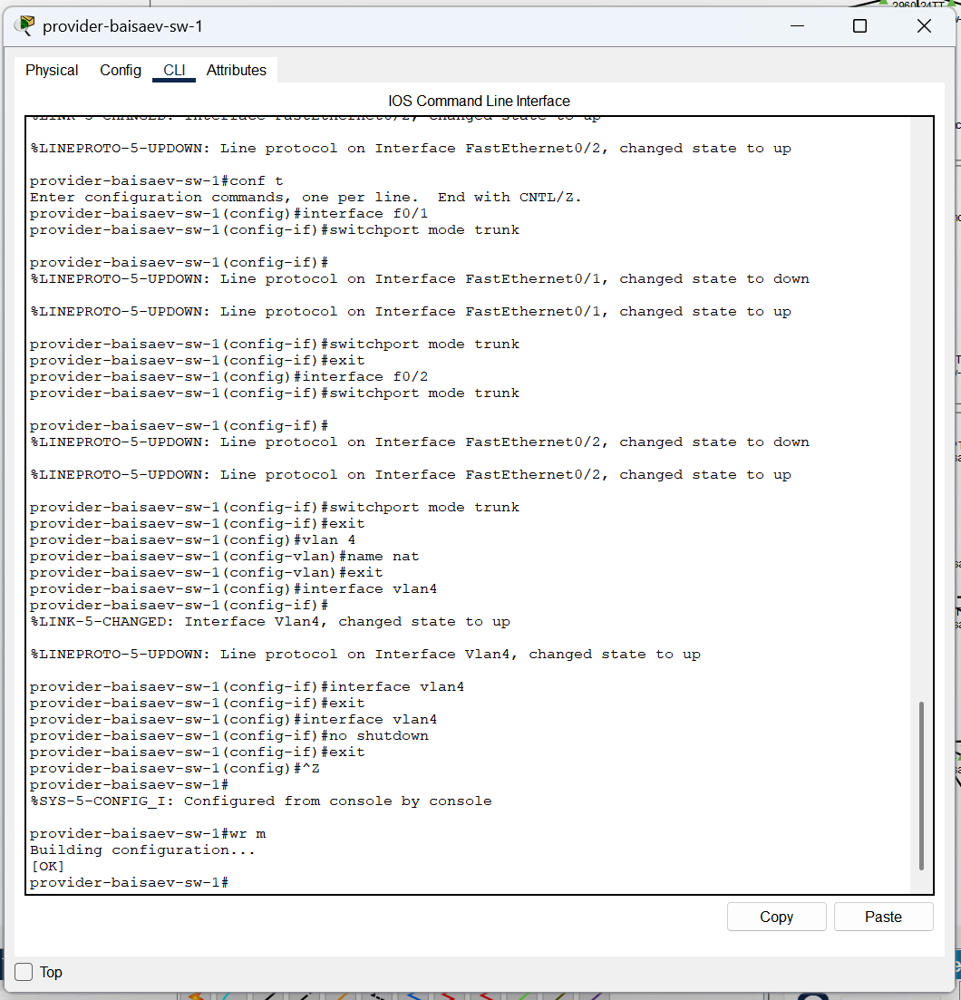{ #fig:005 width=70% }

## Проверка

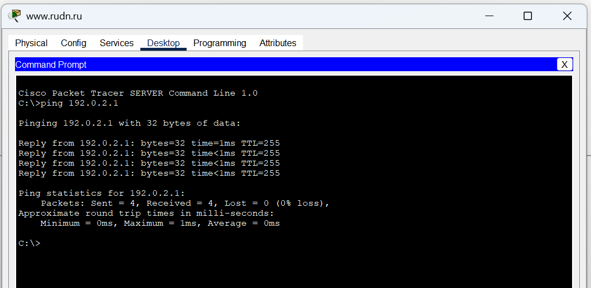{ #fig:006 width=70% }

## Настройка интерфейсов

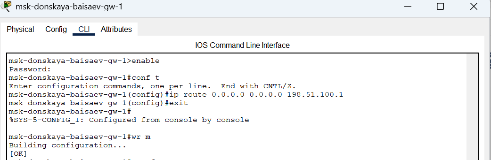{ #fig:007 width=70% }

## Проверка

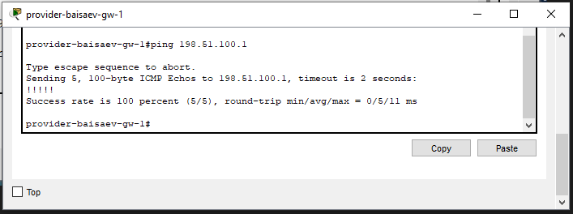{ #fig:008 width=70% }

## Настройка пула адресов

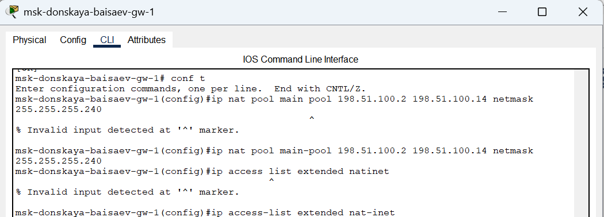{ #fig:009 width=70% }

## Настройка списка доступа

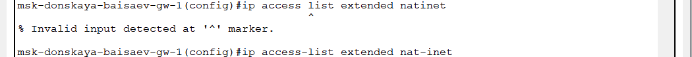{ #fig:010 width=70% }

## Сеть

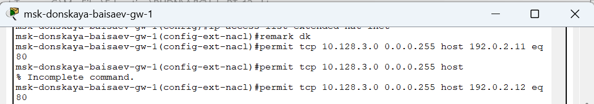{ #fig:011 width=70% }

## Сеть

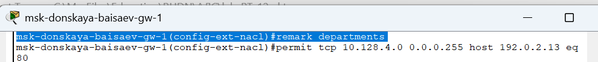{ #fig:012 width=70% }

## Сеть

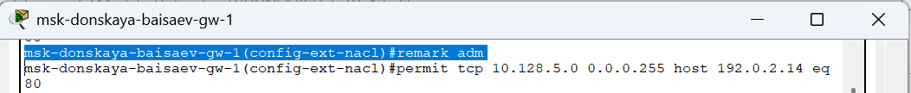{ #fig:013 width=70% }

## Сеть

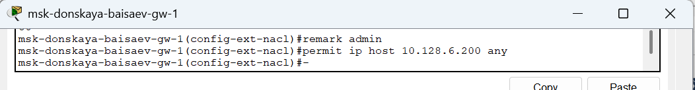{ #fig:014 width=70% }

## Настройка

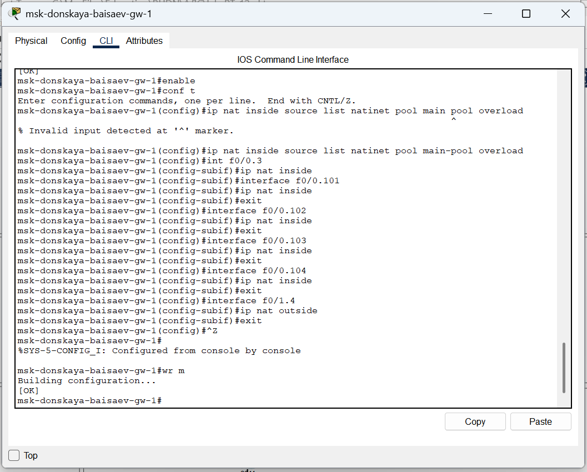{ #fig:015 width=70% }

## Проверка

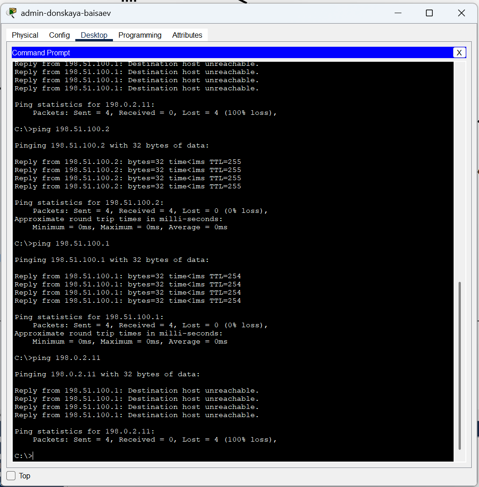{ #fig:016 width=70% }

## Проверка

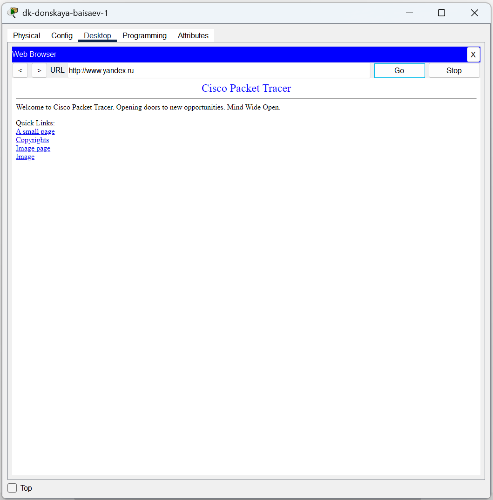{ #fig:017 width=70% }

## Настройка доступа из Интернета

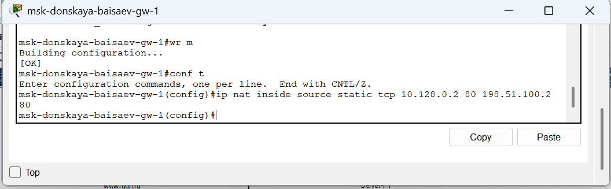{ #fig:018 width=70% }

## Настройка доступа из Интернета

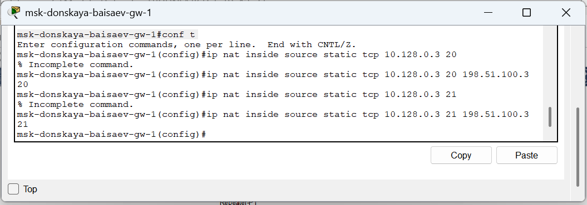{ #fig:019 width=70% }

## Настройка доступа из Интернета

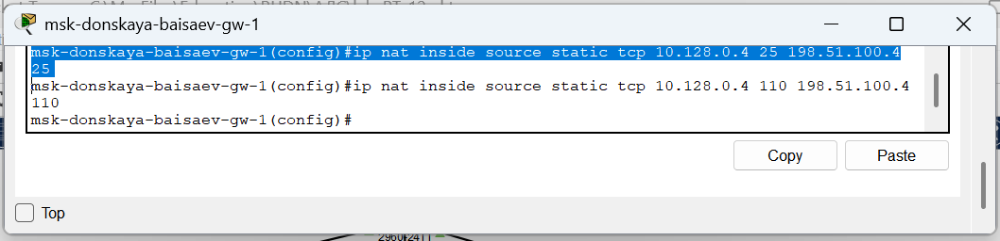{ #fig:020 width=70% }

## Настройка доступа из Интернета

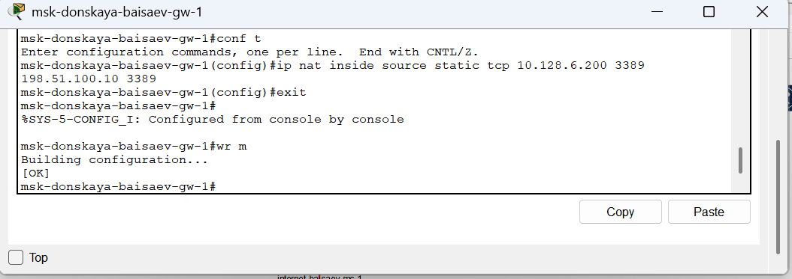{ #fig:021 width=70% }

## Проверка

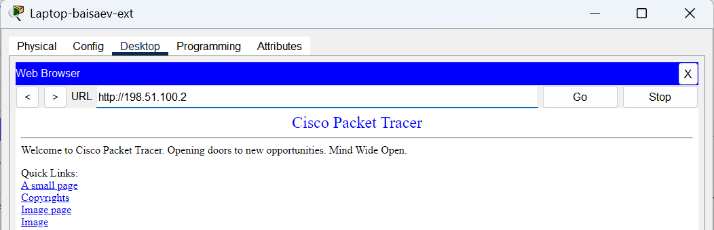{ #fig:022 width=70% }

## Вывод

В ходе выполнения лабораторной работы мы приобрели практические навыки по настройке доступа локальной сети к внешней сети посредством NAT.
