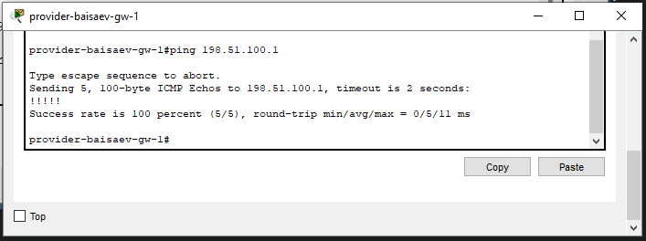

**РОССИЙСКИЙ УНИВЕРСИТЕТ ДРУЖБЫ НАРОДОВ** 

**Факультет физико-математических и естественных наук Кафедра теории вероятностей и кибербезопасности** 

**ОТЧЁТ** 

**ПО ЛАБОРАТОРНОЙ РАБОТЕ №12** 
*дисциплина: Администрирование локальных сетей* 

Студент: Исаев Булат Абубакарович Студ. билет № 1132227131 

Группа: НПИбд-01-22

**МОСКВА** 2025 г.

**Цель работы:** 
Приобретение практических навыков по настройке доступа локальной сети к внешней сети посредством NAT.

**Выполнение работы:** 
Откроем проект с названием lab_PT-11.pkt и сохраним под названием lab_PT-12.pkt. После чего откроем его для дальнейшего редактирования (Рис. 1.1):

**Рис. 1.1.** Открытие проекта lab_PT-12.pkt.

Для начала сделаем первоначальную настройку маршрутизатора provider-baisaev-gw-1 и коммутатора provider-baisaev-sw-1 провайдера (зададим имя, настроим доступ по паролю и т.п.) (Рис. 1.2 – 1.3). 

**Рис. 1.2.** Первоначальная настройка маршрутизатора provider-baisaev-gw-1 (присвоение имени, настройка доступа по паролю и др.).

**Рис. 1.3.** Первоначальная настройка коммутатора provider-baisaev-sw-1 (присвоение имени, настройка доступа по паролю и др.).

Теперь настроим интерфейсы маршрутизатора provider-baisaev-gw-1 и коммутатора provider-baisaev-sw-1 провайдера (Рис. 1.4 – 1.5):

**Рис. 1.4.** Настройка интерфейсов маршрутизатора provider-baisaev-gw-1.

**Рис. 1.5.** Настройка интерфейсов коммутатора provider-baisaev-sw-1.

Выполним проверку командой ping с сервера www.rudn.ru на роутер провайдера (Рис. 1.6): 

**Рис. 1.6.** Проверка командой ping с сервера www.rudn.ru на роутер провайдера.

Следующим шагом настроим интерфейсы маршрутизатора сети «Донская» для доступа к сети провайдера (Рис. 1.7): 

**Рис. 1.7.** Настройка интерфейсов маршрутизатора msk-donskaya-baisaev-gw-1 для доступа к сети провайдера.

Выполним проверку (Рис. 1.8): 

**Рис. 1.8.** Проверка

Настроим на маршрутизаторе сети «Донская» NAT с правилами, указанными в лабораторной работе (Рис. 1.9 – 1.16): 

**Рис. 1.9.** Настройка пула адресов для NAT. 

**Рис. 1.10.** Настройка списка доступа для NAT

**Рис. 1.11.** Сеть дисплейных классов (имеют доступ только к сайтам, необходимым для учёбы (www.yandex.ru (192.0.2.11), stud.rudn.university (192.0.2.12)).

**Рис. 1.12.** Сеть кафедр (работает только с образовательными сайтами (esystem.pfur.ru (192.0.2.13))).

**Рис. 1.13.** Сеть администрации (имеет возможность работать только с сайтом университета (www.rudn.ru (192.0.2.14))).

**Рис. 1.14.** Доступ для компьютера администратора (в сети для других пользователей компьютер администратора имеет полный доступ в Интернет. Другие не имеют доступа.).

**Рис. 1.15.** Настройка NAT (Port Address Translation и интерфейсов для NAT).

**Рис. 1.16.** Проверка

**Рис. 1.17.** Проверка

**Рис. 1.18.** Настройка доступа из Интернета (WWW-сервер).

**Рис. 1.19.** Настройка доступа из Интернета (файловый сервер).

**Рис. 1.20.** Настройка доступа из Интернета (почтовый сервер).

**Рис. 1.21.** Настройка доступа из Интернета (доступ по RDP).

**Рис. 1.22.** Проверка

**Вывод:** 
В ходе выполнения лабораторной работы мы приобрели практические навыки по настройке доступа локальной сети к внешней сети посредством NAT.

**Ответы на контрольные вопросы:** 

1.	В чём состоит основной принцип работы NAT (что даёт наличие NAT в сети организации)?  - **NAT на устройстве позволяет ему соединять публичные и частные сети между собой с помощью только одного IP-адреса для группы.**

2.	В чём состоит принцип настройки NAT (на каком оборудовании и что нужно настроить для из локальной сети во внешнюю сеть через NAT)?  - **Настроить интерфейсы на внутренних и внешних маршрутизаторах, наборы правил для преобразования IP.**

3.	Можно ли применить Cisco IOS NAT к субинтерфейсам?  - **Да, поскольку они существуют в энергонезависимой памяти.**

4.	Что такое пулы IP NAT?  - **Выделяемые для трансляции NAT IP.**

5.	Что такое статические преобразования NAT?  - **Взаимно однозначное преобразование внутренних IP во внешние.**
