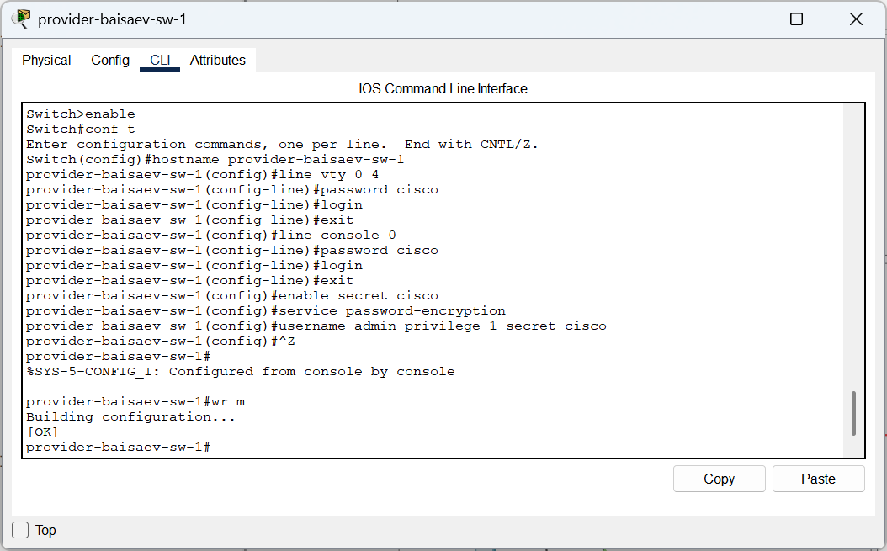
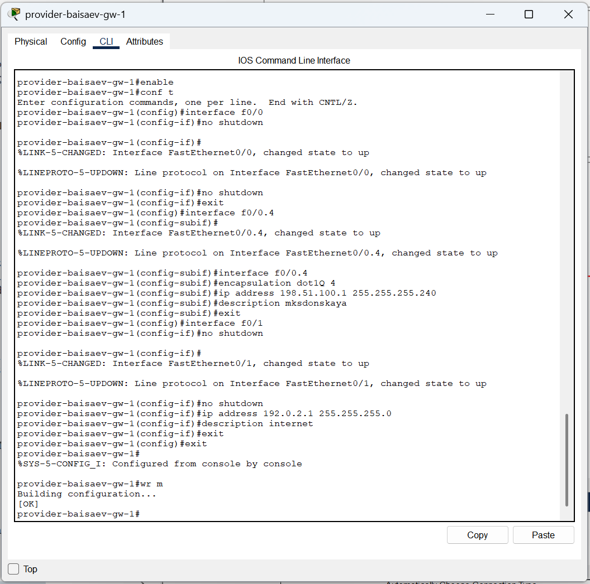
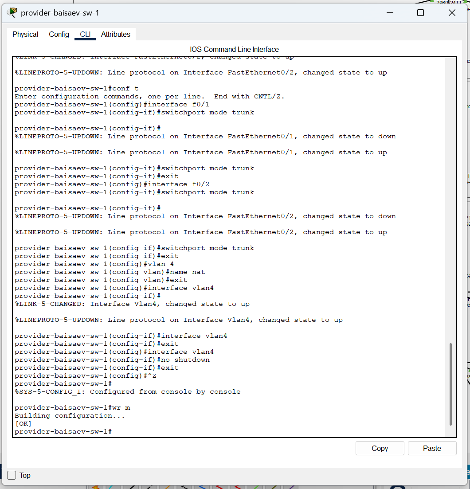
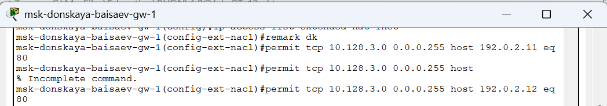
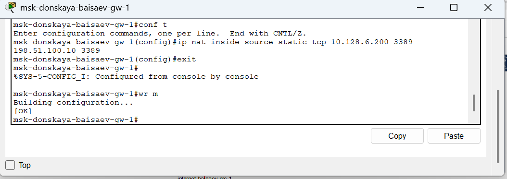

---
## Front matter
title: "Отчёт по лабораторной работе №12"
subtitle: "Дисциплина: Администрирование локальных сетей"
author: "Исаев Булат Абубакарович НПИбд-01-22"

## Generic otions
lang: ru-RU
toc-title: "Содержание"

## Bibliography
bibliography: bib/cite.bib
csl: pandoc/csl/gost-r-7-0-5-2008-numeric.csl

## Pdf output format
toc: true # Table of contents
toc-depth: 2
lof: true # List of figures
lot: true # List of tables
fontsize: 12pt
linestretch: 1.5
papersize: a4
documentclass: scrreprt
## I18n polyglossia
polyglossia-lang:
  name: russian
polyglossia-otherlangs:
  name: english
## I18n babel
babel-lang: russian
babel-otherlangs: english
## Fonts
mainfont: Arial
romanfont: Arial
sansfont: Arial
monofont: Arial
mainfontoptions: Ligatures=TeX
romanfontoptions: Ligatures=TeX
sansfontoptions: Ligatures=TeX,Scale=MatchLowercase
monofontoptions: Scale=MatchLowercase,Scale=0.9
## Biblatex
biblatex: true
biblio-style: "gost-numeric"
biblatexoptions:
  - parentracker=true
  - backend=biber
  - hyperref=auto
  - language=auto
  - autolang=other*
  - citestyle=gost-numeric
## Pandoc-crossref LaTeX customization
figureTitle: "Рис."
tableTitle: "Таблица"
listingTitle: "Листинг"
lofTitle: "Список иллюстраций"
lotTitle: "Список таблиц"
lolTitle: "Листинги"
## Misc options
indent: true
header-includes:
  - \usepackage{indentfirst}
  - \usepackage{float} # keep figures where there are in the text
  - \floatplacement{figure}{H} # keep figures where there are in the text
---

# Цель работы
Приобретение практических навыков по настройке доступа локальной сети к внешней сети посредством NAT.

# Выполнение лабораторной работы
Откроем проект с названием lab_PT-11.pkt и сохраним под названием lab_PT-12.pkt. После чего откроем его для дальнейшего редактирования (рис. [-@fig:001]) 

{ #fig:001 width=70% }

Для начала сделаем первоначальную настройку маршрутизатора provider-baisaev-gw-1 и коммутатора provider-baisaev-sw-1 провайдера (зададим имя, настроим доступ по паролю и т.п.)  (рис. [-@fig:002]), (рис. [-@fig:003]) 

{ #fig:002 width=70% }

{ #fig:003 width=70% }

Теперь настроим интерфейсы маршрутизатора provider-baisaev-gw-1 и коммутатора provider-baisaev-sw-1 провайдера  (рис. [-@fig:004]), (рис. [-@fig:005]) 

{ #fig:004 width=70% }

{ #fig:005 width=70% }

Выполним проверку командой ping с сервера www.rudn.ru на роутер провайдера  (рис. [-@fig:006]) 

{ #fig:006 width=70% }

Следующим шагом настроим интерфейсы маршрутизатора сети «Донская» для доступа к сети провайдера  (рис. [-@fig:007]) 

{ #fig:007 width=70% }

Выполним проверку  (рис. [-@fig:008]) 

{ #fig:008 width=70% }

Настроим на маршрутизаторе сети «Донская» NAT с правилами, указанными в лабораторной работе  (рис. [-@fig:009]), (рис. [-@fig:010]), (рис. [-@fig:011]), (рис. [-@fig:012]), (рис. [-@fig:013]), (рис. [-@fig:014]), (рис. [-@fig:015]), (рис. [-@fig:016]), 

{ #fig:009 width=70% }

{ #fig:010 width=70% }

{ #fig:011 width=70% }

{ #fig:012 width=70% }

{ #fig:013 width=70% }

{ #fig:014 width=70% }

{ #fig:015 width=70% }

{ #fig:016 width=70% }

{ #fig:017 width=70% }

{ #fig:018 width=70% }

{ #fig:019 width=70% }

{ #fig:020 width=70% }

{ #fig:021 width=70% }

{ #fig:022 width=70% }

# Вывод

В ходе выполнения лабораторной работы мы приобрели практические навыки по настройке доступа локальной сети к внешней сети посредством NAT.

##  Контрольные вопросы

1. В чём состоит основной принцип работы NAT (что даёт наличие NAT в сети организации)? - 
  
   **NAT на устройстве позволяет ему соединять публичные и частные сети между собой с помощью только одного IP-адреса для группы.**

2. В чём состоит принцип настройки NAT (на каком оборудовании и что нужно настроить для из локальной сети во внешнюю сеть через NAT)? - 
  
   **Настроить интерфейсы на внутренних и внешних маршрутизаторах, наборы правил для преобразования IP.**

3. Можно ли применить Cisco IOS NAT к субинтерфейсам?  -
  
    **Да, поскольку они существуют в энергонезависимой памяти.**

4. Что такое пулы IP NAT?  - 
  
    **Выделяемые для трансляции NAT IP.**

5. Что такое статические преобразования NAT?  - 
  
    **Взаимно однозначное преобразование внутренних IP во внешние.**
