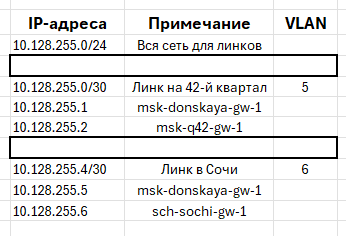
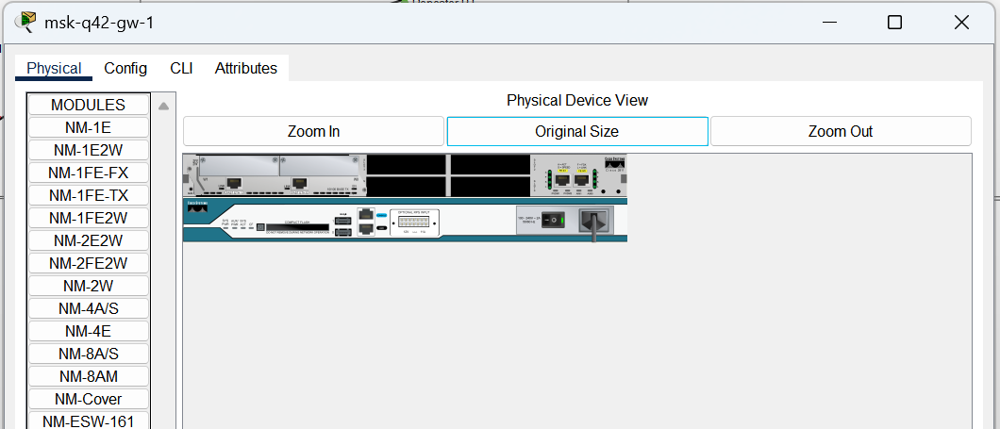
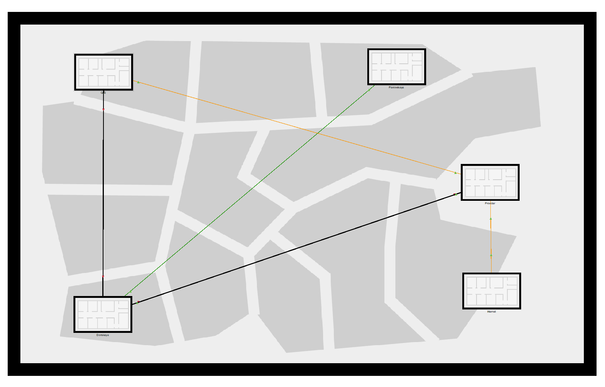
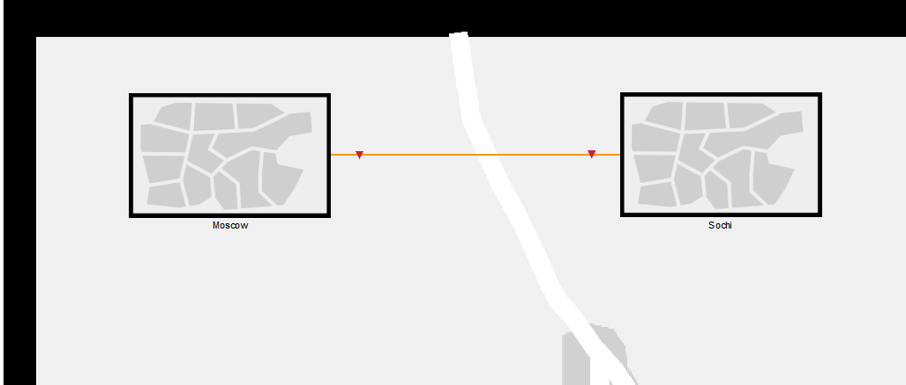
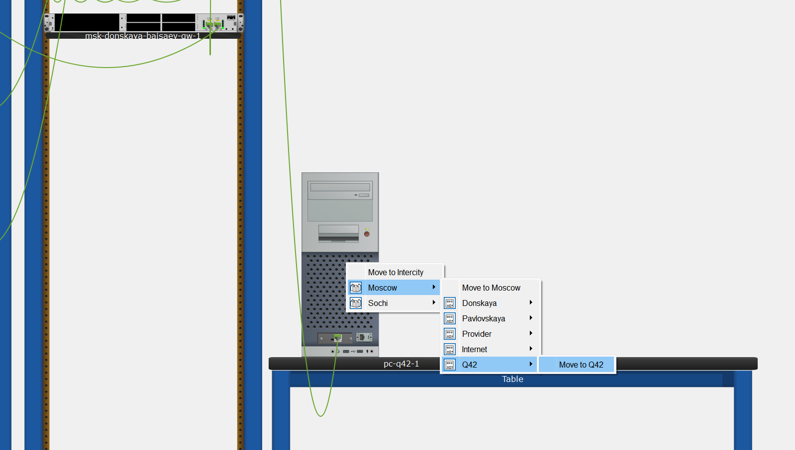

**РОССИЙСКИЙ УНИВЕРСИТЕТ ДРУЖБЫ НАРОДОВ** 

**Факультет физико-математических и естественных наук Кафедра теории вероятностей и кибербезопасности** 

**ОТЧЁТ** 

**ПО ЛАБОРАТОРНОЙ РАБОТЕ №13** 
*дисциплина: Администрирование локальных сетей* 

Студент: Исаев Булат Абубакарович Студ. билет № 1132227131 

Группа: НПИбд-01-22

**МОСКВА** 2025 г.

**Цель работы:** 
Провести подготовительные мероприятия по организации взаимодействия через сеть провайдера посредством статической маршрутизации локальной сети с сетью основного здания, расположенного в 42-м квартале в Москве, и сетью филиала, расположенного в г. Сочи.

**Выполнение работы:** 
Для начала внесём изменения в схему L1 сети, добавив информацию о сети основной территории (42-й квартал в Москве) и сети филиала в г. Сочи. (Рис. 1.1). После этого добавим информацию в таблицы (Рис. 1.2 – 1.5):

**Рис. 1.1.** Внесение изменений в схему L1 сети (добавление информации о сети основной территории (42-й квартал в Москве) и сети филиала в г. Сочи).

**Рис. 1.2.** . Таблица VLAN сети основной территории и сети филиала в г. Сочи.

**Рис. 1.3.** Таблица IP для связующих разные территории линков.

**Рис. 1.4.** Таблица IP для сети основной территории (42-й квартал г. Москва).

**Рис. 1.5.** Таблица IP для филиала в г. Сочи.

Теперь откроем проект с названием lab_PT-12.pkt и сохраним под названием lab_PT-13.pkt. После чего откроем его для дальнейшего редактирования (Рис. 1.1):

**Рис. 1.6.** Открытие проекта lab_PT-13.pkt. 

На схеме нашего проекта разместим необходимое оборудование: 4 медиаконвертера (Repeater-PT), 2 маршрутизатора типа Cisco 2811, 1 маршрутизирующий коммутатор типа Cisco 3560-24PS, 2 коммутатора типа Cisco 2950-24, коммутатор Cisco 2950-24T, 3 оконечных устройства типа PC-PT. А также присвоим им названия и проведём соединение объектов согласно скорректированной нами схеме (Рис. 1.7):

**Рис. 1.7.** Размещение необходимого оборудования (4 медиаконвертера (Repeater-PT), 2 маршрутизатора типа Cisco 2811, 1 маршрутизирующий коммутатор типа Cisco 3560-24PS, 2 коммутатора типа Cisco 2950-24, коммутатор Cisco 2950-24T, 3 оконечных устройства типа PC-PT). Присвоение названий и соединение объектов.

На медиаконвертерах заменим имеющиеся модули на PT-REPEATERNM-1FFE и PT-REPEATER-NM-1CFE для подключения витой пары по технологии Fast Ethernet и оптоволокна соответственно (Рис. 1.8):

**Рис. 1.8.** Замена на медиаконвертерах имеющихся модулей на PT-REPEATERNM-1FFE и PT-REPEATER-NM-1CFE (для подключения витой пары по технологии Fast Ethernet и оптоволокна соответственно).

Далее на маршрутизаторе msk-q42-gw-1 добавим дополнительный интерфейс NM-2FE2W (Рис. 1.9): 

**Рис. 1.9.** Добавление на маршрутизаторе msk-q42-gw-1 дополнительного интерфейса NM-2FE2W. 

В физической рабочей области Packet Tracer добавим в г.Москва здание 42-го квартала и присвоим ему название (Рис. 1.10): 

**Рис. 1.10.** Добавление в физической рабочей области Packet Tracer в г.Москва здания 42-го квартала, присвоение названия.

Затем в физической рабочей области добавим город Сочи и в нём здание филиала, присвоим ему соответствующее название (Рис. 1.11): 

**Рис. 1.11.** Добавление в физической рабочей области города Сочи и в нём здания филиала, присвоение названия.

После чего нужно перенести из сети «Донская» оборудование сети 42-го квартала и сети филиала в соответствующие здания и выполнить расстановку (Рис. 1.12 – 1.14): 

**Рис. 1.12.** Перенос из сети «Донская» оборудование сети 42-го квартала и сети филиала в соответствующие здания.

**Рис. 1.13.** Размещение объектов в основном здании 42-го квартала в Москве.

**Рис. 1.14.** Размещение объектов в здании филиала в г. Сочи.

На последнем шаге выполним первоначальную настройку оборудования (Рис. 1.15 – 1.21): 

**Рис. 1.15.** Первоначальная настройка маршрутизатора msk-q42-gw-1.

**Рис. 1.16.** Первоначальная настройка коммутатора msk-q42-sw-1.

**Рис. 1.17.** Первоначальная настройка маршрутизирующего коммутатора msk-hostel-gw-1.

**Рис. 1.18.** Первоначальная настройка коммутатора msk-hostel-sw-1.

**Рис. 1.19.** Первоначальная настройка коммутатора sch-sochi-sw-1.

**Рис. 1.20.** Первоначальная настройка маршрутизатора sch-sochi-gw-1.

**Вывод:** 
В ходе выполнения лабораторной работы мы провели подготовительные мероприятия по организации взаимодействия через сеть провайдера посредством статической маршрутизации локальной сети с сетью основного здания, расположенного в 42-м квартале в Москве, и сетью филиала, расположенного в г. Сочи.

**Ответы на контрольные вопросы:** 

1. В каких случаях следует использовать статическую маршрутизацию? Приведите примеры - **AAAAAВ реальных условиях статическая маршрутизация используется в условиях наличия шлюза по умолчанию (узла, обладающего связностью с остальными узлами) и 1-2 сетями. Помимо этого, статическая маршрутизация используется для «выравнивания» работы маршрутизирующих протоколов в условиях наличия туннеля (для того, чтобы маршрутизация трафика, создаваемого туннелем, не производилась через сам туннель).AAAAAAAAAAAAA**

2. Укажите основные принципы статической маршрутизации между VLANs. - **Процесс маршрутизации на 3-м уровне можно осуществлять с помощью маршрутизатора или коммутатора 3-го уровня. Использование устройства 3- го уровня обеспечивает возможность управления передачей трафика между сегментами сети, в том числе сегментами, которые были созданы с помощью VLAN.**
