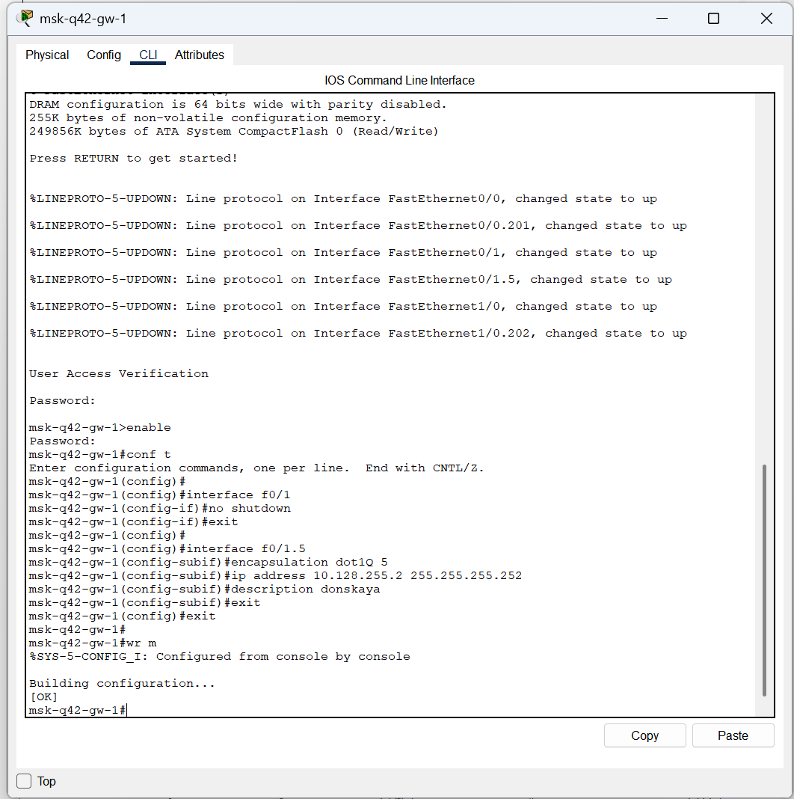
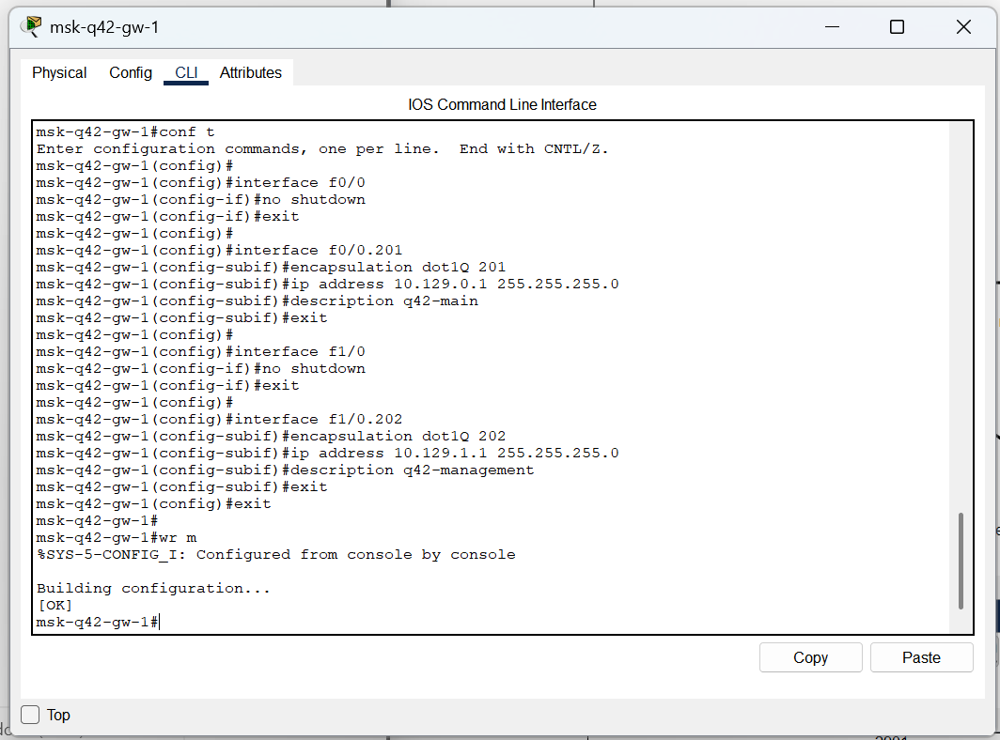
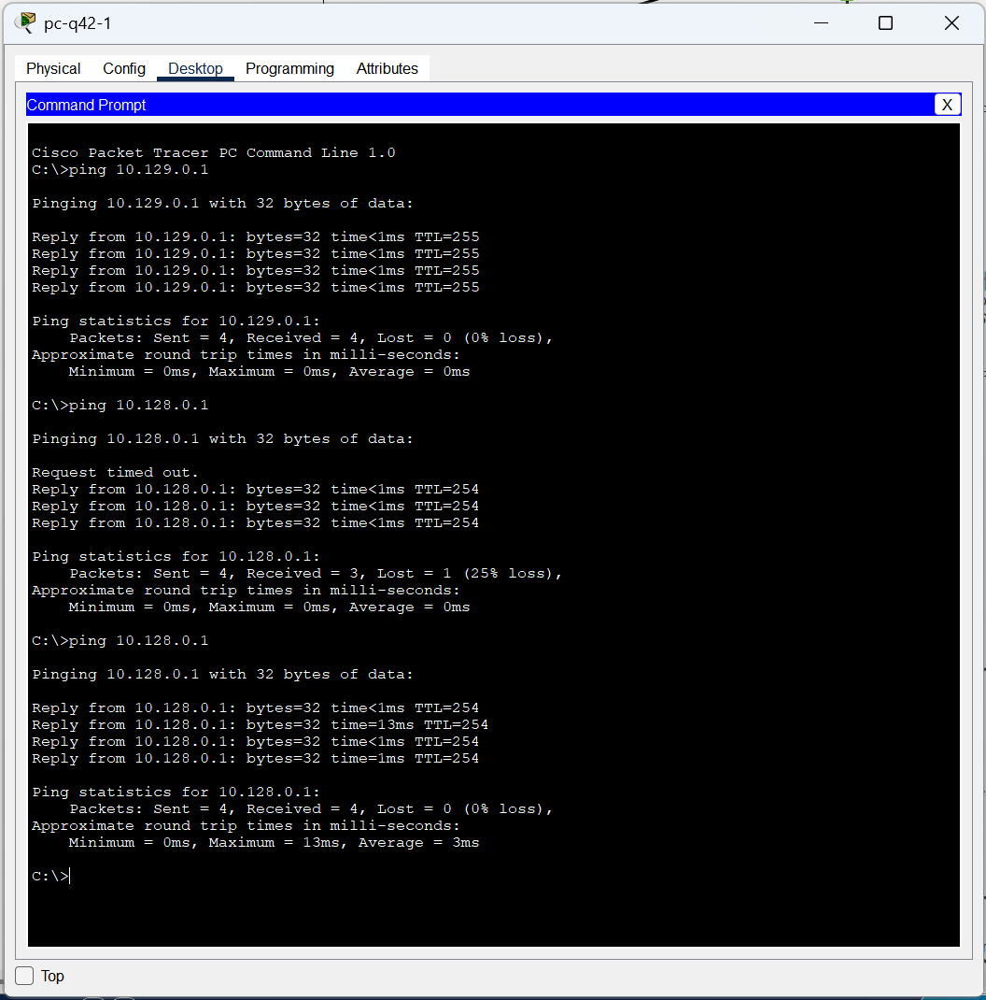
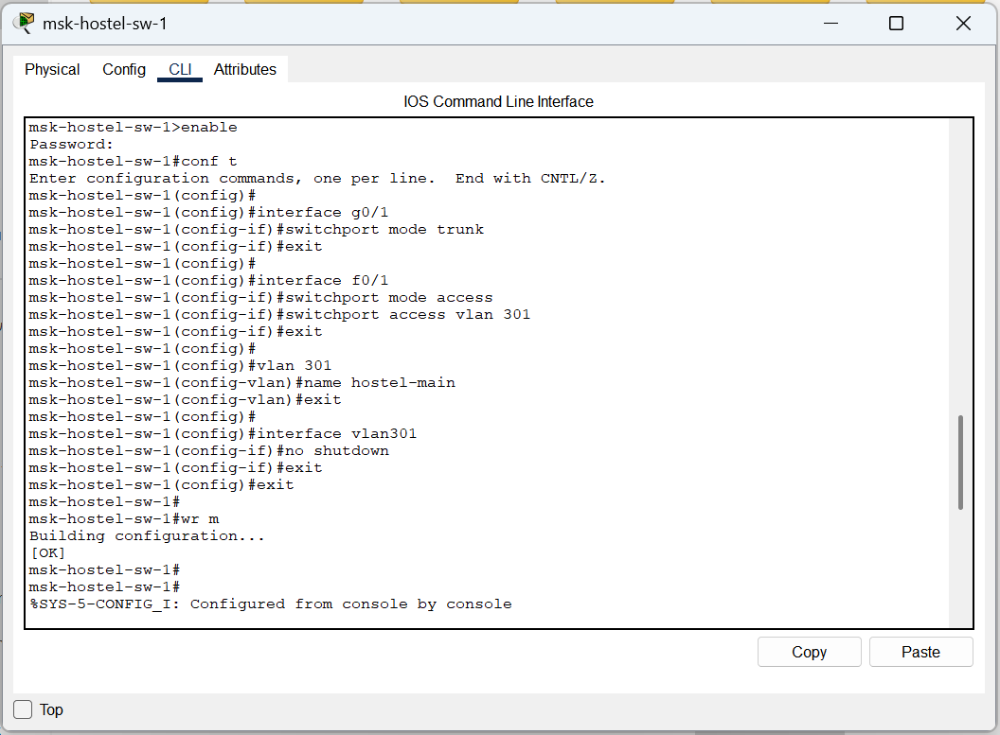
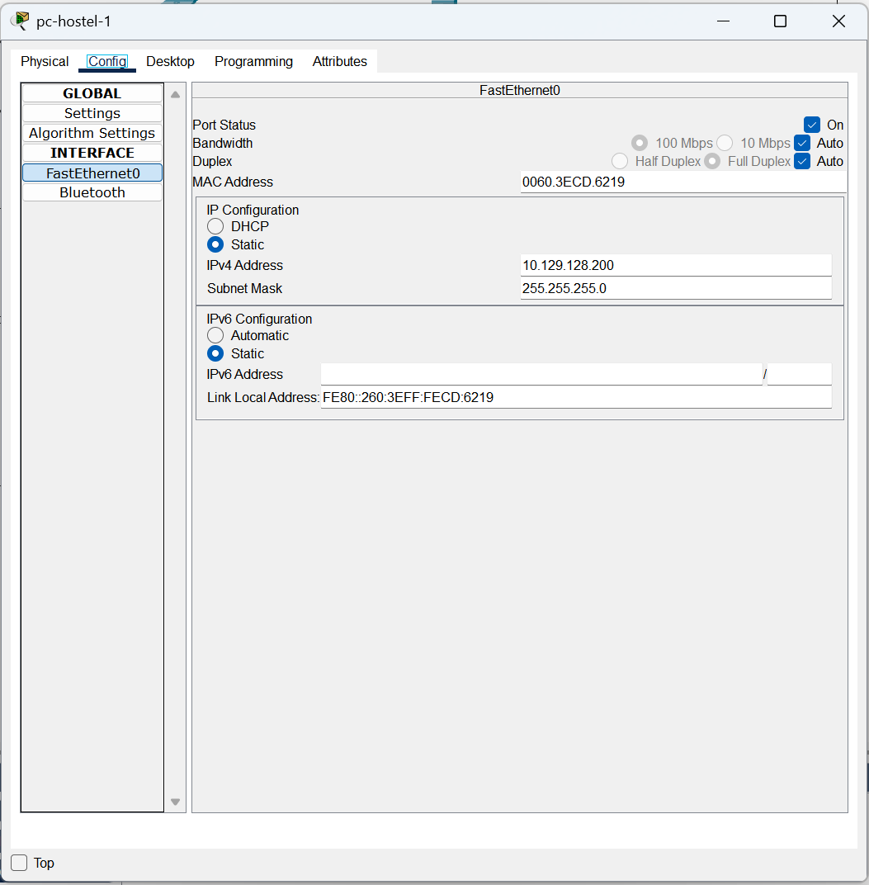
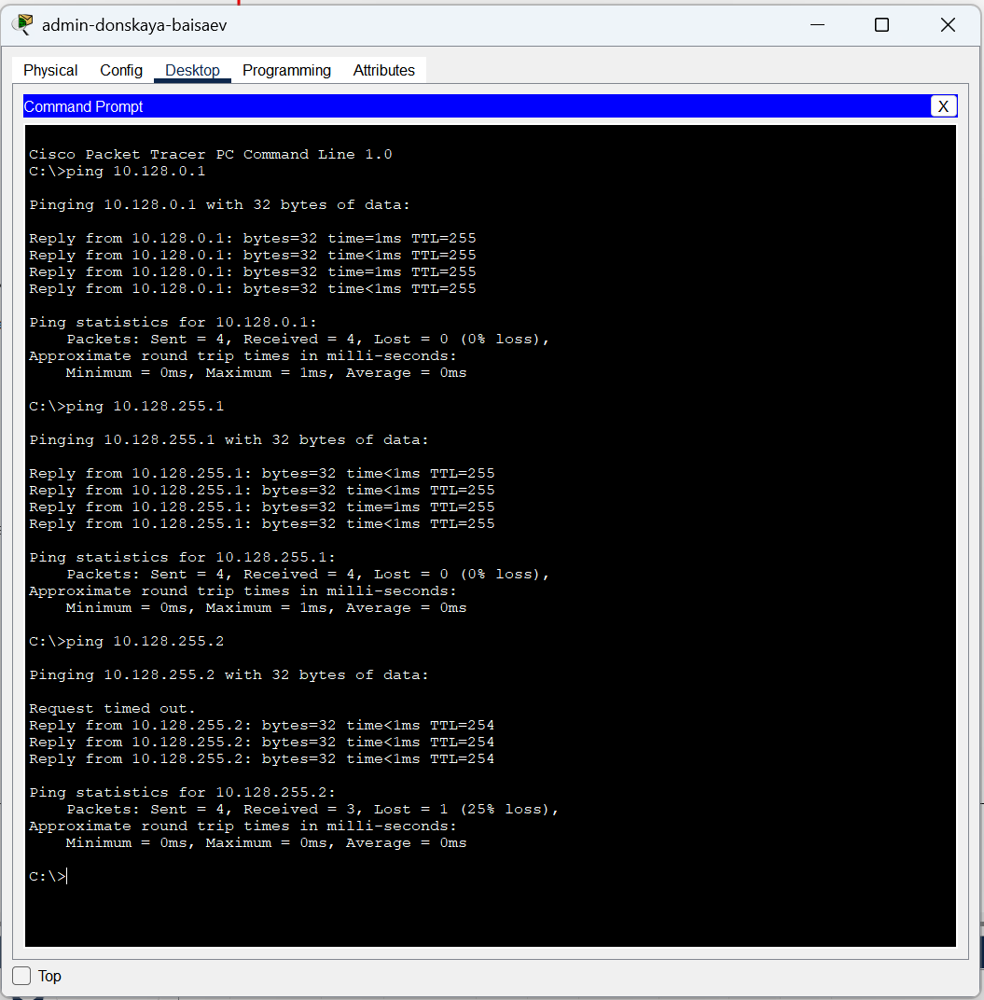
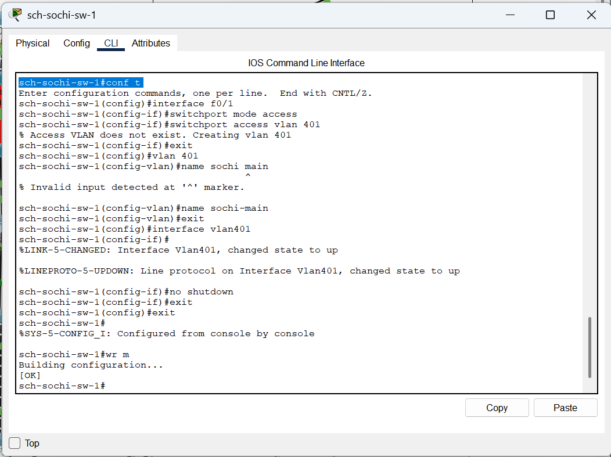
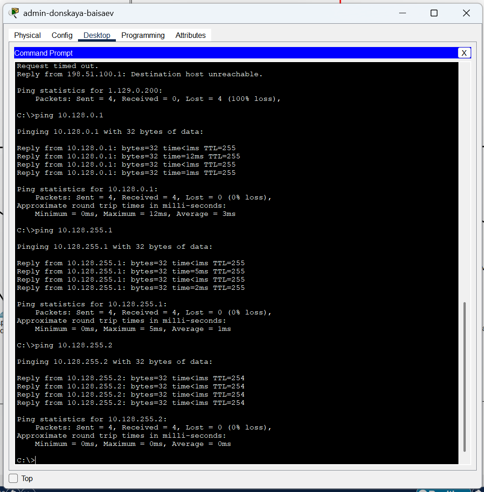
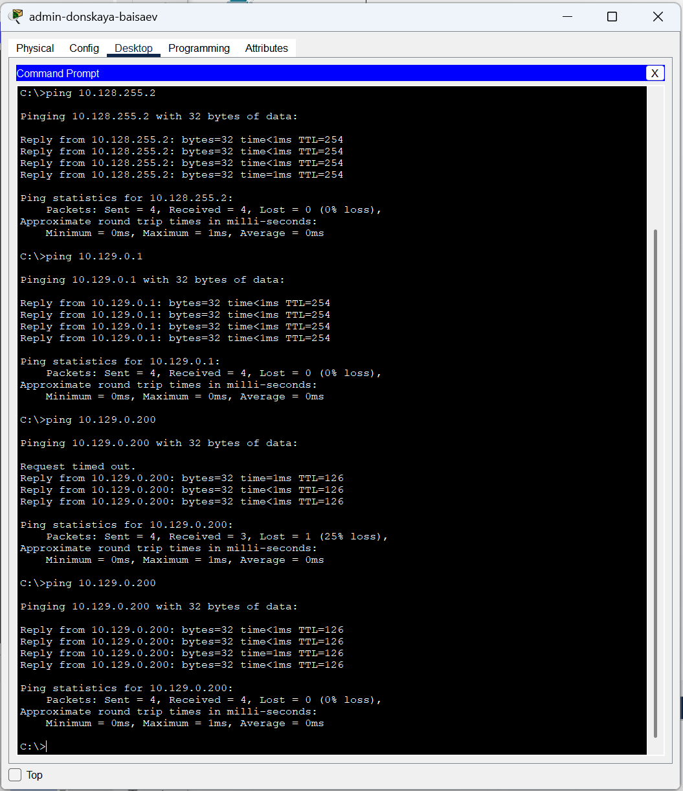

---
## Front matter
lang: ru-RU
title: Лабораторная Работа №14. Статическая маршрутизация в Интернете. Настройка.
subtitle: Администрирование локальных сетей
author:
  - Исаев Б.А.
institute:
  - Российский университет дружбы народов им. Патриса Лумумбы, Москва, Россия

## i18n babel
babel-lang: russian
babel-otherlangs: english

## Formatting pdf
toc: false
toc-title: Содержание
slide_level: 2
aspectratio: 169
section-titles: true
theme: metropolis
header-includes:
 - \metroset{progressbar=frametitle,sectionpage=progressbar,numbering=fraction}
 - '\makeatletter'
 - '\beamer@ignorenonframefalse'
 - '\makeatother'

## Fonts
mainfont: Arial
romanfont: Arial
sansfont: Arial
monofont: Arial
---

## Докладчик

  * Исаев Булат Абубакарович
  * НПИбд-01-22
  * Российский университет дружбы народов
  * [1132227131@pfur.ru]

## Открытие проекта
{#fig:001 width=70%}
**Рис. 1.1.** Открытие проекта lab_PT-14.pkt.

## Настройка линка между площадками
{#fig:001 width=70%}
**Рис. 1.2.**  Настройка интерфейсов коммутатора provider-baisaev-sw-1.

## Настройка линка между площадками
{#fig:001 width=70%}
**Рис. 1.3.** Настройка интерфейсов маршрутизатора msk-donskaya-baisaev-gw-1.

## Настройка линка между площадками
{#fig:001 width=70%}
**Рис. 1.4.** Настройка интерфейсов маршрутизатора msk-q42-gw-1.

## Настройка линка между площадками
{#fig:001 width=70%}
**Рис. 1.5.** Настройка интерфейсов коммутатора sch-sochi-sw-1.

## Настройка линка между площадками
{#fig:001 width=70%}
**Рис. 1.6.** Настройка интерфейсов маршрутизатора sch-sochi-gw-1.

## Настройка площадки 42-го квартала
{#fig:001 width=70%}
**Рис. 1.7.** Настройка интерфейсов маршрутизатора msk-q42-gw-1.

## Настройка площадки 42-го квартала
{#fig:001 width=70%}
**Рис. 1.8.** Настройка интерфейсов коммутатора msk-q42-sw-1.

## Настройка площадки 42-го квартала
{#fig:001 width=70%}
**Рис. 1.9.** Присвоение адресов оконечному устройству pc-q42-1. 

## Настройка площадки 42-го квартала
{#fig:001 width=70%}
**Рис. 1.10.** Выполнение проверки.

## Настройка площадки 42-го квартала
{#fig:001 width=70%}
**Рис. 1.11.** Настройка интерфейсов маршрутизирующего коммутатора msk-hostel-gw-1.

## Настройка площадки 42-го квартала
{#fig:001 width=70%}
**Рис. 1.12.** Выполнение проверки.

## Настройка площадки 42-го квартала
{#fig:001 width=70%}
**Рис. 1.13.** Настройка интерфейсов коммутатора msk-hostel-sw-1.

## Настройка площадки 42-го квартала
{#fig:001 width=70%}
**Рис. 1.14.** Присвоение адресов оконечному устройству pc-hostel-1.

## Настройка площадки 42-го квартала
{#fig:001 width=70%}
**Рис. 1.15.** Выполнение проверки.

## Настройка площадки в Сочи
{#fig:001 width=70%}
**Рис. 1.16.** Первоначальная настройка маршрутизатора sch-sochi-gw-1.

## Настройка площадки в Сочи
{#fig:001 width=70%}
**Рис. 1.17.** Первоначальная настройка коммутатора sch-sochi-sw-1.

## Настройка площадки в Сочи
{#fig:001 width=70%}
**Рис. 1.18.** Присвоение адресов оконечному устройству pc-sochi-1.

## Настройка маршрутизации между площадками
{#fig:001 width=70%}
**Рис. 1.19.** Настройка маршрутизатора msk-donskaya-baisaev-gw-1.

## Настройка маршрутизации между площадками
{#fig:001 width=70%}
**Рис. 1.20.** Выполнение проверки.

## Настройка маршрутизации между площадками
{#fig:001 width=70%}
**Рис. 1.21.** Настройка маршрутизатора msk-q42-gw-1.

## Настройка маршрутизации между площадками
{#fig:001 width=70%}
**Рис. 1.22.** Выполнение проверки.

## Настройка маршрутизации между площадками
{#fig:001 width=70%}
**Рис. 1.23.** Настройка маршрутизатора sch-sochi-gw-1.

## Настройка маршрутизации на 42 квартале 
{#fig:001 width=70%}
**Рис. 1.24.** Настройка маршрутизатора msk-q42-gw-1.

## Настройка маршрутизации на 42 квартале 
{#fig:001 width=70%}
**Рис. 1.25.** Настройка интерфейсов маршрутизирующего коммутатора msk-hostel-gw-1.

## Настройка NAT
{#fig:001 width=70%}
**Рис. 1.26.** Настройка NAT на маршрутизаторе msk-donskaya-baisaev-gw-1.

## Настройка NAT
{#fig:001 width=70%}
**Рис. 1.27.** Контрольная проверка.

## Вывод
В ходе выполнения лабораторной работы мы настроили взаимодействие через сеть провайдера посредством статической маршрутизации локальной сети организации с сетью основного здания, расположенного в 42-м квартале в Москве, и сетью филиала, расположенного в г. Сочи.

## Спасибо за внимание!