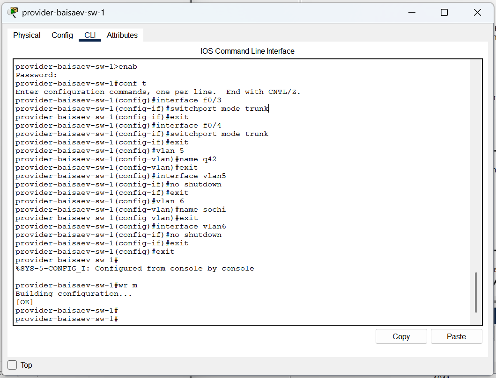
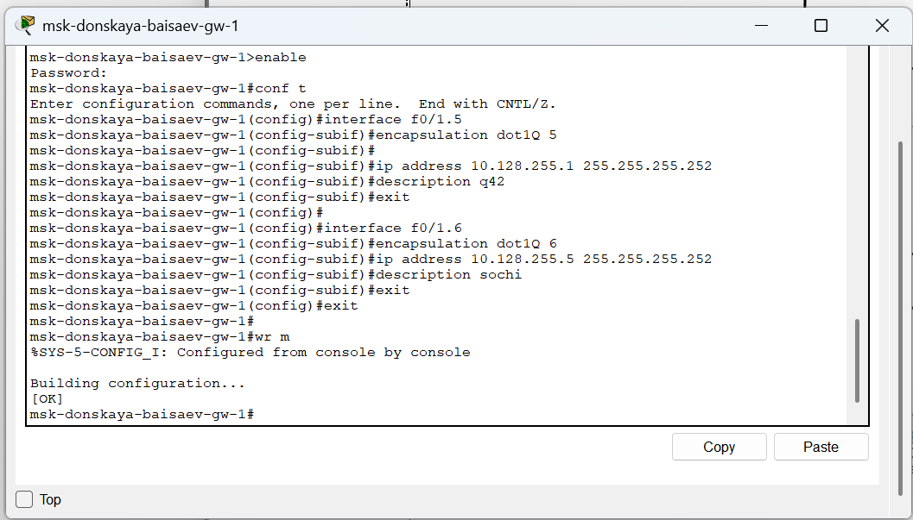
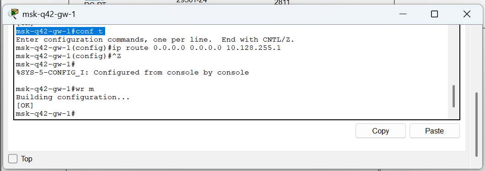
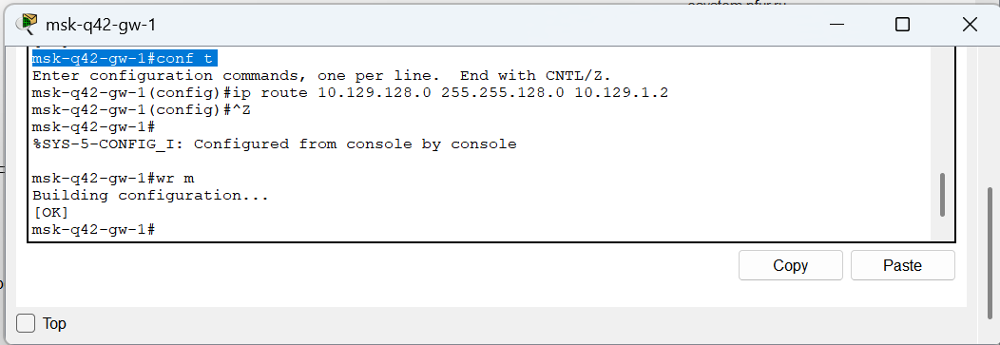
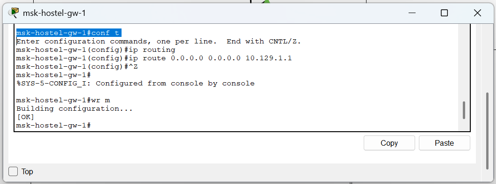

**РОССИЙСКИЙ УНИВЕРСИТЕТ ДРУЖБЫ НАРОДОВ** 

**Факультет физико-математических и естественных наук Кафедра теории вероятностей и кибербезопасности** 

**ОТЧЁТ** 

**ПО ЛАБОРАТОРНОЙ РАБОТЕ №14** 
*дисциплина: Администрирование локальных сетей* 

Студент: Исаев Булат Абубакарович Студ. билет № 1132227131 

Группа: НПИбд-01-22

**МОСКВА** 2025 г.

**Цель работы:** 
Настроить взаимодействие через сеть провайдера посредством статической маршрутизации локальной сети организации с сетью основного здания, расположенного в 42-м квартале в Москве, и сетью филиала, расположенного в г. Сочи.

**Выполнение работы:** 
Теперь откроем проект с названием lab_PT-13.pkt и сохраним под названием lab_PT-14.pkt. После чего откроем его для дальнейшего редактирования (Рис. 1.1):

**Рис. 1.1.** Открытие проекта lab_PT-14.pkt.

Первым делом нам нужно настроить линку между площадками. Для этого настроим интерфейсы у коммутатора provider-baisaev-sw-1, маршрутизатора msk-donskaya-baisaev-gw-1, маршрутизатора msk-q42-gw-1, коммутатора sch-sochi-sw-1 и маршрутизатора sch-sochi -gw-1 (Рис. 1.2 – 1.8):

**Рис. 1.2.**  Настройка интерфейсов коммутатора provider-baisaev-sw-1.

**Рис. 1.3.** Настройка интерфейсов маршрутизатора msk-donskaya-baisaev-gw-1.

**Рис. 1.4.** Настройка интерфейсов маршрутизатора msk-q42-gw-1.

**Рис. 1.5.** Настройка интерфейсов коммутатора sch-sochi-sw-1.

**Рис. 1.6.** Настройка интерфейсов маршрутизатора sch-sochi-gw-1.

Следующим шагом настроим площадку 42-го квартала. Для этого настроим интерфейсы у маршрутизатора msk-q42-gw-1, коммутатора msk-q42-sw-1, маршрутизирующего коммутатора msk-hostel-gw-1 и коммутатора msk-hostel-sw-1 (Рис. 1.9 – 1.17):  

**Рис. 1.7.** Настройка интерфейсов маршрутизатора msk-q42-gw-1.

**Рис. 1.8.** Настройка интерфейсов коммутатора msk-q42-sw-1.

**Рис. 1.9.** Присвоение адресов оконечному устройству pc-q42-1. 

**Рис. 1.10.** Выполнение проверки.

**Рис. 1.11.** Настройка интерфейсов маршрутизирующего коммутатора msk-hostel-gw-1.

**Рис. 1.12.** Выполнение проверки.

**Рис. 1.13.** Настройка интерфейсов коммутатора msk-hostel-sw-1.

**Рис. 1.14.** Присвоение адресов оконечному устройству pc-hostel-1.

**Рис. 1.15.** Выполнение проверки.

Далее настроим площадку в Сочи. Настроим интерфейсы у маршрутизатора sch-sochi-gw-1 и у коммутатора sch-sochi-sw-1 (Рис. 1.18 – 1.20): 

**Рис. 1.16.** Первоначальная настройка маршрутизатора sch-sochi-gw-1.

**Рис. 1.17.** Первоначальная настройка коммутатора sch-sochi-sw-1.

**Рис. 1.18.** Присвоение адресов оконечному устройству pc-sochi-1.

Затем настроим маршрутизацию между площадками. Настроим маршрутизатор msk-donskaya-baisaev-gw-1, маршрутизатор msk-q42-gw-1 и маршрутизатор sch-sochi-gw-1 (Рис. 1.21 – 1.25): 

**Рис. 1.19.** Настройка маршрутизатора msk-donskaya-baisaev-gw-1.

**Рис. 1.20.** Выполнение проверки.

**Рис. 1.21.** Настройка маршрутизатора msk-q42-gw-1.

**Рис. 1.22.** Выполнение проверки.

**Рис. 1.23.** Настройка маршрутизатора sch-sochi-gw-1.

Предпоследним шагом настроим маршрутизацию на 42 квартале. Для этого настроим маршрутизатор msk-q42-gw-1 (Рис. 1.26) и маршрутизирующий коммутатор msk-hostel-gw-1 (Рис. 1.27): 

**Рис. 1.24.** Настройка маршрутизатора msk-q42-gw-1.

**Рис. 1.25.** Настройка интерфейсов маршрутизирующего коммутатора msk-hostel-gw-1.

И наконец последним шагом настроим NAT на маршрутизаторе msk-donskaya-baisaev-gw-1 (Рис. 1.28) и выполним контрольную проверку (Рис. 1.28): 

**Рис. 1.26.** Настройка NAT на маршрутизаторе msk-donskaya-baisaev-gw-1.

**Рис. 1.27.** Контрольная проверка.

**Вывод:** 
В ходе выполнения лабораторной работы мы настроили взаимодействие через сеть провайдера посредством статической маршрутизации локальной сети организации с сетью основного здания, расположенного в 42-м квартале в Москве, и сетью филиала, расположенного в г. Сочи.

**Ответы на контрольные вопросы:** 

1. Приведите пример настройки статической маршрутизации между двумя подсетями организации - **Необходимо задать IP шлюзов на интерфейсах, настроить sub-интерфейсы с тегированием кадром VLAN'ами и своими IP, затем настроить статические маршруты между сетями.**

2. Опишите процесс обращения устройства из одного VLAN к устройству из другого VLAN. - **1 устройство посылает фрейм на маршрутизатор, тот меняет MAC исходника на свой и перенаправляет фрейм 2 устройству.**

3. Как проверить работоспособность маршрута?  - **ping на диаметрально противоположных устройствах друг к другу.**

4. Как посмотреть таблицу маршрутизации?  - **show ip route**
