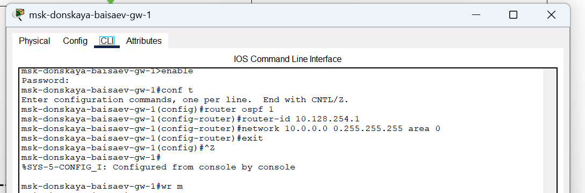
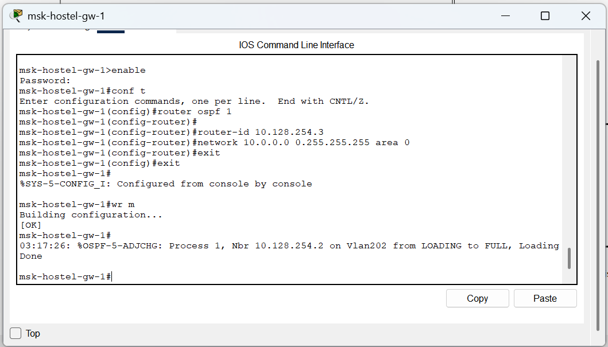
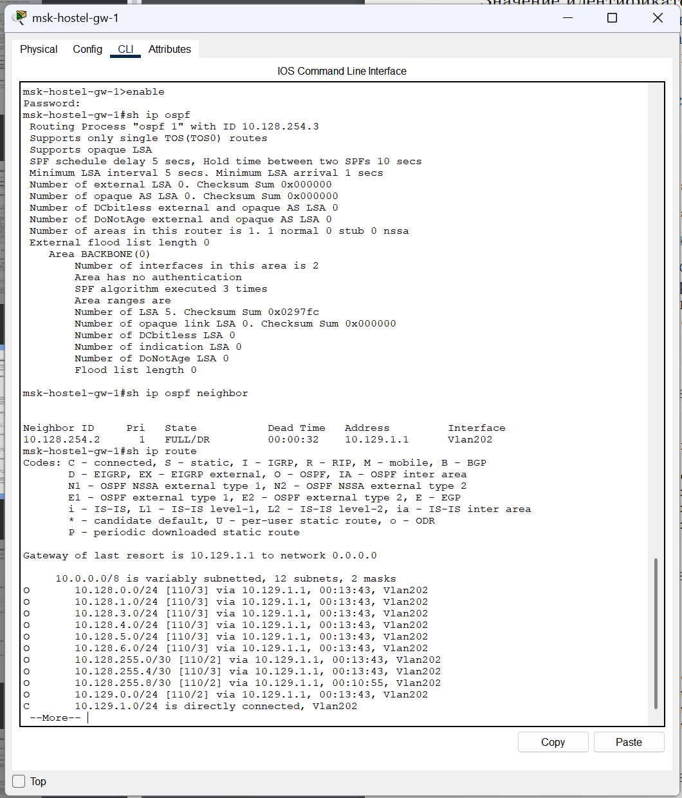

---
## Front matter
lang: ru-RU
title: Лабораторная Работа №15. Динамическая маршрутизация.
subtitle: Администрирование локальных сетей
author:
  - Исаев Б.А.
institute:
  - Российский университет дружбы народов им. Патриса Лумумбы, Москва, Россия

## i18n babel
babel-lang: russian
babel-otherlangs: english

## Formatting pdf
toc: false
toc-title: Содержание
slide_level: 2
aspectratio: 169
section-titles: true
theme: metropolis
header-includes:
 - \metroset{progressbar=frametitle,sectionpage=progressbar,numbering=fraction}
 - '\makeatletter'
 - '\beamer@ignorenonframefalse'
 - '\makeatother'

## Fonts
mainfont: Arial
romanfont: Arial
sansfont: Arial
monofont: Arial
---

## Докладчик

  * Исаев Булат Абубакарович
  * НПИбд-01-22
  * Российский университет дружбы народов
  * [1132227131@pfur.ru]

## Открытие проекта
{#fig:001 width=70%}
**Рис. 1.1.** Открытие проекта lab_PT-15.pkt.

## Настройка OSPF
{#fig:001 width=70%}
**Рис. 1.2.** Настройка OSPF на маршрутизаторе msk-donskaya-baisaev-gw-1 (включение процесса OSPF, назначение областей интерфейсам).

## Проверка OSPF
{#fig:001 width=70%}
**Рис. 1.3.** Проверка состояния протокола OSPF на маршрутизаторе msk-donskaya-baisaev-gw-1 (просмотр статуса всех соседей в заданном сегменте, вывод информации из таблицы маршрутизации).

## Настройка оборудования
{#fig:001 width=70%}
**Рис. 1.4.** Настройка маршрутизатора msk-q42-gw-1.

## Настройка оборудования
{#fig:001 width=70%}
**Рис. 1.5.** Настройка маршрутизирующего коммутатора msk-hostel-gw-1.

## Настройка оборудования
{#fig:001 width=70%}
**Рис. 1.6.** Настройка маршрутизатора sch-sochi-gw-1.

## Проверка OSPF
{#fig:001 width=70%}
**Рис. 1.7.** Проверка состояния протокола OSPF на маршрутизаторе msk-q42-gw-1.

## Проверка OSPF
{#fig:001 width=70%}
**Рис. 1.8.** Проверка состояния протокола OSPF на маршрутизирующем коммутаторе msk-hostel-gw-1.

## Проверка OSPF
{#fig:001 width=70%}
**Рис. 1.9.** Проверка состояния протокола OSPF на маршрутизаторе sch-sochi-gw-1.

## Настройка интерфейсов
{#fig:001 width=70%}
**Рис. 1.10.** Настройка интерфейсов коммутатора provider-baisaev-sw-1.

## Настройка оборудования
{#fig:001 width=70%}
**Рис. 1.11.** Настройка маршрутизатора msk-q42-gw-1.

## Настройка оборудования
{#fig:001 width=70%}
**Рис. 1.12.** Настройка коммутатора sch-sochi-sw-1.

## Настройка оборудования
{#fig:001 width=70%}
**Рис. 1.13.** Настройка маршрутизатора sch-sochi-gw-1.

## Ping
{#fig:001 width=70%}
**Рис. 1.14.** Ping по адресу 10.130.0.200.

## Отслеживание пакета
{#fig:001 width=70%}
**Рис. 1.15.** Отслеживание в режиме симуляции движения пакета ICMP (OSPF) с ноутбука администратора сети на Донской в Москве до компьютера пользователя в филиале в г. Сочи.

## Отключение vlan 6
{#fig:001 width=70%}
**Рис. 1.16.** Временное отключение на коммутаторе провайдера vlan 6.

## Отслеживание пакета
{#fig:001 width=70%}
**Рис. 1.17.** Проверка изменения маршрута прохождения пакета ICMP в режиме симуляции с ноутбука администратора сети на Донской в Москве до компьютера пользователя в филиале в г. Сочи.

## Ping
{#fig:001 width=70%}
**Рис. 1.18.** Потеря пакетов.

## Восстановление vlan 6
{#fig:001 width=70%}
**Рис. 1.19.** Восстановление на коммутаторе провайдера vlan 6.

## Отслеживание пакета
{#fig:001 width=70%}
**Рис. 1.20.** Проверка изменения маршрута прохождения пакета ICMP в режиме симуляции с ноутбука администратора сети на Донской в Москве до компьютера пользователя в филиале в г. Сочи.

## Вывод
В ходе выполнения лабораторной работы мы настроили динамическую маршрутизацию между территориями организации.

## Спасибо за внимание!