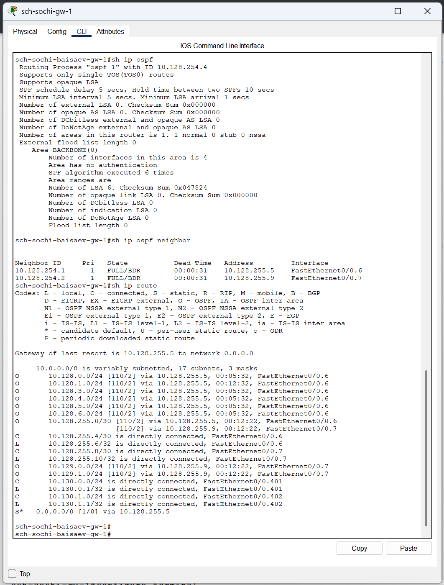
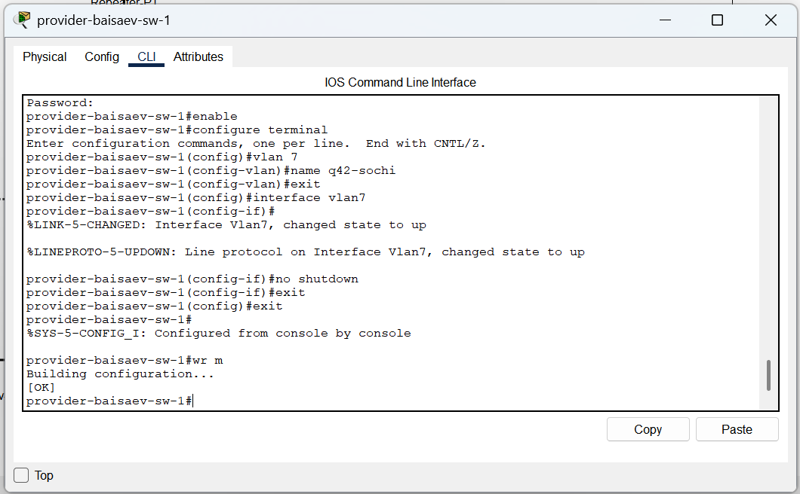
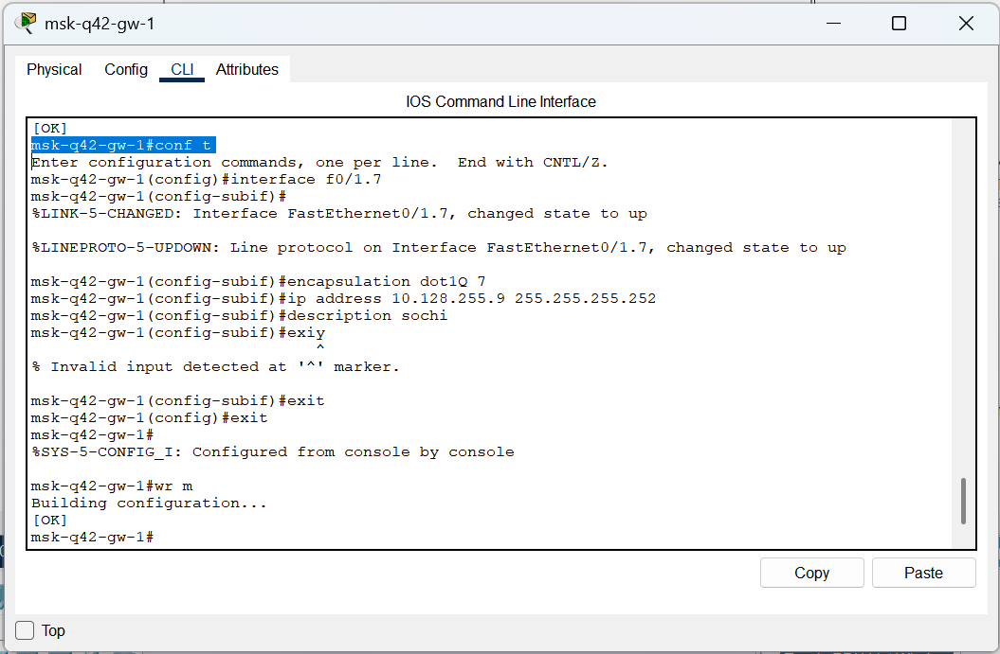
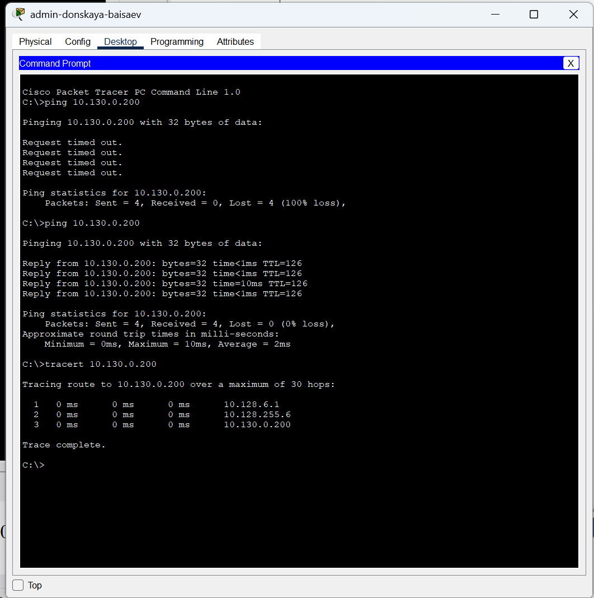
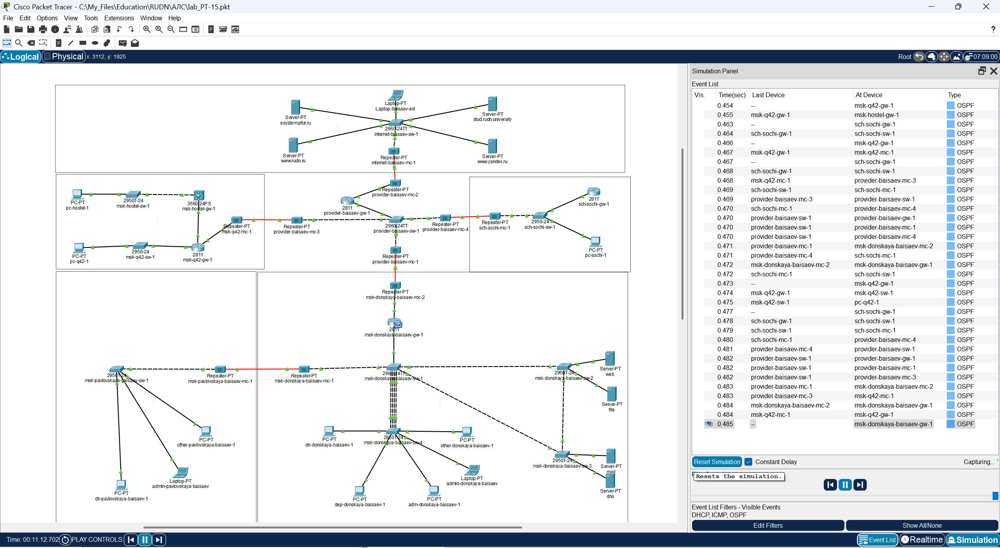
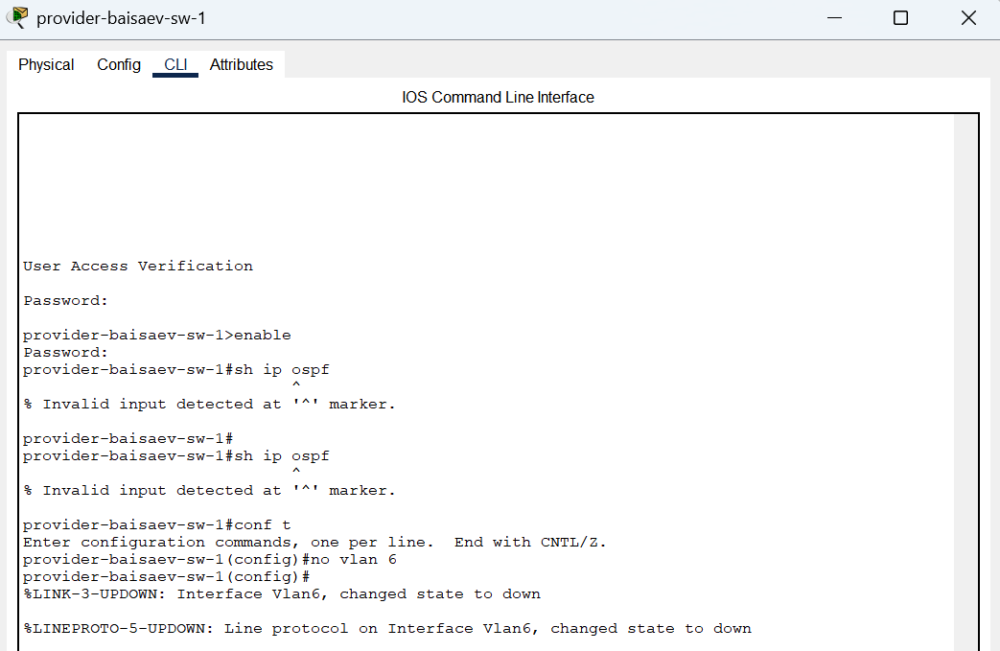
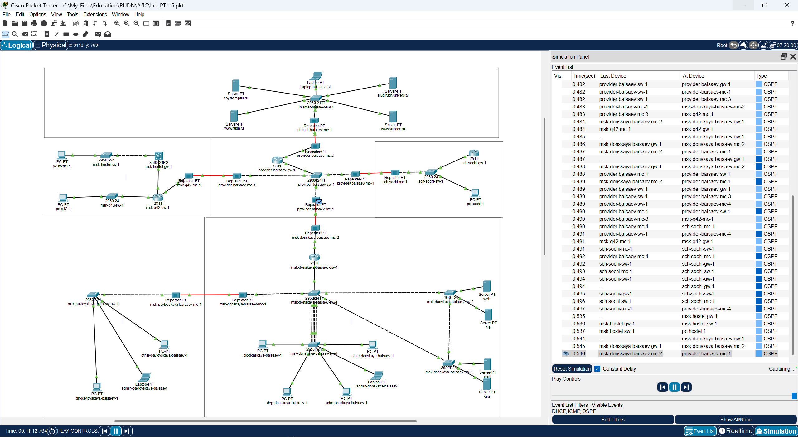

**РОССИЙСКИЙ УНИВЕРСИТЕТ ДРУЖБЫ НАРОДОВ** 

**Факультет физико-математических и естественных наук Кафедра теории вероятностей и кибербезопасности** 

**ОТЧЁТ** 

**ПО ЛАБОРАТОРНОЙ РАБОТЕ №15** 
*дисциплина: Администрирование локальных сетей* 

Студент: Исаев Булат Абубакарович Студ. билет № 1132227131 

Группа: НПИбд-01-22

**МОСКВА** 2025 г.

**Цель работы:** 
Настроить динамическую маршрутизацию между территориями организации.

**Выполнение работы:** 
Теперь откроем проект с названием lab_PT-14.pkt и сохраним под названием lab_PT-15.pkt. После чего откроем его для дальнейшего редактирования (Рис. 1.1):

**Рис. 1.1.** Открытие проекта lab_PT-15.pkt.

Для начала настроим OSPF на маршрутизаторе msk-donskaya-baisaev-gw-1. Включение OSPF на маршрутизаторе предполагает, во-первых, включение процесса OSPF командой router ospf, во-вторых — назначение областей (зон) интерфейсам с помощью команды network area (Рис. 1.2). 
Идентификатор процесса OSPF (process-id) по сути идентифицирует маршрутизатор в автономной системе, и, вообще говоря, он не должен совпадать с идентификаторами процессов на других маршрутизаторах. 
Значение идентификатора области (area-id) может быть целым числом от 0 до 4294967295 или может быть представлено в виде IP-адреса: A.B.C.D. Область 0 называется магистралью, области с другими идентификаторами должны подключаться к магистрали.

**Рис. 1.2.** Настройка OSPF на маршрутизаторе msk-donskaya-baisaev-gw-1 (включение процесса OSPF, назначение областей интерфейсам).

Проверим состояние протокола OSPF на маршрутизаторе msk-donskaya-baisaev-gw-1. Маршрутизаторы с общим сегментом являются соседями в этом сегменте. Соседи выбираются с помощью протокола Hello. Команда show ip ospf neighbor показывает статус всех соседей в заданном сегменте. Команда show ip ospf route (или show ip route) выводит информацию из таблицы маршрутизации (Рис. 1.3): 

**Рис. 1.3.** Проверка состояния протокола OSPF на маршрутизаторе msk-donskaya-baisaev-gw-1 (просмотр статуса всех соседей в заданном сегменте, вывод информации из таблицы маршрутизации).

Далее приступим к настройке: маршрутизатора msk-q42-gw-1, маршрутизирующего коммутатора msk-hostel-gw-1, маршрутизатора sch-sochi-gw-1 (Рис. 1.4 – 1.6): 

**Рис. 1.4.** Настройка маршрутизатора msk-q42-gw-1.

**Рис. 1.5.** Настройка маршрутизирующего коммутатора msk-hostel-gw-1.

**Рис. 1.6.** Настройка маршрутизатора sch-sochi-gw-1.

Теперь проверим состояние протокола OSPF на всех маршрутизаторах (Рис. 1.7 – 1.9): 

**Рис. 1.7.** Проверка состояния протокола OSPF на маршрутизаторе msk-q42-gw-1.

**Рис. 1.8.** Проверка состояния протокола OSPF на маршрутизирующем коммутаторе msk-hostel-gw-1.

**Рис. 1.9.** Проверка состояния протокола OSPF на маршрутизаторе sch-sochi-gw-1.

Следующим шагом настроим линк 42-й квартал–Сочи (Рис. 1.10 – 1.13): 

**Рис. 1.10.** Настройка интерфейсов коммутатора provider-baisaev-sw-1.

**Рис. 1.11.** Настройка маршрутизатора msk-q42-gw-1.

**Рис. 1.12.** Настройка коммутатора sch-sochi-sw-1.

**Рис. 1.13.** Настройка маршрутизатора sch-sochi-gw-1.

В режиме симуляции отследим движение пакета ICMP с ноутбука администратора сети на Донской в Москве (admin-donskaya-baisaev) до компьютера пользователя в филиале в г. Сочи pc-sochi-1 (Рис. 1.14 – 1.15): 

**Рис. 1.14.** Ping по адресу 10.130.0.200.

**Рис. 1.15.** Отслеживание в режиме симуляции движения пакета ICMP (OSPF) с ноутбука администратора сети на Донской в Москве до компьютера пользователя в филиале в г. Сочи.

Следующим шагом на коммутаторе провайдера отключим временно vlan 6 и в режиме симуляции убедимся в изменении маршрута прохождения пакета ICMP с ноутбука администратора сети на Донской в Москве до компьютера пользователя в филиале в г. Сочи (Рис. 1.16 – 1.17): 

**Рис. 1.16.** Временное отключение на коммутаторе провайдера vlan 6.

**Рис. 1.17.** Проверка изменения маршрута прохождения пакета ICMP в режиме симуляции с ноутбука администратора сети на Донской в Москве до компьютера пользователя в филиале в г. Сочи.

На коммутаторе провайдера восстановим vlan 6 и в режиме симуляции вновь убедимся в изменении маршрута прохождения пакета ICMP (Рис. 1.18 – 1.20): 

**Рис. 1.18.** Потеря пакетов.

**Рис. 1.19.** Восстановление на коммутаторе провайдера vlan 6.

**Рис. 1.20.** Проверка изменения маршрута прохождения пакета ICMP в режиме симуляции с ноутбука администратора сети на Донской в Москве до компьютера пользователя в филиале в г. Сочи.

**Вывод:** 
В ходе выполнения лабораторной работы мы настроили динамическую маршрутизацию между территориями организации.

**Ответы на контрольные вопросы:** 

1. Какие протоколы относятся к протоколам динамической маршрутизации?  - **OSPF, RIP, EIGRP.**

2. Охарактеризуйте принципы работы протоколов динамической маршрутизации.  - **Маршрутизаторы по протоколу делятся между собой информацией из своих таблиц маршрутизации и корректируют их в соответствии с остальными.**

3. Опишите процесс обращения устройства из одной подсети к устройству из другой подсети по протоколу динамической маршрутизации. - **Вектор-Расстояние — маршрутизатор рассылает список адресов со сборным параметром расстояния (кол-во маршрутизаторов, производительность и т. д.) из доступных сетей. Состояние канала — маршрутизаторы обмениваются топологической (связи маршрутизаторов) информацией.**

4. Опишите выводимую информацию при просмотре таблицы маршрутизации. - **Протокол Тип маршрута Адрес удаленной сети [Административная дистанция источника/Метрика маршрута] Следующий маршрутизатор Время последнего обновления маршрута Интерфейс.**
