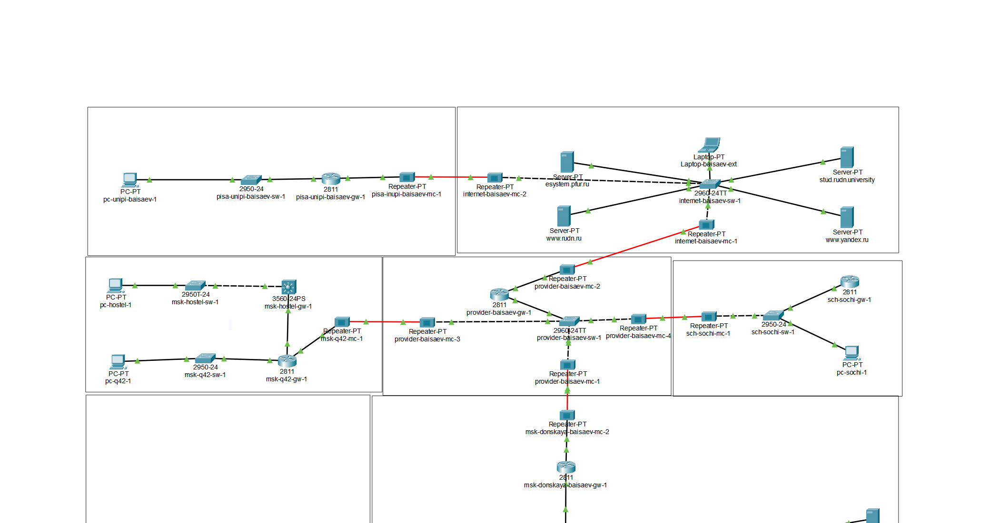
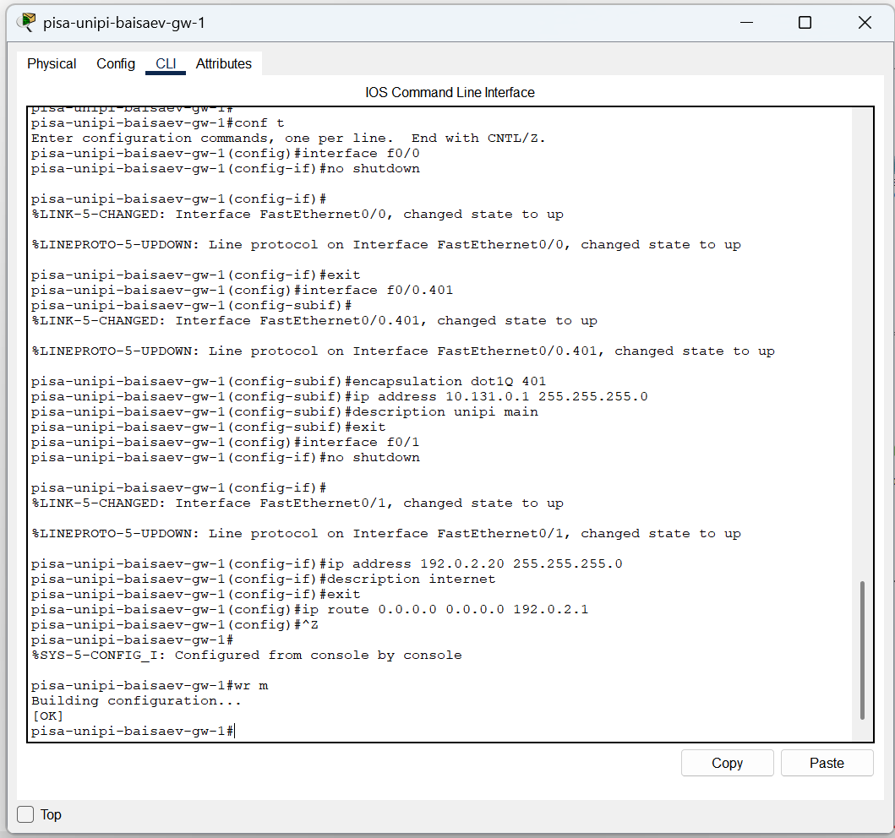
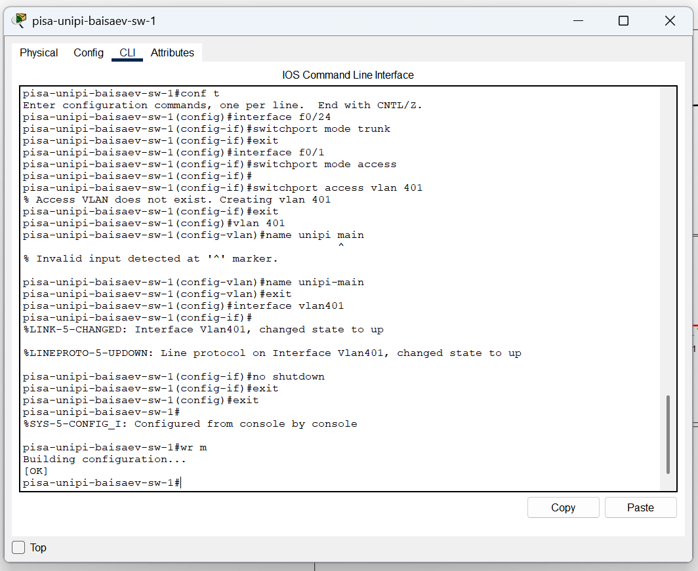

---
## Front matter
lang: ru-RU
title: Лабораторная Работа №16. Настройка VPN.
subtitle: Администрирование локальных сетей
author:
  - Исаев Б.А.
institute:
  - Российский университет дружбы народов им. Патриса Лумумбы, Москва, Россия

## i18n babel
babel-lang: russian
babel-otherlangs: english

## Formatting pdf
toc: false
toc-title: Содержание
slide_level: 2
aspectratio: 169
section-titles: true
theme: metropolis
header-includes:
 - \metroset{progressbar=frametitle,sectionpage=progressbar,numbering=fraction}
 - '\makeatletter'
 - '\beamer@ignorenonframefalse'
 - '\makeatother'

## Fonts
mainfont: Arial
romanfont: Arial
sansfont: Arial
monofont: Arial
---

## Докладчик

  * Исаев Булат Абубакарович
  * НПИбд-01-22
  * Российский университет дружбы народов
  * [1132227131@pfur.ru]

## Открытие проекта
{#fig:001 width=70%}
**Рис. 1.1.** Открытие проекта lab_PT-16.pkt.

## Размещение оборудования
{#fig:001 width=70%}
**Рис. 1.2.** Размещение оборудования в рабочей области проекта.

## Замена модулей
{#fig:001 width=70%}
**Рис. 1.3.** Замена модулей на Repeater-PT.

## Подключение
{#fig:001 width=70%}
**Рис. 1.4.** Подключение оборудования.

## Создание города
{#fig:001 width=70%}
**Рис. 1.5.** Создание города Пиза в физической рабочей области.

## Перемещение оборудования
{#fig:001 width=70%}
**Рис. 1.6.** Перемещение оборудования.

## Первоначальная настройка
{#fig:001 width=70%}
**Рис. 1.7.** Первоначальная настройка маршрутизатора pisa-unipi-baisaev-gw-1.

## Первоначальная настройка
{#fig:001 width=70%}
**Рис. 1.8.** Первоначальная настройка коммутатора pisa-unipi-baisaev-sw-1.

## Настройка интерфейсов
{#fig:001 width=70%}
**Рис. 1.9.** Настройка интерфейсов маршрутизатора pisa-unipi-baisaev-gw-1. 

## Настройка интерфейсов
{#fig:001 width=70%}
**Рис. 1.10.** Настройка интерфейсов коммутатора pisa-unipi-baisaev-sw-1.

## Присвоение адресов
{#fig:001 width=70%}
**Рис. 1.11.** Присвоение адресов оконечному устройству.

## Ping
{#fig:001 width=70%}
**Рис. 1.12.** Пинг адреса 10.131.0.1.

## Настройка VPN на основе GRE 
{#fig:001 width=70%}
**Рис. 1.13.** Настройка маршрутизатора msk-donskaya-baisaev-gw-1.

## Настройка VPN на основе GRE 
{#fig:001 width=70%}
**Рис. 1.14.** Настройка маршрутизатора pisa-unipi-baisaev-gw-1.

## Проверка
{#fig:001 width=70%}
**Рис. 1.15.** Проверка доступности узлов сети Университета г. Пиза с ноутбука администратора сети «Донская».

## Вывод
В ходе выполнения лабораторной работы мы получили навыки настройки VPN-туннеля через незащищённое Интернет-соединение.

## Спасибо за внимание!