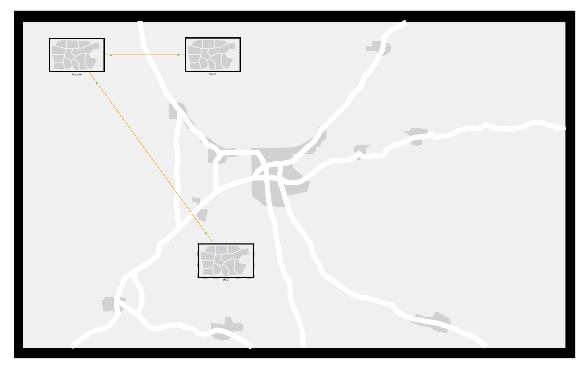
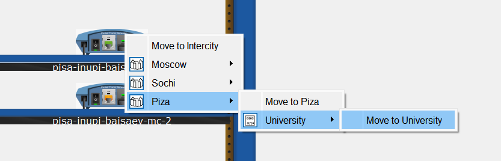
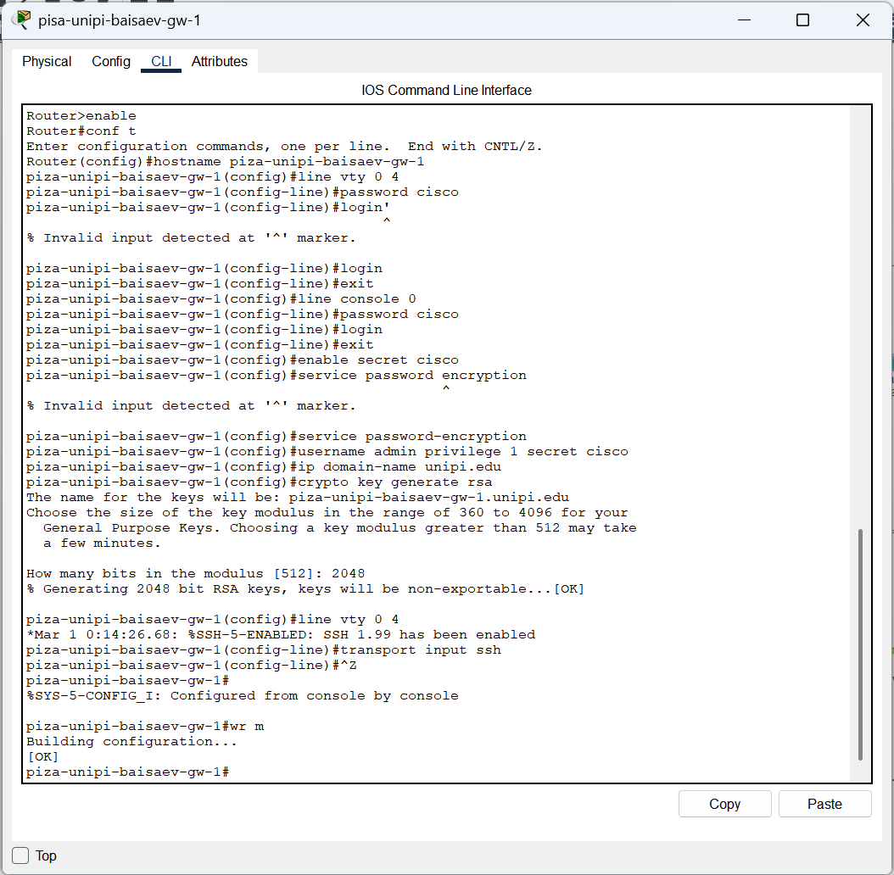
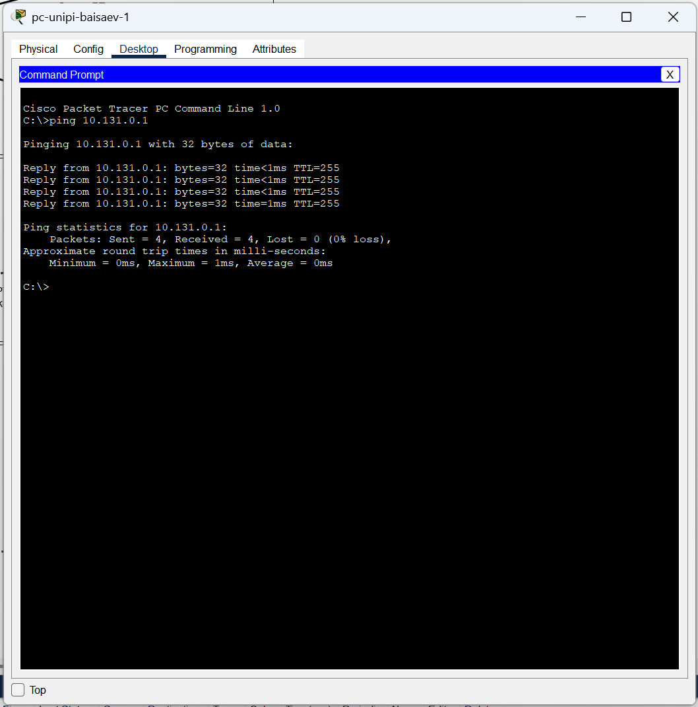
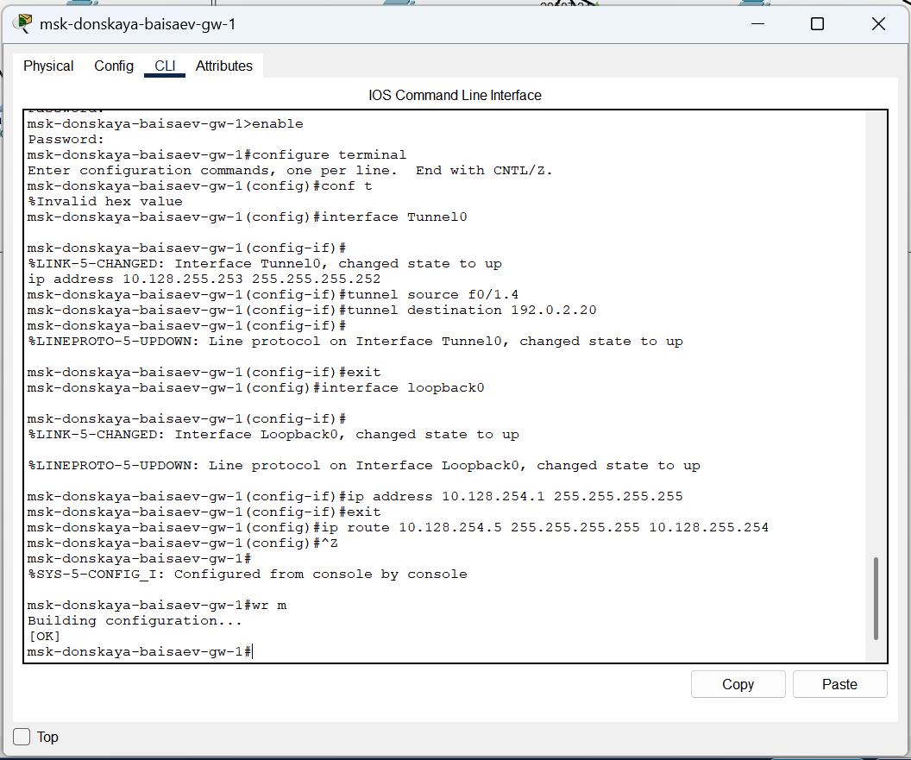

---
## Front matter
title: "Отчёт по лабораторной работе №16"
subtitle: "Дисциплина: Администрирование локальных сетей"
author: "Исаев Булат Абубакарович НПИбд-01-22"

## Generic otions
lang: ru-RU
toc-title: "Содержание"

## Bibliography
bibliography: bib/cite.bib
csl: pandoc/csl/gost-r-7-0-5-2008-numeric.csl

## Pdf output format
toc: true # Table of contents
toc-depth: 2
lof: true # List of figures
lot: true # List of tables
fontsize: 12pt
linestretch: 1.5
papersize: a4
documentclass: scrreprt
## I18n polyglossia
polyglossia-lang:
  name: russian
polyglossia-otherlangs:
  name: english
## I18n babel
babel-lang: russian
babel-otherlangs: english
## Fonts
mainfont: Arial
romanfont: Arial
sansfont: Arial
monofont: Arial
mainfontoptions: Ligatures=TeX
romanfontoptions: Ligatures=TeX
sansfontoptions: Ligatures=TeX,Scale=MatchLowercase
monofontoptions: Scale=MatchLowercase,Scale=0.9
## Biblatex
biblatex: true
biblio-style: "gost-numeric"
biblatexoptions:
  - parentracker=true
  - backend=biber
  - hyperref=auto
  - language=auto
  - autolang=other*
  - citestyle=gost-numeric
## Pandoc-crossref LaTeX customization
figureTitle: "Рис."
tableTitle: "Таблица"
listingTitle: "Листинг"
lofTitle: "Список иллюстраций"
lotTitle: "Список таблиц"
lolTitle: "Листинги"
## Misc options
indent: true
header-includes:
  - \usepackage{indentfirst}
  - \usepackage{float} # keep figures where there are in the text
  - \floatplacement{figure}{H} # keep figures where there are in the text
---

# Цель работы
Получить навыки настройки VPN-туннеля через незащищённое Интернет-соединение.

# Выполнение лабораторной работы
Откроем проект с названием lab_PT-15.pkt и сохраним под названием lab_PT-16.pkt. После чего откроем его для дальнейшего редактирования (рис. [-@fig:001]) 

{ #fig:001 width=70% }

Разместим в рабочей области проекта в соответствии с модельными предположениями оборудование для сети Университета г. Пиза  (рис. [-@fig:002]), (рис. [-@fig:003]), (рис. [-@fig:004])

{ #fig:002 width=70% }

{ #fig:003 width=70% }

{ #fig:004 width=70% }

В физической рабочей области проекта создадим город Пиза, здание Университета г. Пиза. Переместим туда соответствующее оборудование  (рис. [-@fig:005]), (рис. [-@fig:006]) 

{ #fig:005 width=70% }

{ #fig:006 width=70% }

Теперь сделаем первоначальную настройку и настройку интерфейсов оборудования сети Университета г. Пиза (рис. [-@fig:007]), (рис. [-@fig:008]), (рис. [-@fig:009]), (рис. [-@fig:010]) 

{ #fig:007 width=70% }

{ #fig:008 width=70% }

{ #fig:009 width=70% }

{ #fig:010 width=70% }

{ #fig:011 width=70% }

{ #fig:012 width=70% }

Далее настроим VPN на основе протокола GRE [25] (рис. [-@fig:013]), (рис. [-@fig:014]) 

{ #fig:013 width=70% }

{ #fig:014 width=70% }

Последним шагом проверим доступность узлов сети Университета г. Пиза с ноутбука администратора сети «Донская»  (рис. [-@fig:015]) 

{ #fig:015 width=70% }

# Вывод

В ходе выполнения лабораторной работы мы получили навыки настройки VPN-туннеля через незащищённое Интернет-соединение.

##  Контрольные вопросы

1. Что такое VPN? -
  
   **Зашифрованное соединение, устанавливаемое через Интернет между устройством и сетью.**

2. В каких случаях следует использовать VPN?  - 
  
   **Для дополнительного шифрования в сетях, безопасному подключению к локальным сетям извне.**

3. Как с помощью VPN обойти NAT? - 
  
    **Поднять VPN-туннель/подключить OpenVPN.**
