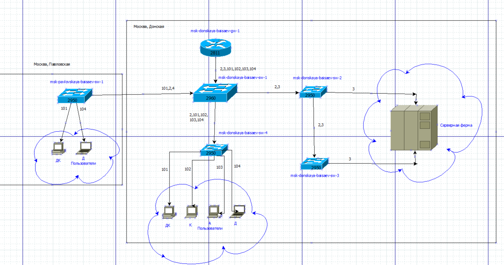
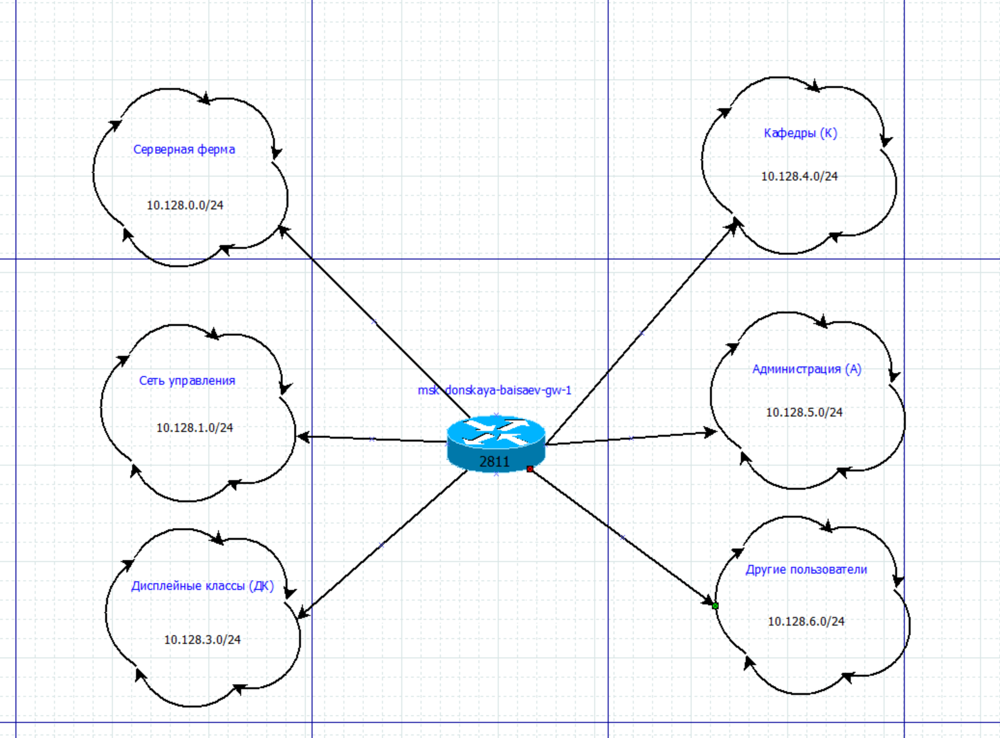
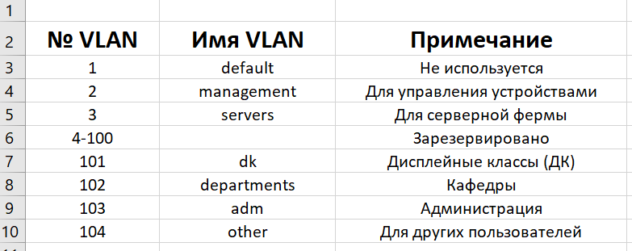
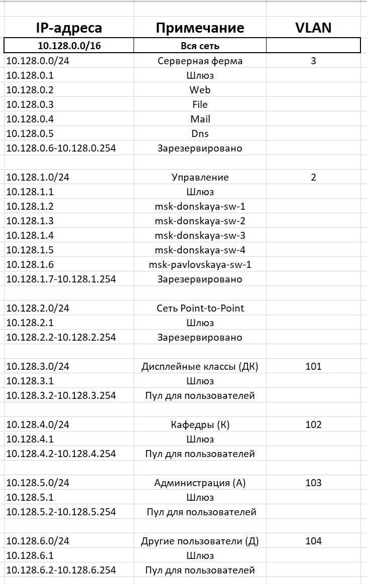
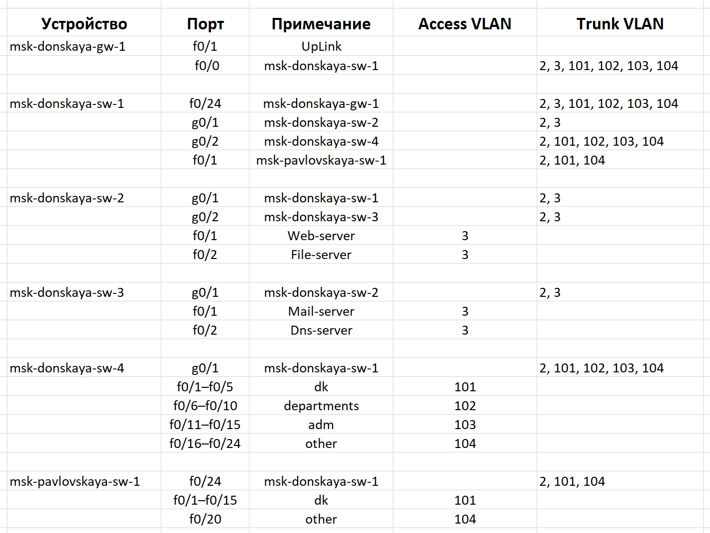
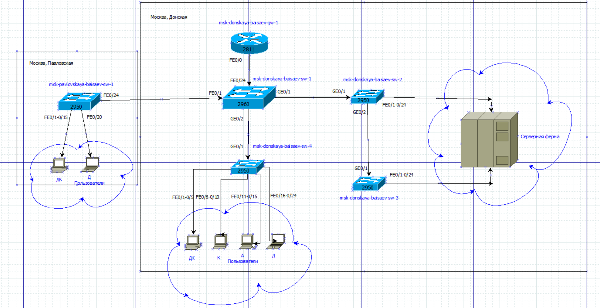
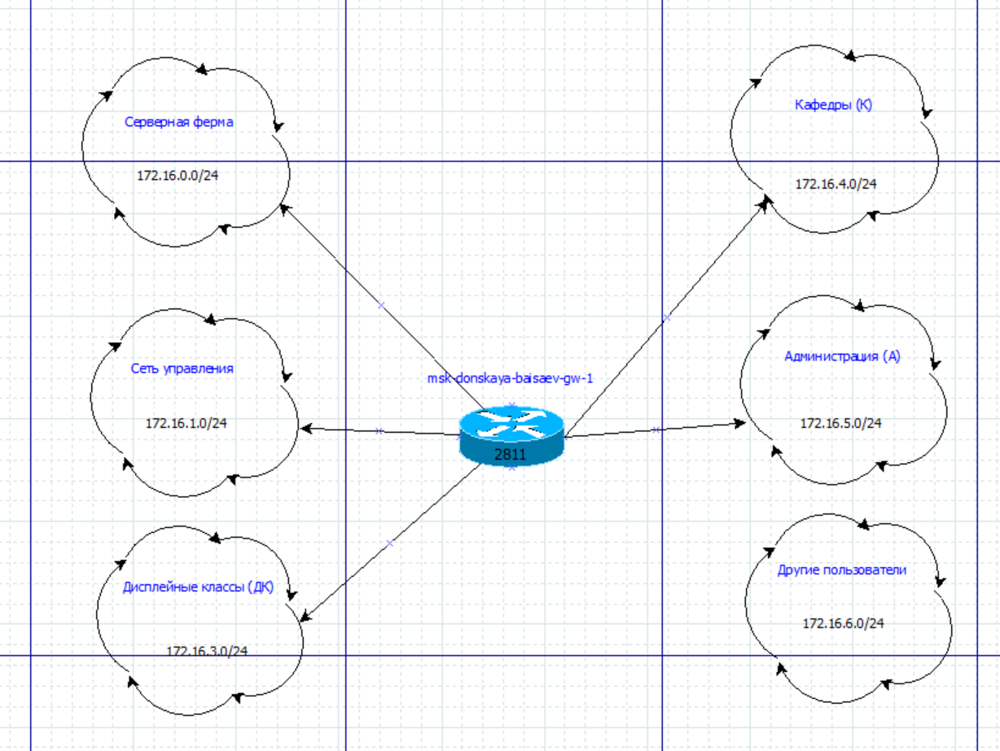
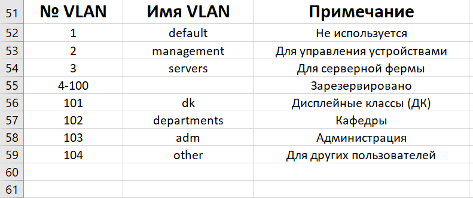
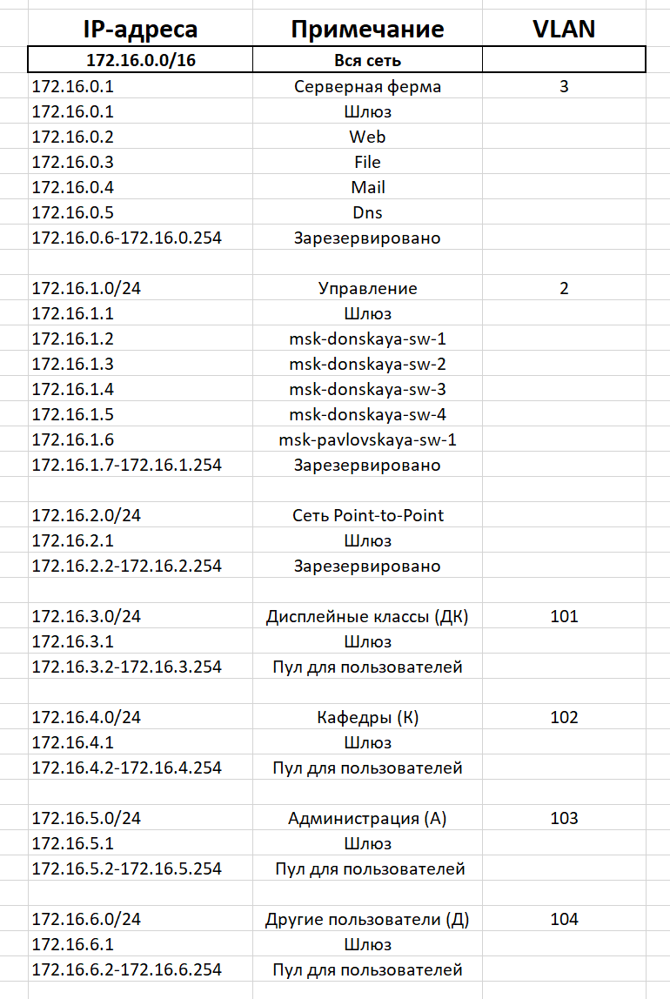
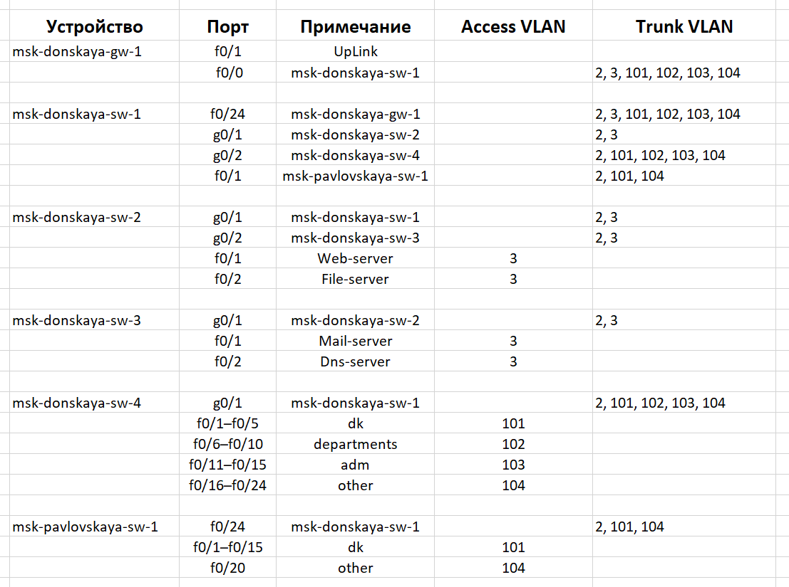

---
## Front matter
lang: ru-RU
title: Лабораторная Работа №3. Планирование локальной сети организации 
subtitle: Администрирование локальных сетей
author:
  - Исаев Б.А.
institute:
  - Российский университет дружбы народов им. Патриса Лумумбы, Москва, Россия

## i18n babel
babel-lang: russian
babel-otherlangs: english

## Formatting pdf
toc: false
toc-title: Содержание
slide_level: 2
aspectratio: 169
section-titles: true
theme: metropolis
header-includes:
 - \metroset{progressbar=frametitle,sectionpage=progressbar,numbering=fraction}
 - '\makeatletter'
 - '\beamer@ignorenonframefalse'
 - '\makeatother'

## Fonts
mainfont: Arial
romanfont: Arial
sansfont: Arial
monofont: Arial
---

## Докладчик

  * Исаев Булат Абубакарович
  * НПИбд-01-22
  * Российский университет дружбы народов
  * [1132227131@pfur.ru]

## Цели и задачи

Провести  подготовительную  работу  по  первоначальной  настройке коммутаторов сети.

## Схема L1 (сеть 10.128.0.0/16)
{#fig:001 width=70%}
**Рис. 1.1.** Повтор схемы L1 (физический уровень) в графическом редакторе Dia.

## Схема L2 (сеть 10.128.0.0/16)
{#fig:001 width=70%}
**Рис. 1.2.** Повтор схемы L1 (физический уровень) в графическом редакторе Dia.

## Схема L3 (сеть 10.128.0.0/16)
{#fig:001 width=70%}
**Рис. 1.3.** Повтор схемы L1 (физический уровень) в графическом редакторе Dia.

## Таблица VLAN (сеть 10.128.0.0/16)
{#fig:001 width=70%}
**Рис. 1.4.** Повтор таблицы VLAN в Excel.

## Таблица IP (сеть 10.128.0.0/16)
{#fig:001 width=70%}
**Рис. 1.5.** Повтор таблицы IP в Excel.

## Таблица портов (сеть 10.128.0.0/16)
{#fig:001 width=70%}
**Рис. 1.6.** Повтор таблицы портов в Excel.

## Схема L1 (сеть 172.16.0.0/12)
{#fig:001 width=70%}
**Рис. 2.1.** Схема L1 (физический уровень) в графическом редакторе Dia для сети 172.16.0.0/12.

## Схема L2 (сеть 172.16.0.0/12)
{#fig:001 width=70%}
**Рис. 2.2.** Схема L2 (канальный уровень) в графическом редакторе Dia для сети 172.16.0.0/12.

## Схема L3 (сеть 172.16.0.0/12)
{#fig:001 width=70%}
**Рис. 2.3.** Схема L3 (сетевой уровень) в графическом редакторе Dia для сети 172.16.0.0/12.

## Таблица VLAN (сеть 172.16.0.0/12)
{#fig:001 width=70%}
**Рис. 2.4.** Таблица VLAN в Excel для сети 172.16.0.0/12.

## Таблица IP (сеть 172.16.0.0/12)
{#fig:001 width=70%}
**Рис. 2.5.** Таблица IP в Excel для сети 172.16.0.0/12.

## Таблица портов (сеть 172.16.0.0/12)
{#fig:001 width=70%}
**Рис. 2.6.** Таблица портов в Excel для сети 172.16.0.0/12.

## Схема L1 (сеть 192.168.0.0/16)
{#fig:001 width=70%}
**Рис. 2.1.** Схема L1 (физический уровень) в графическом редакторе Dia для сети 192.168.0.0/16.

## Схема L2 (сеть 192.168.0.0/16)
{#fig:001 width=70%}
**Рис. 2.2.** Схема L2 (канальный уровень) в графическом редакторе Dia для сети 192.168.0.0/16.

## Схема L3 (сеть 192.168.0.0/16)
{#fig:001 width=70%}
**Рис. 2.3.** Схема L3 (сетевой уровень) в графическом редакторе Dia для сети 192.168.0.0/16.

## Таблица VLAN (сеть 192.168.0.0/16)
{#fig:001 width=70%}
**Рис. 2.4.** Таблица VLAN в Excel для сети 192.168.0.0/16.

## Таблица IP (сеть 192.168.0.0/16)
{#fig:001 width=70%}
**Рис. 2.5.** Таблица IP в Excel для сети 192.168.0.0/16.

## Таблица портов (сеть 192.168.0.0/16)
{#fig:001 width=70%}
**Рис. 2.6.** Таблица портов в Excel для сети 192.168.0.0/16.

## Вывод
В ходе выполнения лабораторной работы мы познакомились с принципами планирования локальной сети организации.
