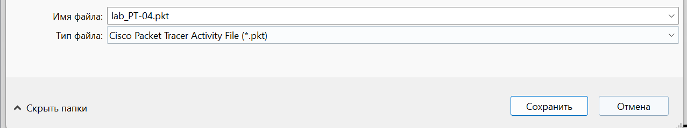
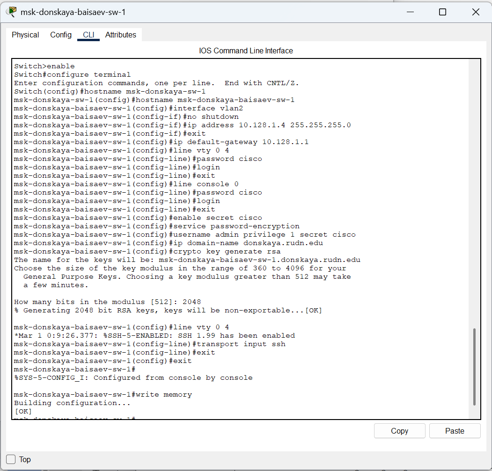
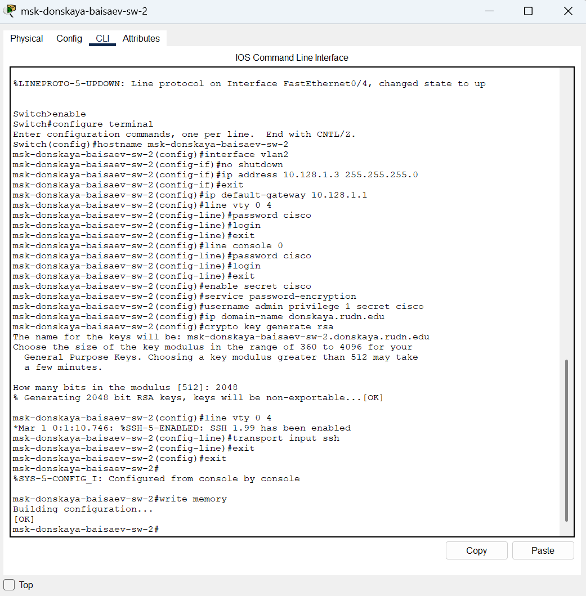
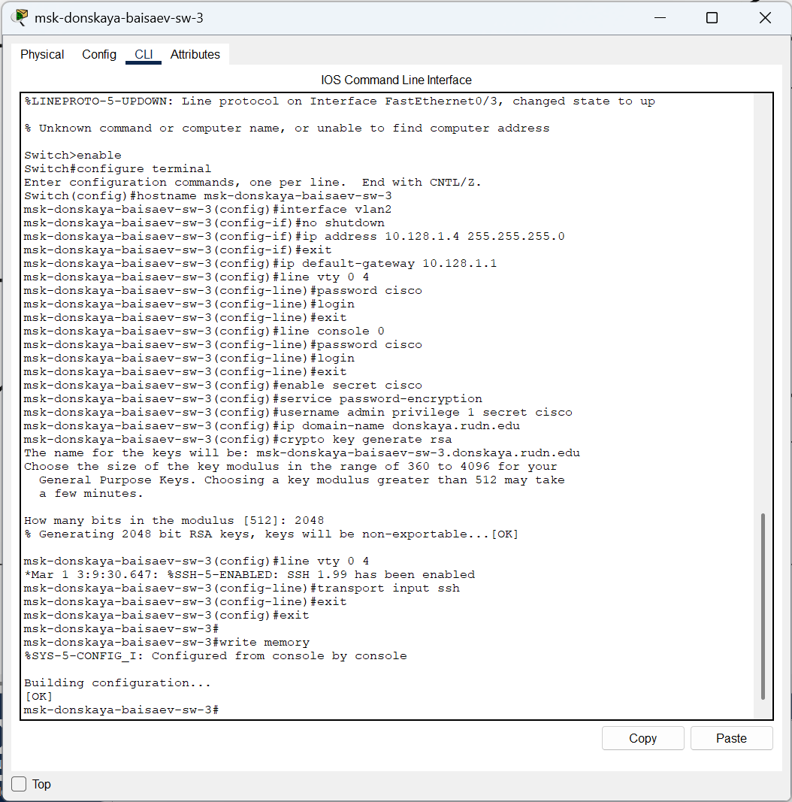
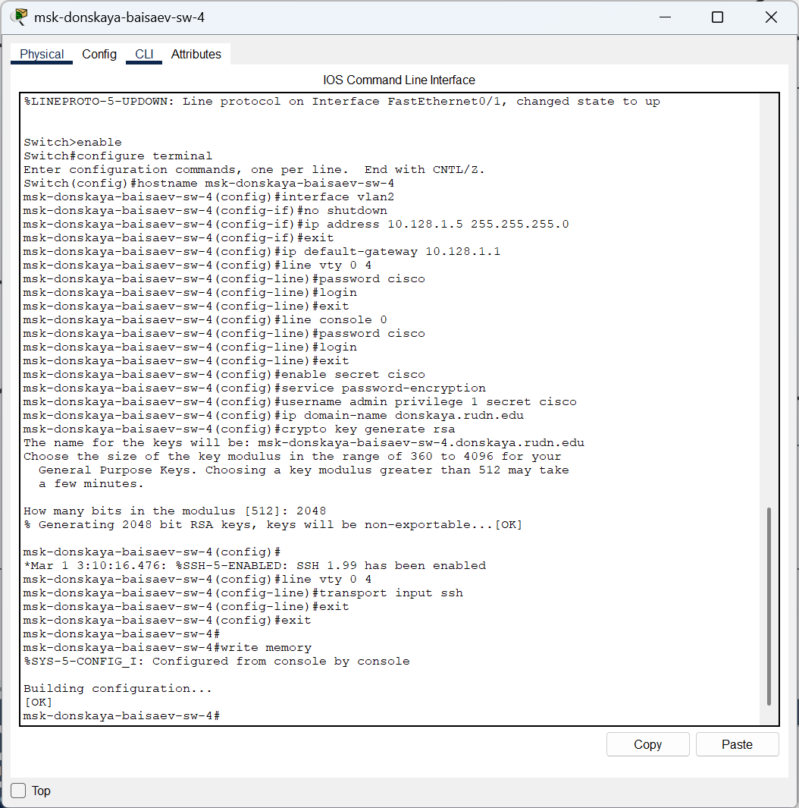

---
## Front matter
title: "Отчёт по лабораторной работе №4"
subtitle: "Дисциплина: Администрирование локальных сетей"
author: "Исаев Булат Абубакарович НПИбд-01-22"

## Generic otions
lang: ru-RU
toc-title: "Содержание"

## Bibliography
bibliography: bib/cite.bib
csl: pandoc/csl/gost-r-7-0-5-2008-numeric.csl

## Pdf output format
toc: true # Table of contents
toc-depth: 2
lof: true # List of figures
lot: true # List of tables
fontsize: 12pt
linestretch: 1.5
papersize: a4
documentclass: scrreprt
## I18n polyglossia
polyglossia-lang:
  name: russian
polyglossia-otherlangs:
  name: english
## I18n babel
babel-lang: russian
babel-otherlangs: english
## Fonts
mainfont: Arial
romanfont: Arial
sansfont: Arial
monofont: Arial
mainfontoptions: Ligatures=TeX
romanfontoptions: Ligatures=TeX
sansfontoptions: Ligatures=TeX,Scale=MatchLowercase
monofontoptions: Scale=MatchLowercase,Scale=0.9
## Biblatex
biblatex: true
biblio-style: "gost-numeric"
biblatexoptions:
  - parentracker=true
  - backend=biber
  - hyperref=auto
  - language=auto
  - autolang=other*
  - citestyle=gost-numeric
## Pandoc-crossref LaTeX customization
figureTitle: "Рис."
tableTitle: "Таблица"
listingTitle: "Листинг"
lofTitle: "Список иллюстраций"
lotTitle: "Список таблиц"
lolTitle: "Листинги"
## Misc options
indent: true
header-includes:
  - \usepackage{indentfirst}
  - \usepackage{float} # keep figures where there are in the text
  - \floatplacement{figure}{H} # keep figures where there are in the text
---

# Цель работы
Провести  подготовительную  работу  по  первоначальной  настройке коммутаторов сети. 

# Выполнение лабораторной работы
Создадим новый проект с названием lab\_PT-04.pkt  (рис. [-@fig:001]) 

{ #fig:001 width=70% }

В  логической  рабочей  области  Packet  Tracer  разместим  коммутаторы  и оконечные устройства согласно схеме сети L1 (схема приведена в лабораторной работе) и соединим их через соответствующие интерфейсы  (рис. [-@fig:002]) 

{ #fig:002 width=70% }

Используя  типовую  конфигурацию  коммутатора,  настроем  все коммутаторы, изменяя название устройства и его IP-адрес согласно плану IP  (рис. [-@fig:003]), (рис. [-@fig:004]), (рис. [-@fig:005]), (рис. [-@fig:006]), (рис. [-@fig:007])

{ #fig:003 width=70% }

{ #fig:004 width=70% }

{ #fig:005 width=70% }

{ #fig:006 width=70% }

{ #fig:007 width=70% }

# Вывод

В  ходе  выполнения  лабораторной  работы  мы  научились  проводить подготовительную работу по первоначальной настройке коммутаторов сети. 

##  Контрольные вопросы

1. При помощи каких команд можно посмотреть конфигурацию сетевого оборудования? - 
  
   **show running-config**

2. При  помощи  каких  команд  можно  посмотреть  стартовый конфигурационный файл оборудования? - 
  
   **show startup-config**

3. При помощи каких команд можно экспортировать конфигурационный файл  оборудования?  -  
  
    **copy  running-config  startup-config/copy running-config flash**

4. При помощи каких команд можно импортировать конфигурационный файл оборудования? - 
  
    **copy startup-config running-config**
