---
## Front matter
lang: ru-RU
title: Лабораторная Работа №5. Конфигурирование VLAN
subtitle: Администрирование локальных сетей
author:
  - Исаев Б.А.
institute:
  - Российский университет дружбы народов им. Патриса Лумумбы, Москва, Россия

## i18n babel
babel-lang: russian
babel-otherlangs: english

## Formatting pdf
toc: false
toc-title: Содержание
slide_level: 2
aspectratio: 169
section-titles: true
theme: metropolis
header-includes:
 - \metroset{progressbar=frametitle,sectionpage=progressbar,numbering=fraction}
 - '\makeatletter'
 - '\beamer@ignorenonframefalse'
 - '\makeatother'

## Fonts
mainfont: Arial
romanfont: Arial
sansfont: Arial
monofont: Arial
---

## Докладчик

  * Исаев Булат Абубакарович
  * НПИбд-01-22
  * Российский университет дружбы народов
  * [1132227131@pfur.ru]

## Новый проект
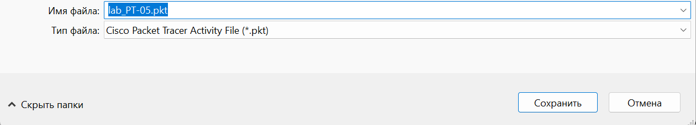{#fig:001 width=70%}
**Рис. 1.1.** Открытие проекта lab_PT-05.pkt.

## Настройка Trunk-портов
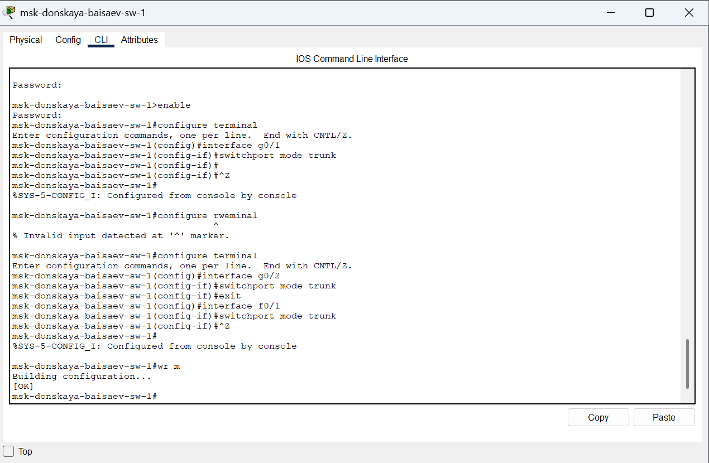{#fig:001 width=70%}
**Рис. 1.2.** Настройка Trunk-портов на коммутаторе msk-donskaya-baisaev-sw-1.

## Настройка Trunk-портов
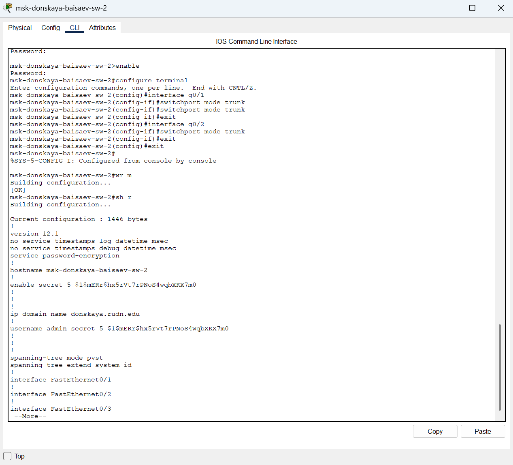{#fig:001 width=70%}
**Рис. 1.3.** Настройка Trunk-портов на коммутаторе msk-donskaya-baisaev-sw-2.

## Настройка Trunk-портов
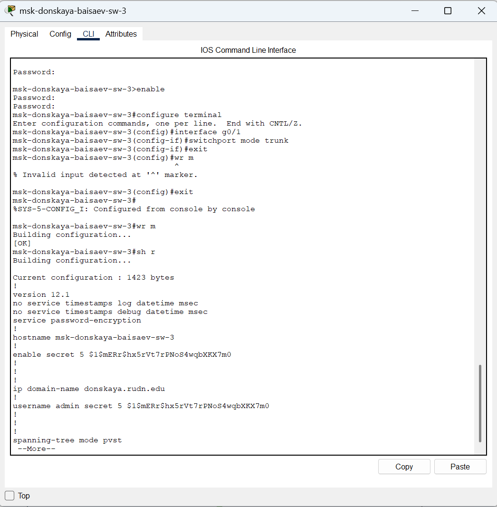{#fig:001 width=70%}
**Рис. 1.4.** Настройка Trunk-портов на коммутаторе msk-donskaya-baisaev-sw-3.

## Настройка Trunk-портов
{#fig:001 width=70%}
**Рис. 1.5.** Настройка Trunk-портов на коммутаторе msk-donskaya-baisaev-sw-4.

## Настройка Trunk-портов
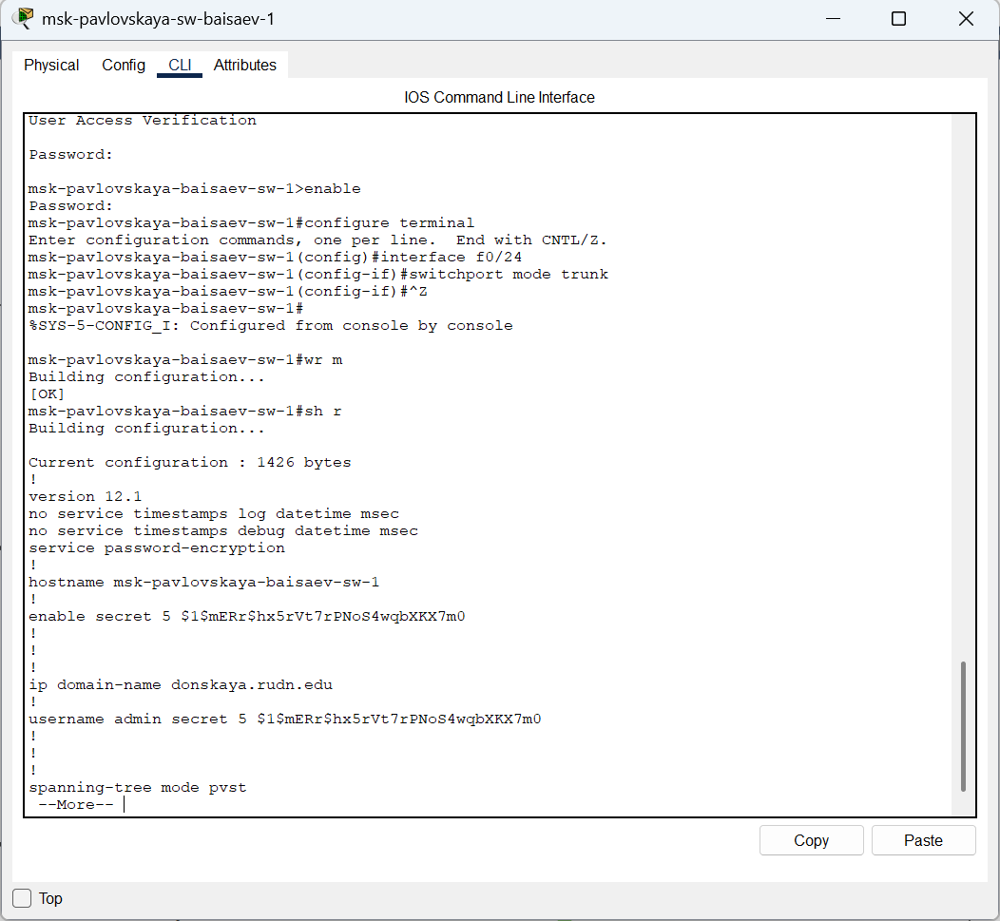{#fig:001 width=70%}
**Рис. 1.6.** Настройка Trunk-портов на коммутаторе msk-pavlovskaya-baisaev-sw-1.

## Настройка Trunk-портов
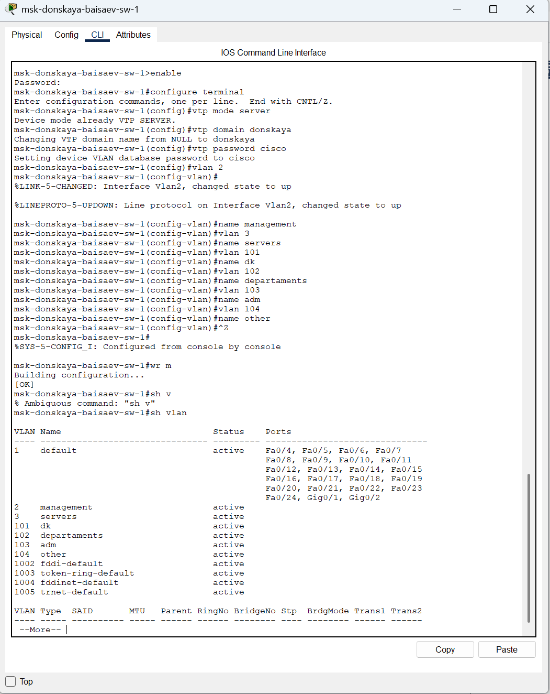{#fig:001 width=70%}
**Рис. 1.7.** Настройка коммутатора msk-donskaya-baisaev-sw-1 как VTP-сервера, добавление номеров и названий VLAN.

## Настройка Trunk-портов
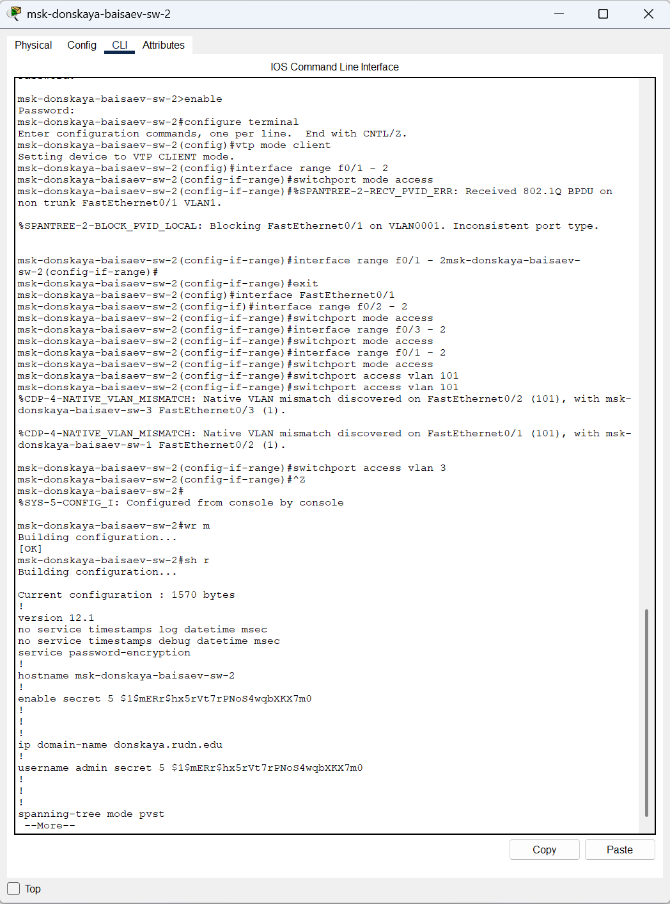{#fig:001 width=70%}
**Рис. 1.8.** Настройка коммутатора msk-donskaya-baisaev-sw-2 как VTP-клиента и указание принадлежности к VLAN.

## Настройка Trunk-портов
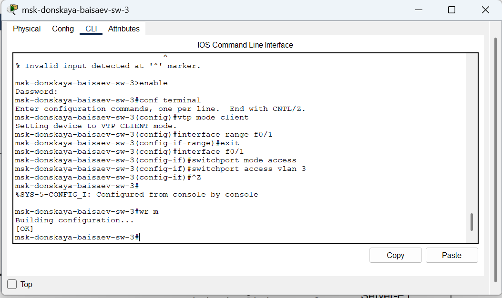{#fig:001 width=70%}
**Рис. 1.9.** Настройка коммутатора msk-donskaya-baisaev-sw-3 как VTP-клиента и указание принадлежности к VLAN.

## Настройка Trunk-портов
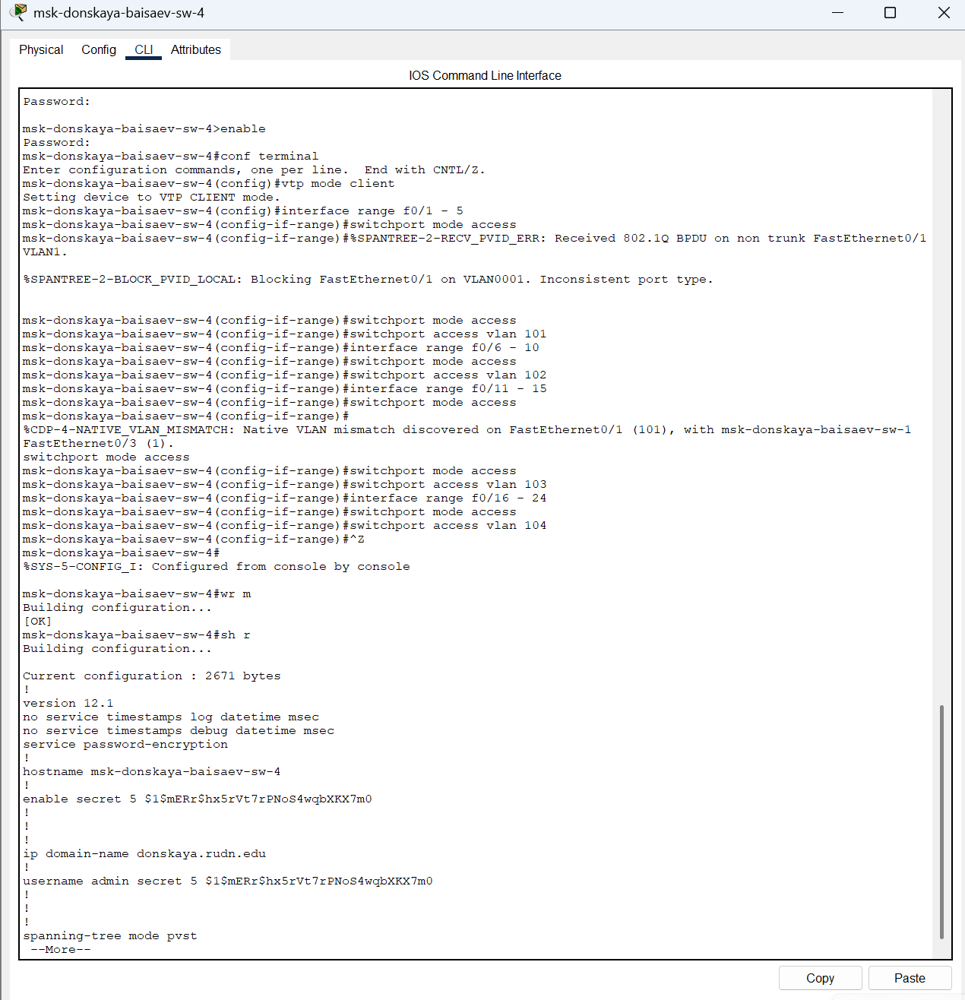{#fig:001 width=70%}
**Рис. 1.10.** Настройка коммутатора msk-donskaya-baisaev-sw-4 как VTP-клиента и указание принадлежности к VLAN.

## Настройка Trunk-портов
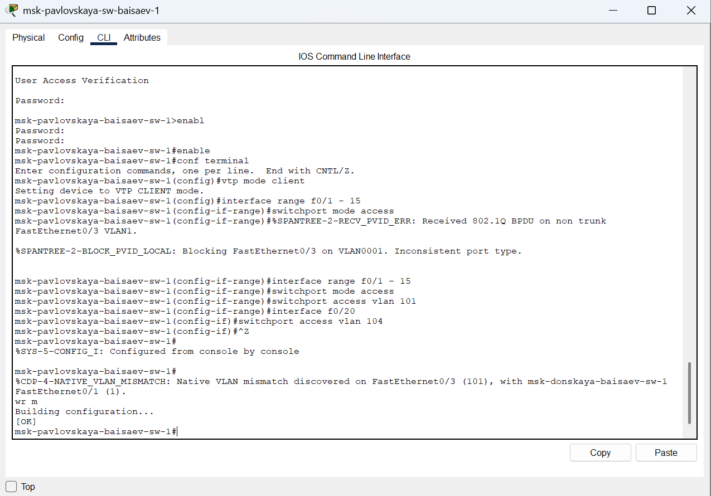{#fig:001 width=70%}
**Рис. 1.11.** Настройка коммутатора msk-pavlovskaya-baisaev-sw-1 как VTP-клиента и указание принадлежности к VLAN.

## Указание статических IP-адресов
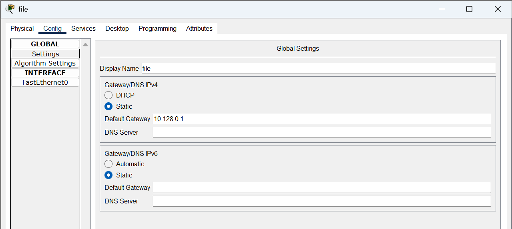{#fig:001 width=70%}
**Рис. 1.12.** Пример указания статического IP-адреса на оконечном устройстве (Default Gateway).

## Указание статических IP-адресов
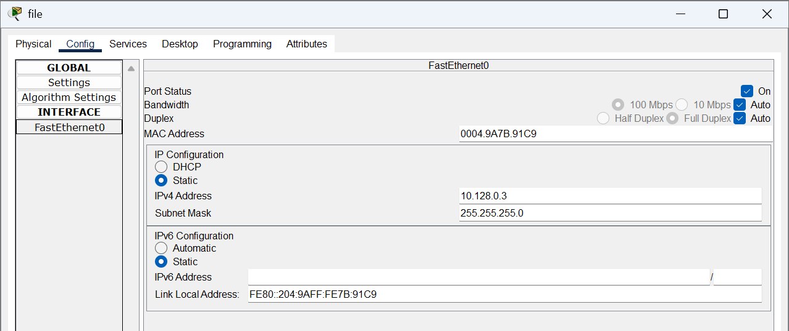{#fig:001 width=70%}
**Рис. 1.13.** Пример указания статического IP-адреса на оконечном устройстве (IP Configuration).

## Ping (доступность/недоступность)
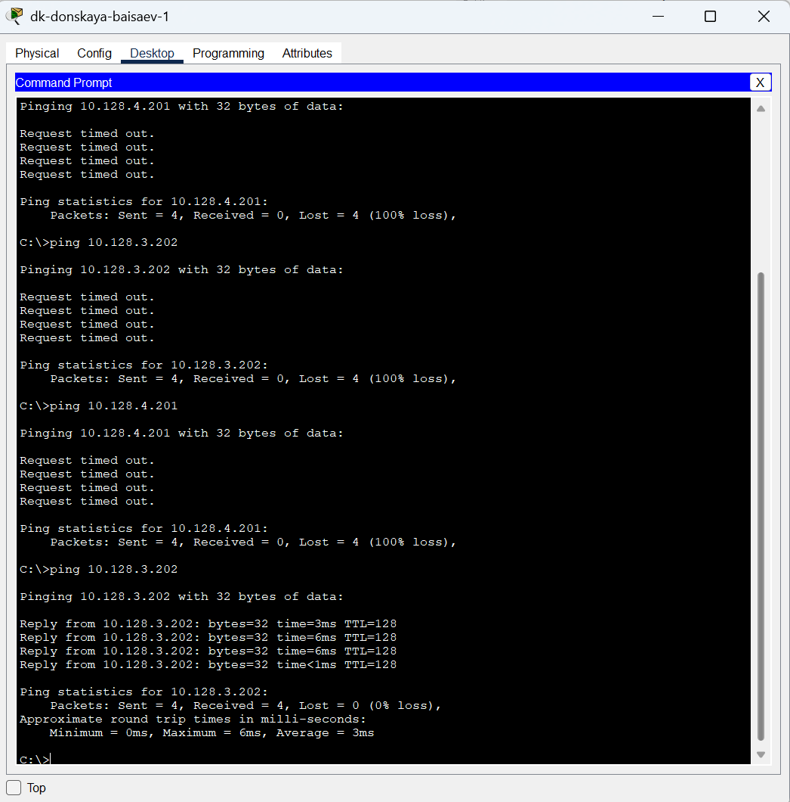{#fig:001 width=70%}
**Рис. 1.14.** Проверка доступности устройств, принадлежащих одному VLAN, и недоступность устройств, принадлежащих разным VLAN.

## Режим симуляции в Packet Tracer, пакет ICMP
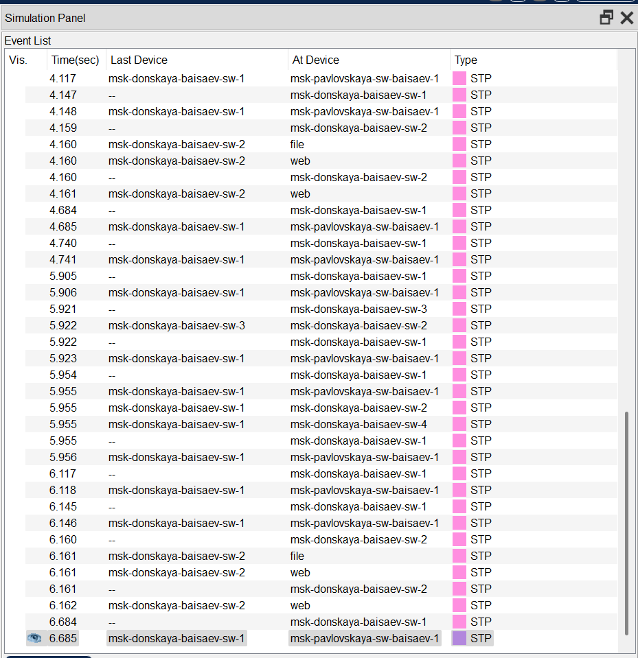{#fig:001 width=70%}
**Рис. 1.15.** Изучение процесса передвижения пакета ICMP (STP) по сети в режиме симуляции в Packet Tracer.

## Вывод
В ходе выполнения лабораторной работы мы получили основные навыки по настройке VLAN на коммутаторах сети.
