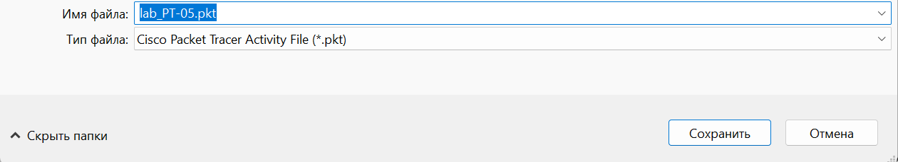
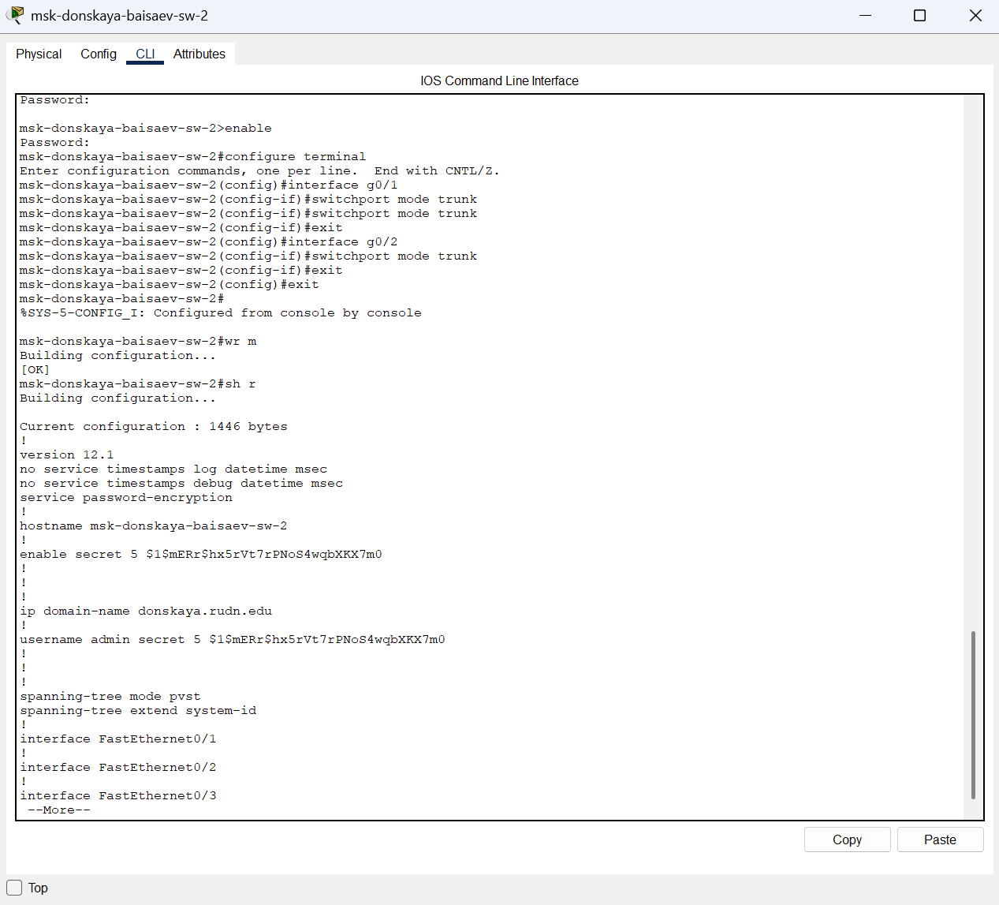
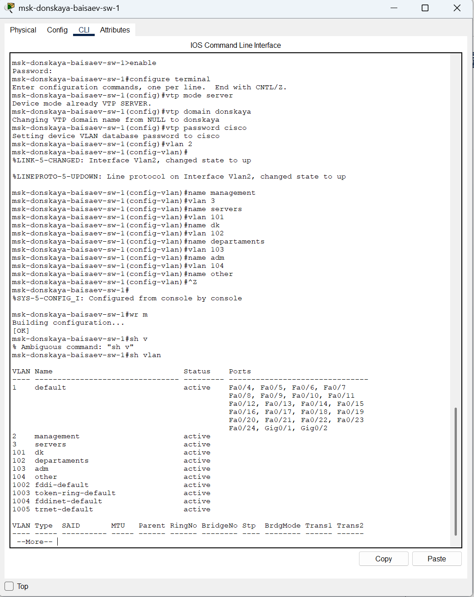
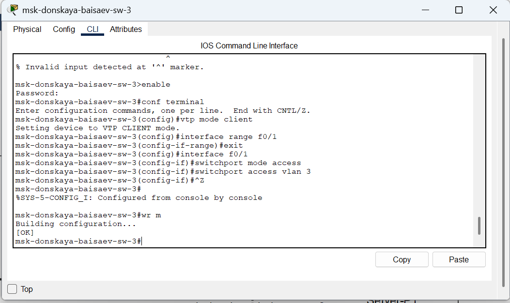
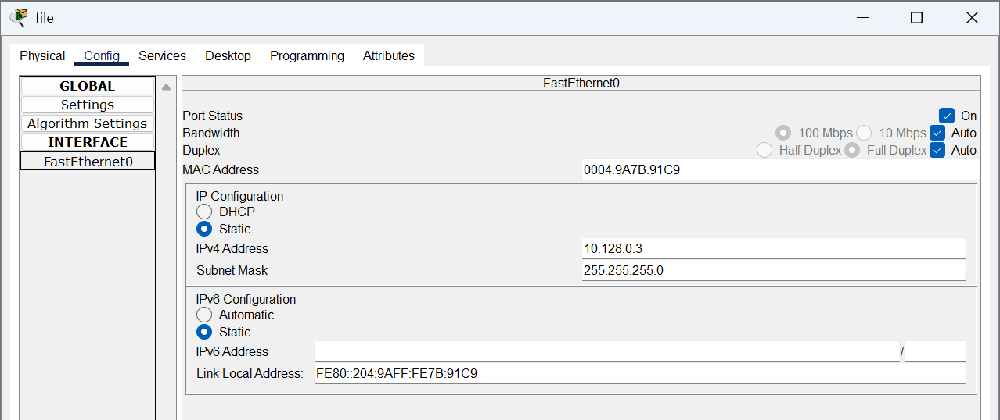

---
## Front matter
lang: ru-RU
title: Лабораторная Работа №5. Конфигурирование VLAN
subtitle: Администрирование локальных сетей
author:
  - Исаев Б.А.
institute:
  - Российский университет дружбы народов им. Патриса Лумумбы, Москва, Россия

## i18n babel
babel-lang: russian
babel-otherlangs: english

## Formatting pdf
toc: false
toc-title: Содержание
slide_level: 2
aspectratio: 169
section-titles: true
theme: metropolis
header-includes:
 - \metroset{progressbar=frametitle,sectionpage=progressbar,numbering=fraction}
 - '\makeatletter'
 - '\beamer@ignorenonframefalse'
 - '\makeatother'

## Fonts
mainfont: Arial
romanfont: Arial
sansfont: Arial
monofont: Arial
---

## Докладчик

  * Исаев Булат Абубакарович
  * НПИбд-01-22
  * Российский университет дружбы народов
  * [1132227131@pfur.ru]

## Новый проект

{#fig:001 width=70%}

## Настройка Trunk-портов

{#fig:002 width=70%}

## Настройка Trunk-портов

{#fig:003 width=70%}

## Настройка Trunk-портов

{#fig:004 width=70%}

## Настройка Trunk-портов

{#fig:005 width=70%}

## Настройка Trunk-портов

{#fig:006 width=70%}

## Настройка Trunk-портов

{#fig:007 width=70%}

## Настройка Trunk-портов

{#fig:008 width=70%}

## Настройка Trunk-портов

{#fig:009 width=70%}

## Настройка Trunk-портов

{#fig:010 width=70%}

## Настройка Trunk-портов

{#fig:011 width=70%}

## Указание статических IP-адресов

{#fig:012 width=70%}

## Указание статических IP-адресов

{#fig:013 width=70%}

## Ping (доступность/недоступность)

{#fig:014 width=70%}

## Режим симуляции в Packet Tracer, пакет ICMP

{#fig:015 width=70%}

## Вывод
В ходе выполнения лабораторной работы мы получили основные навыки по настройке VLAN на коммутаторах сети.
