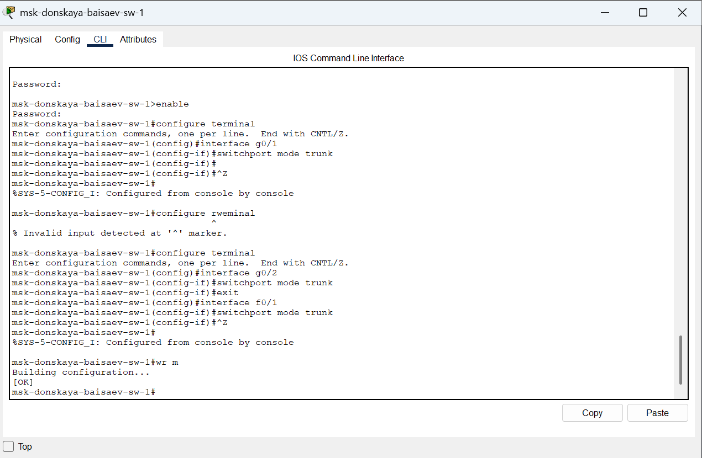
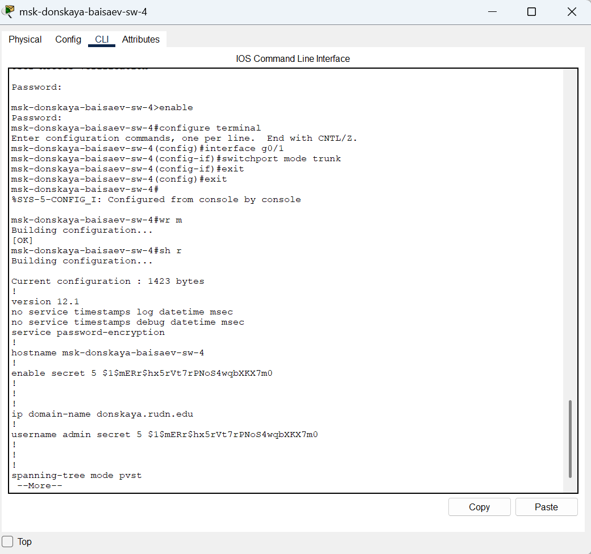
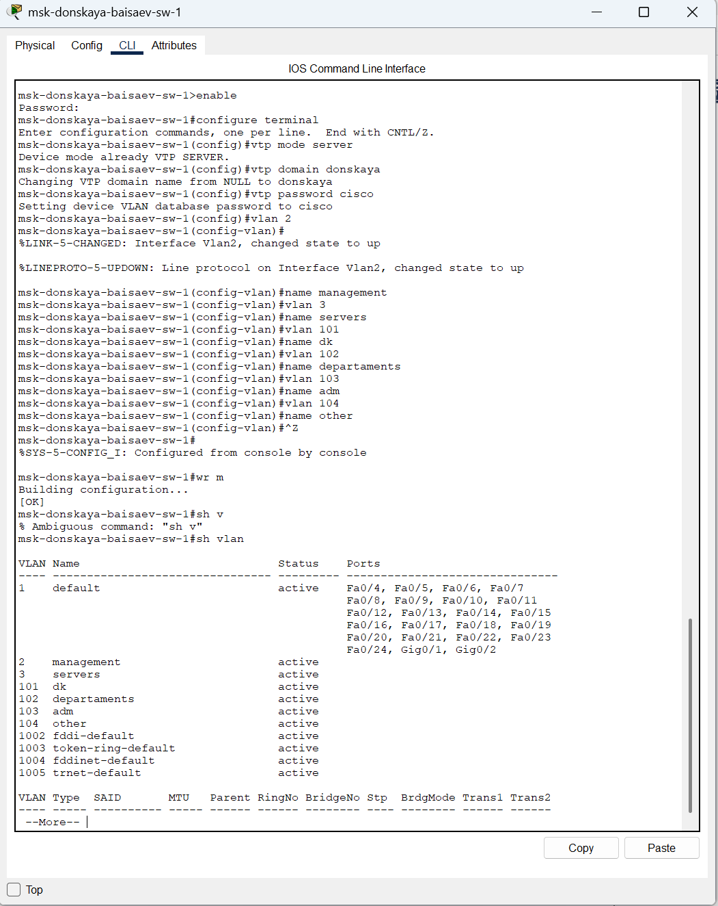

**РОССИЙСКИЙ УНИВЕРСИТЕТ ДРУЖБЫ НАРОДОВ** 

**Факультет физико-математических и естественных наук Кафедра теории вероятностей и кибербезопасности** 

**ОТЧЁТ** 

**ПО ЛАБОРАТОРНОЙ РАБОТЕ №5** 
*дисциплина: Администрирование локальных сетей* 

Студент: Исаев Булат Абубакарович Студ. билет № 1132227131 

Группа: НПИбд-01-22

**МОСКВА** 2025 г.

**Цель работы:** 

Получить основные навыки по настройке VLAN на коммутаторах сети.

**Выполнение работы:** 

Откроем проект с названием lab_PT-04.pkt и сохраним под названием lab_PT-05.pkt. После чего откроем его для дальнейшего редактирования (Рис. 1.1):

**Рис. 1.1.** Открытие проекта lab_PT-05.pkt.

Используя приведённую в лабораторной работе последовательность команд из примера по конфигурации Trunk-порта на интерфейсе g0/1 коммутатора mskdonskaya-sw-1, настроим Trunk-порты на соответствующих интерфейсах всех коммутаторов (Рис. 1.2 – 1.6):

**Рис. 1.2.** Настройка Trunk-портов на коммутаторе msk-donskaya-baisaev-sw-1.

**Рис. 1.3.** Настройка Trunk-портов на коммутаторе msk-donskaya-baisaev-sw-2.

**Рис. 1.4.** Настройка Trunk-портов на коммутаторе msk-donskaya-baisaev-sw-3.

**Рис. 1.5.** Настройка Trunk-портов на коммутаторе msk-donskaya-baisaev-sw-4.

**Рис. 1.6.** Настройка Trunk-портов на коммутаторе msk-pavlovskaya-baisaev-sw-1.

Далее настроим коммутатор msk-donskaya-baisaev-sw-1 как VTP-сервер и пропишем на нём номера и названия VLAN (Рис. 1.7):

**Рис. 1.7.** Настройка коммутатора msk-donskaya-baisaev-sw-1 как VTP-сервера, добавление номеров и названий VLAN.

Теперь настроим коммутаторы msk-donskaya-baisaev-sw-2, msk-donskaya-baisaev-sw-3, msk-donskaya-baisaev-sw-4 и msk-pavlovskaya-baisaev-sw-1 как VTP-клиенты и на интерфейсах укажем принадлежность к VLAN (Рис. 1.8 – 1.11):

**Рис. 1.8.** Настройка коммутатора msk-donskaya-baisaev-sw-2 как VTP-клиента и указание принадлежности к VLAN.

**Рис. 1.9.** Настройка коммутатора msk-donskaya-baisaev-sw-3 как VTP-клиента и указание принадлежности к VLAN.

**Рис. 1.10.** Настройка коммутатора msk-donskaya-baisaev-sw-4 как VTP-клиента и указание принадлежности к VLAN.

**Рис. 1.11.** Настройка коммутатора msk-pavlovskaya-baisaev-sw-1 как VTP-клиента и указание принадлежности к VLAN.

**Рис. 1.12.** Пример указания статического IP-адреса на оконечном устройстве (Default Gateway).

**Рис. 1.13.** Пример указания статического IP-адреса на оконечном устройстве (IP Configuration).

После указания статических IP-адресов на оконечных устройствах проверим с помощью команды ping доступность устройств, принадлежащих одному VLAN, и недоступность устройств, принадлежащих разным VLAN (Рис. 1.14):

**Рис. 1.14.** Проверка доступности устройств, принадлежащих одному VLAN, и недоступность устройств, принадлежащих разным VLAN.

Используя режим симуляции в Packet Tracer, изучим процесс передвижения пакета ICMP по сети (Рис. 1.15):

**Рис. 1.15.** Изучение процесса передвижения пакета ICMP (STP) по сети в режиме симуляции в Packet Tracer.

**Вывод:** 
В ходе выполнения лабораторной работы мы получили основные навыки по настройке VLAN на коммутаторах сети.

**Ответы на контрольные вопросы:** 

1. Какая команда используется для просмотра списка VLAN на сетевом устройстве? - **show vlan** 

2. Охарактеризуйте VLAN Trunking Protocol (VTP). Приведите перечень команд с пояснениями для настройки и просмотра информации о VLAN. – **switchport mode trunk/access:**
**switchport mode trunk: устанавливает порт в режим транка (trunk), который передает данные для нескольких VLAN через один физический интерфейс.**
**switchport mode access: устанавливает порт в режим доступа (access), который предназначен для работы с одним определенным VLAN.**
**switchport access vlan <номер_VLAN>: назначает определенный VLAN для порта в режиме доступа.**
**vtp mode server/client:**
**vtp mode server: устанавливает коммутатор в режим сервера VTP, позволяя ему рассылать информацию о VLAN другим коммутаторам в сети.**
**vtp mode client: устанавливает коммутатор в режим клиента VTP, что позволяет ему принимать информацию о VLAN от серверов VTP.**
**vtp domain <имя_домена>: устанавливает домен VTP, в котором находится коммутатор. Для синхронизации информации о VLAN, все коммутаторы в сети должны находиться в одном домене VTP с одинаковым именем.**
**vtp password <пароль>: устанавливает пароль VTP для доступа к домену VTP. Это помогает обеспечить безопасность и предотвратить несанкционированные изменения конфигурации VLAN.**
**vlan <номер_VLAN>: создает новый VLAN с указанным номером.**
**name <имя_VLAN>: присваивает имя VLAN, что делает его более понятным для администраторов сети.**

3.	Охарактеризуйте Internet Control Message Protocol (ICMP). Опишите формат пакета ICMP  -  **Это протокол в семействе протоколов интернета, который используется для передачи сообщений об ошибках и других исключительных ситуациях, возникших при передаче данных в компьютерных сетях. ICMP также выполняет некоторые сервисные функции, такие как проверка доступности хостов и диагностика сетевых проблем.**
**Формат пакета ICMP обычно состоит из заголовка и полезной нагрузки, которая может включать в себя различные поля, зависящие от типа сообщения ICMP. Основные поля заголовка ICMP включают в себя:**
**Тип: определяет тип сообщения ICMP, например, сообщение об ошибках, запрос эхо и т. д.**
**Код: подтип сообщения, который помогает уточнить тип сообщения. Например, для сообщения об ошибке этот код может указывать на конкретный тип ошибки.**
**Контрольная сумма: используется для обеспечения целостности пакета ICMP.**
**Дополнительные данные: в зависимости от типа и кода сообщения, может содержать дополнительные поля с информацией о сетевой проблеме или другой полезной информацией.**

4.	Охарактеризуйте Address Resolution Protocol (ARP). Опишите формат пакета ARP - **Это протокол, используемый в компьютерных сетях для связывания IP-адресов с физическими MAC-адресами устройств в локальной сети. Он позволяет устройствам в сети определять MAC-адреса других устройств на основе их IP-адресов.**
**Когда устройству требуется отправить пакет данных другому устройству в сети, оно сначала проверяет свою локальную таблицу ARP, чтобы узнать MAC-адрес получателя. Если необходимый MAC-адрес отсутствует в таблице ARP, устройство отправляет ARP-запрос на всю сеть, запрашивая MAC-адрес соответствующего IP-адреса. Устройство, которое имеет этот IP-адрес, отвечает на запрос, предоставляя свой MAC-адрес.**
**Формат пакета ARP обычно состоит из следующих полей:**
**Тип аппаратного адреса: определяет тип физического аппаратного адреса в сети, такой как Ethernet (значение 1).**
**Тип протокола: указывает на протокол сетевого уровня, для которого запрашивается соответствие адресов, обычно IPv4 (значение 0x0800).**
**Длина аппаратного адреса: указывает на размер физического адреса, обычно 6 байт для MAC-адресов Ethernet.**
**Длина адреса протокола: указывает на размер адреса протокола, обычно 4 байта для IPv4.**
**Код операции: определяет тип операции ARP, например, запрос (значение 1) или ответ (значение 2).**
**MAC-адрес отправителя: физический адрес отправителя.**
**IP-адрес отправителя: IP-адрес отправителя.**
**MAC-адрес получателя: физический адрес получателя (обычно пустой в ARP-запросах).**
**IP-адрес получателя: IP-адрес получателя, для которого запрашивается соответствие MAC-адреса.** 

5. 5.	Что такое MAC-адрес? Какова его структура? - MAC-адрес (Media Access Control address) - **Это уникальный идентификатор, присваиваемый каждому устройству или интерфейсу активного оборудования в компьютерных сетях Ethernet. Этот адрес используется для уникальной идентификации устройства в сети и обеспечения корректной передачи данных между устройствами.**
**Структура MAC-адреса следующая:**
**MAC-адрес состоит из 6 байт (или 48 бит). Каждый байт разбивается на две части:**
**Префикс: это первые три байта (24 бита) MAC-адреса. Префикс обычно определяет производителя устройства (Organizationally Unique Identifier, OUI). Это уникальный идентификатор, выданный Институтом инженеров** **электротехники и электроники (IEEE) производителям сетевого оборудования.**
**Идентификатор устройства: это оставшиеся три байта (24 бита) MAC-адреса.** **Идентификатор устройства является уникальным номером, присвоенным самим производителем идентификатора.**
**MAC-адрес записывается в шестнадцатеричной системе счисления и обычно разделяется двоеточием или дефисом между каждыми двумя байтами (например, 01:23:45:67:89:ab).**
**Использование уникальных MAC-адресов позволяет коммутирующим устройствам в сети Ethernet правильно маршрутизировать кадры данных и устанавливать точные соединения между устройствами в сети.**
