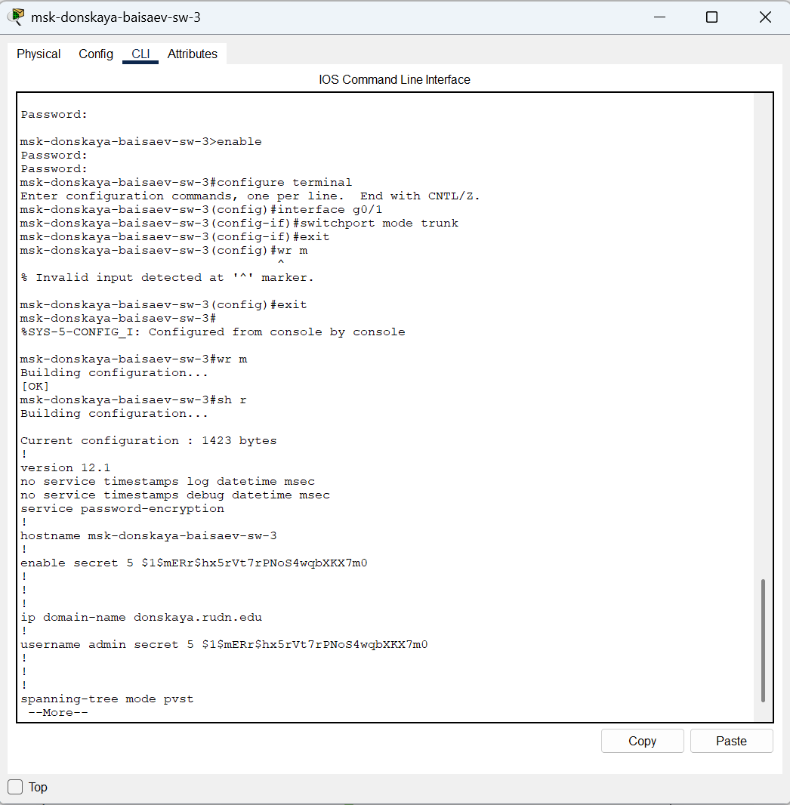

---
## Front matter
title: "Отчёт по лабораторной работе №5"
subtitle: "Дисциплина: Администрирование локальных сетей"
author: "Исаев Булат Абубакарович НПИбд-01-22"

## Generic otions
lang: ru-RU
toc-title: "Содержание"

## Bibliography
bibliography: bib/cite.bib
csl: pandoc/csl/gost-r-7-0-5-2008-numeric.csl

## Pdf output format
toc: true # Table of contents
toc-depth: 2
lof: true # List of figures
lot: true # List of tables
fontsize: 12pt
linestretch: 1.5
papersize: a4
documentclass: scrreprt
## I18n polyglossia
polyglossia-lang:
  name: russian
polyglossia-otherlangs:
  name: english
## I18n babel
babel-lang: russian
babel-otherlangs: english
## Fonts
mainfont: Arial
romanfont: Arial
sansfont: Arial
monofont: Arial
mainfontoptions: Ligatures=TeX
romanfontoptions: Ligatures=TeX
sansfontoptions: Ligatures=TeX,Scale=MatchLowercase
monofontoptions: Scale=MatchLowercase,Scale=0.9
## Biblatex
biblatex: true
biblio-style: "gost-numeric"
biblatexoptions:
  - parentracker=true
  - backend=biber
  - hyperref=auto
  - language=auto
  - autolang=other*
  - citestyle=gost-numeric
## Pandoc-crossref LaTeX customization
figureTitle: "Рис."
tableTitle: "Таблица"
listingTitle: "Листинг"
lofTitle: "Список иллюстраций"
lotTitle: "Список таблиц"
lolTitle: "Листинги"
## Misc options
indent: true
header-includes:
  - \usepackage{indentfirst}
  - \usepackage{float} # keep figures where there are in the text
  - \floatplacement{figure}{H} # keep figures where there are in the text
---

# Цель работы
Получить основные навыки по настройке VLAN на коммутаторах сети.

# Выполнение лабораторной работы
Откроем проект с названием lab_PT-04.pkt и сохраним под названием lab_PT-05.pkt. После чего откроем его для дальнейшего редактирования  (рис. [-@fig:001])

{ #fig:001 width=70% }

Используя приведённую в лабораторной работе последовательность команд из примера по конфигурации Trunk-порта на интерфейсе g01 коммутатора mskdonskaya-sw-1, настроим Trunk-порты на соответствующих интерфейсах всех коммутаторов  (рис. [-@fig:002])  (рис. [-@fig:003])  (рис. [-@fig:004])  (рис. [-@fig:005])  (рис. [-@fig:006]) 

{ #fig:002 width=70% }

{ #fig:003 width=70% }

{ #fig:004 width=70% }

{ #fig:005 width=70% }

{ #fig:006 width=70% }

Далее настроим коммутатор msk-donskaya-baisaev-sw-1 как VTP-сервер и пропишем на нём номера и названия VLAN  (рис. [-@fig:007])

{ #fig:007 width=70% }

Теперь настроим коммутаторы msk-donskaya-baisaev-sw-2, msk-donskaya-baisaev-sw-3, msk-donskaya-baisaev-sw-4 и msk-pavlovskaya-baisaev-sw-1 как VTP-клиенты и на интерфейсах укажем принадлежность к VLAN  (рис. [-@fig:008])  (рис. [-@fig:009])  (рис. [-@fig:010])  (рис. [-@fig:011])

{ #fig:008 width=70% }

{ #fig:009 width=70% }

{ #fig:010 width=70% }

{ #fig:011 width=70% }

 (рис. [-@fig:012])

{ #fig:012 width=70% }

 (рис. [-@fig:013])

{ #fig:013 width=70% }

После указания статических IP-адресов на оконечных устройствах проверим с помощью команды ping доступность устройств, принадлежащих одному VLAN, и недоступность устройств, принадлежащих разным VLAN  (рис. [-@fig:014]):

{ #fig:014 width=70% }

Используя режим симуляции в Packet Tracer, изучим процесс передвижения пакета ICMP по сети  (рис. [-@fig:015])

{ #fig:015 width=70% }

# Вывод

В ходе выполнения лабораторной работы мы получили основные навыки по настройке VLAN на коммутаторах сети.

##  Контрольные вопросы

1. Какая команда используется для просмотра списка VLAN на сетевом устройстве? 
  
   **show vlan**

2. Охарактеризуйте VLAN Trunking Protocol (VTP). Приведите перечень команд с пояснениями для настройки и просмотра информации о VLAN.
  
   **switchport mode trunk/access:**
   **switchport mode trunk: устанавливает порт в режим транка (trunk), который передает данные для нескольких VLAN через один физический интерфейс.**
   **switchport mode access: устанавливает порт в режим доступа (access), который предназначен для работы с одним определенным VLAN.**
   **switchport access vlan номер_VLAN: назначает определенный VLAN для порта в режиме доступа.**
   **vtp mode server/client:**
   **vtp mode server: устанавливает коммутатор в режим сервера VTP, позволяя ему рассылать информацию о VLAN другим коммутаторам в сети.**
   **vtp mode client: устанавливает коммутатор в режим клиента VTP, что позволяет ему принимать информацию о VLAN от серверов VTP.**
   **vtp domain <имя_домена>: устанавливает домен VTP, в котором находится коммутатор. Для синхронизации информации о VLAN, все коммутаторы в сети должны находиться в одном домене VTP с одинаковым именем.**
   **vtp password <пароль>: устанавливает пароль VTP для доступа к домену VTP. Это помогает обеспечить безопасность и предотвратить несанкционированные изменения конфигурации VLAN.**
   **vlan <номер_VLAN>: создает новый VLAN с указанным номером.**
   **name <имя_VLAN>: присваивает имя VLAN, что делает его более понятным для администраторов сети.**

3. Охарактеризуйте Internet Control Message Protocol (ICMP). Опишите формат пакета ICMP
  
    **Это протокол в семействе протоколов интернета, который используется для передачи сообщений об ошибках и других исключительных ситуациях, возникших при передаче данных в компьютерных сетях. ICMP также выполняет некоторые сервисные функции, такие как проверка доступности хостов и диагностика сетевых проблем.**
    **Формат пакета ICMP обычно состоит из заголовка и полезной нагрузки, которая может включать в себя различные поля, зависящие от типа сообщения ICMP. Основные поля заголовка ICMP включают в себя:**
    **Тип: определяет тип сообщения ICMP, например, сообщение об ошибках, запрос эхо и т. д.**
    **Код: подтип сообщения, который помогает уточнить тип сообщения. Например, для сообщения об ошибке этот код может указывать на конкретный тип ошибки.**
    **Контрольная сумма: используется для обеспечения целостности пакета ICMP.**
    **Дополнительные данные: в зависимости от типа и кода сообщения, может содержать дополнительные поля с информацией о сетевой проблеме или другой полезной информацией.**

4. Охарактеризуйте Address Resolution Protocol (ARP). Опишите формат пакета ARP
  
    **Это протокол, используемый в компьютерных сетях для связывания IP-адресов с физическими MAC-адресами устройств в локальной сети. Он позволяет устройствам в сети определять MAC-адреса других устройств на основе их IP-адресов.**
    **Когда устройству требуется отправить пакет данных другому устройству в сети, оно сначала проверяет свою локальную таблицу ARP, чтобы узнать MAC-адрес получателя. Если необходимый MAC-адрес отсутствует в таблице ARP, устройство отправляет ARP-запрос на всю сеть, запрашивая MAC-адрес соответствующего IP-адреса. Устройство, которое имеет этот IP-адрес, отвечает на запрос, предоставляя свой MAC-адрес.**
    **Формат пакета ARP обычно состоит из следующих полей:**
    **Тип аппаратного адреса: определяет тип физического аппаратного адреса в сети, такой как Ethernet (значение 1).**
    **Тип протокола: указывает на протокол сетевого уровня, для которого запрашивается соответствие адресов, обычно IPv4 (значение 0x0800).**
    **Длина аппаратного адреса: указывает на размер физического адреса, обычно 6 байт для MAC-адресов Ethernet.**
    **Длина адреса протокола: указывает на размер адреса протокола, обычно 4 байта для IPv4.**
    **Код операции: определяет тип операции ARP, например, запрос (значение 1) или ответ (значение 2).**
    **MAC-адрес отправителя: физический адрес отправителя.**
    **IP-адрес отправителя: IP-адрес отправителя.**
    **MAC-адрес получателя: физический адрес получателя (обычно пустой в ARP-запросах).**
    **IP-адрес получателя: IP-адрес получателя, для которого запрашивается соответствие MAC-адреса.** 

