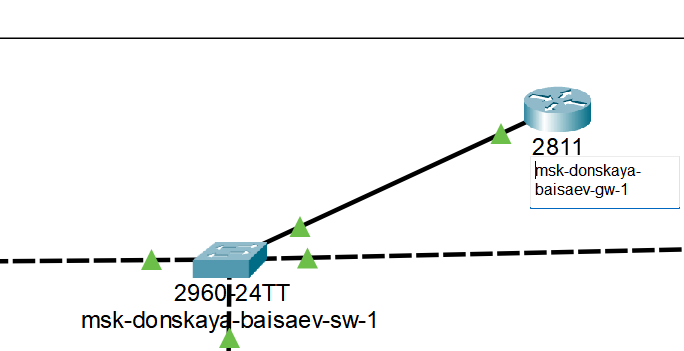

---
## Front matter
lang: ru-RU
title: Лабораторная Работа №6. Статическая маршрутизация VLAN 
subtitle: Администрирование локальных сетей
author:
  - Исаев Б.А.
institute:
  - Российский университет дружбы народов им. Патриса Лумумбы, Москва, Россия

## i18n babel
babel-lang: russian
babel-otherlangs: english

## Formatting pdf
toc: false
toc-title: Содержание
slide_level: 2
aspectratio: 169
section-titles: true
theme: metropolis
header-includes:
 - \metroset{progressbar=frametitle,sectionpage=progressbar,numbering=fraction}
 - '\makeatletter'
 - '\beamer@ignorenonframefalse'
 - '\makeatother'

## Fonts
mainfont: Arial
romanfont: Arial
sansfont: Arial
monofont: Arial
---

## Докладчик

  * Исаев Булат Абубакарович
  * НПИбд-01-22
  * Российский университет дружбы народов
  * [1132227131@pfur.ru]

## Новый проект
{#fig:001 width=70%}
**Рис. 1.1.** Открытие проекта lab_PT-06.pkt.

## Размещение и подключение Cisco 2811
{#fig:001 width=70%}
**Рис. 1.2.** Размещение маршрутизатора Cisco 2811 в логической области проекта и подключение его к порту 24 коммутатора msk-donskaya-baisaev-sw-1.

## Конфигурация маршрутизатора
{#fig:001 width=70%}
**Рис. 1.3.** Конфигурация маршрутизатора: имя, пароль для доступа к консоли и настройка удалённого подключение к нему по ssh.

## Настройка Trunk-порта
{#fig:001 width=70%}
**Рис. 1.4.** Настройка порта 24 коммутатора msk-donskaya-baisaev-sw-1 как trunk-порт.

## Изменение наименования
{#fig:001 width=70%}
**Рис. 1.5.** Изменение на схеме наименование маршрутизатора Cisco 2811. 

## Настройки
{#fig:001 width=70%}
**Рис. 1.6.** Настройка на интерфейсе f0/0 маршрутизатора msk-donskaya-baisaev-gw-1 виртуальных интерфейсов, соответствующих номерам VLAN. Настройка соответствующих IP-адресов на виртуальных интерфейсах согласно таблице IP-адресов.

## Ping
{#fig:001 width=70%}
**Рис. 1.7.** Проверка доступности оконечных устройств из разных VLAN.

## Вывод
В ходе выполнения лабораторной работы мы научились настраивать статическую маршрутизацию VLAN в сети.

## Спасибо за внимание!