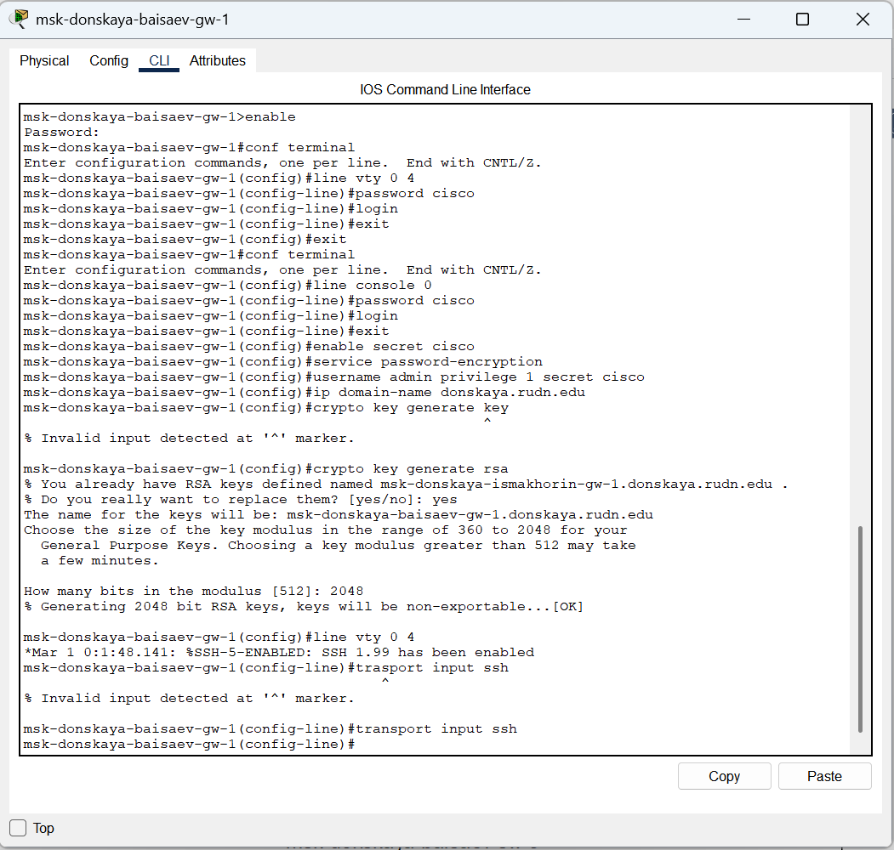

**РОССИЙСКИЙ УНИВЕРСИТЕТ ДРУЖБЫ НАРОДОВ** 

**Факультет физико-математических и естественных наук Кафедра теории вероятностей и кибербезопасности** 

**ОТЧЁТ** 

**ПО ЛАБОРАТОРНОЙ РАБОТЕ №6** 
*дисциплина: Администрирование локальных сетей* 

Студент: Исаев Булат Абубакарович Студ. билет № 1132227131 

Группа: НПИбд-01-22

**МОСКВА** 2025 г.

**Цель работы:** 
Настроить статическую маршрутизацию VLAN в сети.

**Выполнение работы:** 
Откроем проект с названием lab_PT-05.pkt и сохраним под названием lab_PT-06.pkt. После чего откроем его для дальнейшего редактирования (Рис. 1.1):

**Рис. 1.1.** Открытие проекта lab_PT-06.pkt.

В логической области проекта разместим маршрутизатор Cisco 2811, подключим его к порту 24 коммутатора msk-donskaya-baisaev-sw-1 в соответствии с таблицей портов (Рис. 1.2):

**Рис. 1.2.** Размещение маршрутизатора Cisco 2811 в логической области проекта и подключение его к порту 24 коммутатора msk-donskaya-baisaev-sw-1.

Используя приведённую последовательность команд в лабораторной работе по первоначальной настройке маршрутизатора, сконфигурируем маршрутизатор, задав на нём имя, пароль для доступа к консоли и настроим удалённое подключение к нему по ssh (Рис. 1.3):

**Рис. 1.3.** Конфигурация маршрутизатора: имя, пароль для доступа к консоли и настройка удалённого подключение к нему по ssh.

Теперь настроим порт 24 коммутатора msk-donskaya-baisaev-sw-1 как trunk-порт (Рис. 1.4):

**Рис. 1.4.** Настройка порта 24 коммутатора msk-donskaya-baisaev-sw-1 как trunk-порт.

**Рис. 1.5.** Изменение на схеме наименование маршрутизатора Cisco 2811. 

На интерфейсе f0/0 маршрутизатора msk-donskaya-baisaev-gw-1 настроим виртуальные интерфейсы, соответствующие номерам VLAN. Согласно таблице IP-адресов зададим соответствующие IP-адреса на виртуальных интерфейсах (Рис. 1.6):

**Рис. 1.6.** Настройка на интерфейсе f0/0 маршрутизатора msk-donskaya- baisaev-gw-1 виртуальных интерфейсов, соответствующих номерам VLAN. Настройка соответствующих IP-адресов на виртуальных интерфейсах согласно таблице IP-адресов.

После всех настроек проверим доступность оконечных устройств из разных VLAN (Рис. 1.7):

**Рис. 1.7.** Проверка доступности оконечных устройств из разных VLAN.

Используя режим симуляции в Packet Tracer, изучим процесс передвижения пакета ICMP по сети (У меня ICMP не появляется к сожалению):

**Вывод:** 
В ходе выполнения лабораторной работы мы научились настраивать статическую маршрутизацию VLAN в сети.

**Ответы на контрольные вопросы:** 

1. Охарактеризуйте стандарт IEEE 802.1Q - **открытый стандарт, который описывает процедуру тегирования трафика для передачи информации о принадлежности к VLAN по сетям стандарта IEEE 802.3 Ethernet.** 
2. Опишите формат кадра IEEE 802.1Q - **добавляет 32-битное поле между MAC-адресом источника и полями EtherType исходного кадра. В соответствии с 802.1Q минимальный размер кадра остается 64 байта, но мост может увеличить минимальный размер кадра с 64 до 68 байтов при передаче IEEE 802.1Q.** 
