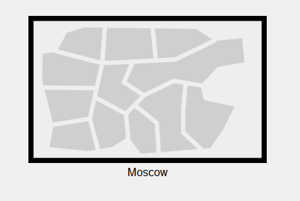
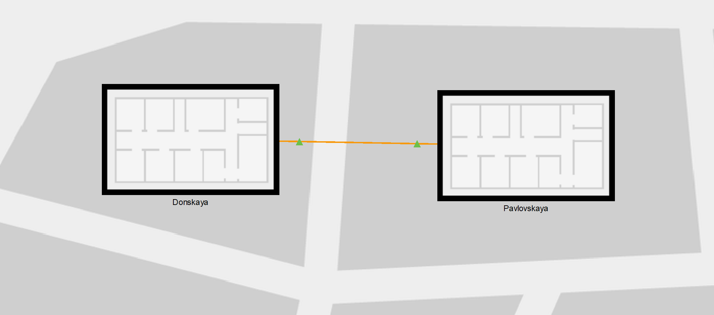
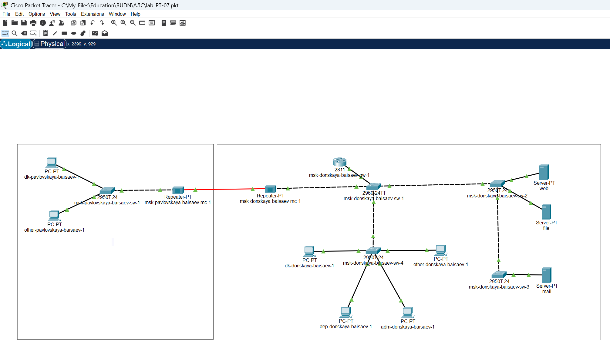

---
## Front matter
lang: ru-RU
title: Лабораторная Работа №7. Учёт физических параметров сети
subtitle: Администрирование локальных сетей
author:
  - Исаев Б.А.
institute:
  - Российский университет дружбы народов им. Патриса Лумумбы, Москва, Россия

## i18n babel
babel-lang: russian
babel-otherlangs: english

## Formatting pdf
toc: false
toc-title: Содержание
slide_level: 2
aspectratio: 169
section-titles: true
theme: metropolis
header-includes:
 - \metroset{progressbar=frametitle,sectionpage=progressbar,numbering=fraction}
 - '\makeatletter'
 - '\beamer@ignorenonframefalse'
 - '\makeatother'

## Fonts
mainfont: Arial
romanfont: Arial
sansfont: Arial
monofont: Arial
---

## Докладчик

  * Исаев Булат Абубакарович
  * НПИбд-01-22
  * Российский университет дружбы народов
  * [1132227131@pfur.ru]

## Новый проект
{#fig:001 width=70%}
**Рис. 1.1.** Открытие проекта lab_PT-07.pkt.

## Физическая рабочая область
{#fig:001 width=70%}
**Рис. 1.2.** Открытие физической рабочей области Packet Tracer и присвоение названия городу.

## Физическая рабочая область
{#fig:001 width=70%}
**Рис. 1.3.** Присвоение зданию названия Donskaya и добавление здания для территории Pavlovskaya.

## Физическая рабочая область
{#fig:001 width=70%}
**Рис. 1.4.** Перемещение изображения, обозначающее серверное помещение, внутрь здания.

## Физическая рабочая область
{#fig:001 width=70%}
**Рис. 1.5.** Перемещение коммутатора msk-pavlovskaya-baisaev-sw-1 на территорию Pavlovskaya. 

## Физическая рабочая область
{#fig:001 width=70%}
**Рис. 1.6.** Перемещение двух оконечных устройств (dk-pavlovskaya-1 и other-pavlovskaya-1)  на территорию Pavlovskaya.

## Ping
{#fig:001 width=70%}
**Рис. 1.7.** Пинг с коммутатора msk-donskaya-baisaev-sw-1 коммутатора msk-pavlovskaya-baisaev-sw-1 (проверка работоспособности соединения).

## Активация разрешения
{#fig:001 width=70%}
**Рис. 1.8.** Активация разрешения на учёт физических характеристик среды передачи.

## Физическая рабочая область
{#fig:001 width=70%}
**Рис. 1.9.** Размещение двух территорий на расстоянии более 100м друг от друга.

## Ping
{#fig:001 width=70%}
**Рис. 1.10.** Пинг с коммутатора msk-donskaya-baisaev-sw-1 коммутатора msk-pavlovskaya-baisaev-sw-1 (проверка неработоспособности соединения).

## Логическая рабочая область
{#fig:001 width=70%}
**Рис. 1.11.** Удаление соединения между msk-donskaya-baisaev-sw-1 и msk-pavlovskaya-baisaev-sw-1, добавление в логическую рабочую область двух повторителей и присвоение им названий (msk-donskaya-baisaev-mc-1 и msk-pavlovskaya-baisaev-mc-1).

## Логическая рабочая область
{#fig:001 width=70%}
**Рис. 1.12.** Замена имеющихся модулей на PT-REPEATERNM-1FFE и PT-REPEATER-NM-1CFE для подключения оптоволокна и витой пары по технологии Fast Ethernet.

## Физическая рабочая область
{#fig:001 width=70%}
**Рис. 1.13.** Перемещение msk-pavlovskaya-baisaev-mc-1 на территорию Pavlovskaya.

## Логическая рабочая область
{#fig:001 width=70%}
**Рис. 1.14.** Подключение: коммутатора msk-donskaya-baisaev-sw-1 к msk-donskaya-baisaev-mc-1 по витой паре, msk-donskaya-baisaev-mc-1 и msk-pavlovskaya-baisaev-mc-1 — по оптоволокну, msk-pavlovskaya-baisaev-sw-1 к msk-pavlovskaya-baisaev-mc-1 — по витой паре.

## Логическая рабочая область
{#fig:001 width=70%}
**Рис. 1.15.** Проверка работоспособности соединения между msk-donskaya-baisaev-sw-1 и msk-pavlovskaya-baisaev-sw-1.

## Вывод
В ходе выполнения лабораторной работы мы получили навыки работы с физической рабочей областью Packet Tracer, а также научились учитывать физические параметры сети.

## Спасибо за внимание!