**РОССИЙСКИЙ УНИВЕРСИТЕТ ДРУЖБЫ НАРОДОВ** 

**Факультет физико-математических и естественных наук Кафедра теории вероятностей и кибербезопасности** 

**ОТЧЁТ** 

**ПО ЛАБОРАТОРНОЙ РАБОТЕ №7** 
*дисциплина: Администрирование локальных сетей* 

Студент: Исаев Булат Абубакарович Студ. билет № 1132227131 

Группа: НПИбд-01-22

**МОСКВА** 2025 г.

**Цель работы:** 
Получить навыки работы с физической рабочей областью Packet Tracer, а также учесть физические параметры сети.

**Выполнение работы:** 
Откроем проект с названием lab_PT-06.pkt и сохраним под названием lab_PT-07.pkt. После чего откроем его для дальнейшего редактирования (Рис. 1.1):

**Рис. 1.1.** Открытие проекта lab_PT-07.pkt.

Перейдём в физическую рабочую область Packet Tracer и присвоим название городу — Moscow (Рис. 1.2):

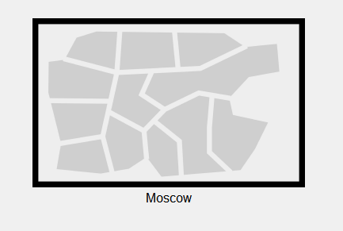
**Рис. 1.2.** Открытие физической рабочей области Packet Tracer и присвоение названия городу.

Щёлкнув на изображение города, мы видим изображение здания. Присвоим ему название Donskaya и добавим здание для территории Pavlovskaya (Рис. 1.3):

**Рис. 1.3.** Присвоение зданию названия Donskaya и добавление здания для территории Pavlovskaya.

Щёлкнув на изображение здания Donskaya, переместим изображение, обозначающее серверное помещение, в него (Рис. 1.4):

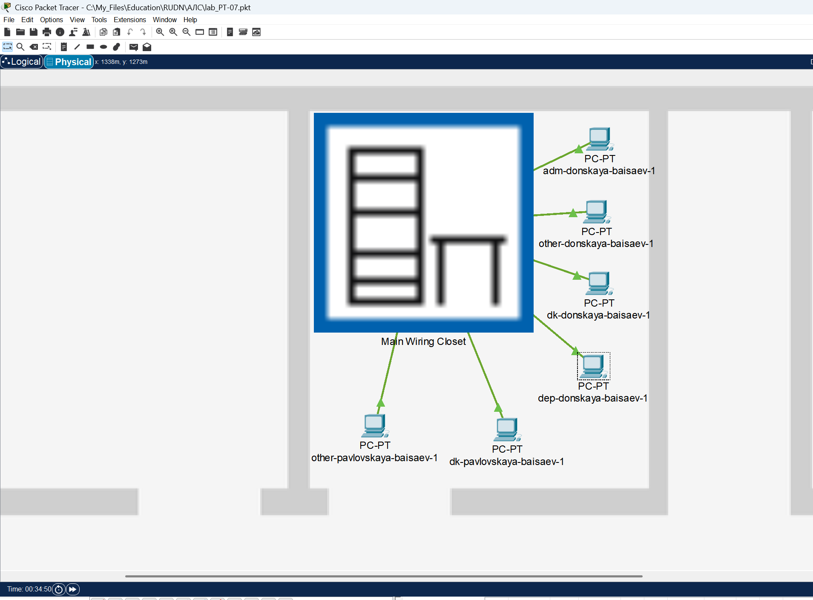
**Рис. 1.4.** Перемещение изображения, обозначающее серверное помещение, внутрь здания.

Затем, щёлкнув на изображение серверной, мы видим отображение серверных стоек. Переместим коммутатор msk-pavlovskaya-baisaev-sw-1 (Рис. 1.5) и два оконечных устройства dk-pavlovskaya-1 и other-pavlovskaya-1 (Рис. 1.6) на территорию Pavlovskaya, используя меню “Move” физической рабочей области Packet Tracer.

**Рис. 1.5.** Перемещение коммутатора msk-pavlovskaya-baisaev-sw-1 на территорию Pavlovskaya. 

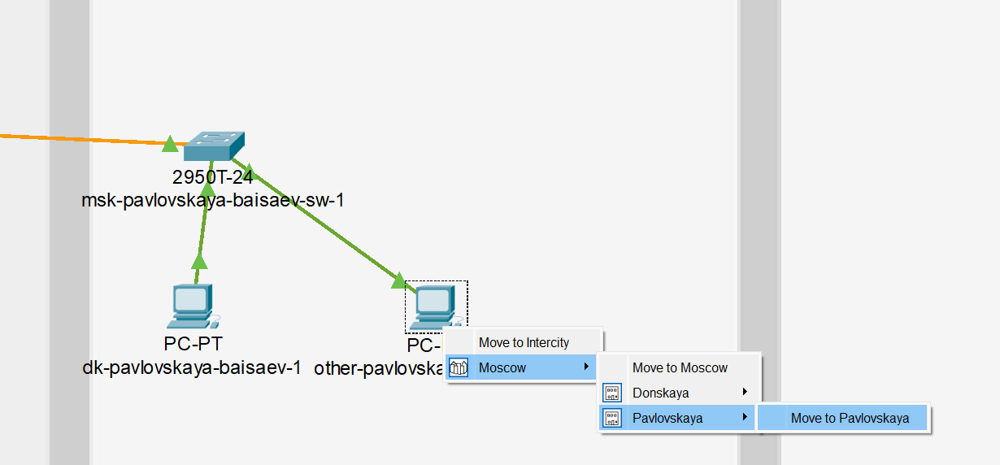
**Рис. 1.6.** Перемещение двух оконечных устройств (dk-pavlovskaya-1 и other-pavlovskaya-1)  на территорию Pavlovskaya.

Вернувшись в логическую рабочую область Packet Tracer, пропингуем с коммутатора msk-donskaya-baisaev-sw-1 коммутатор msk-pavlovskaya-baisaev-sw-1 и убедимся в работоспособности соединения (Рис. 1.7):

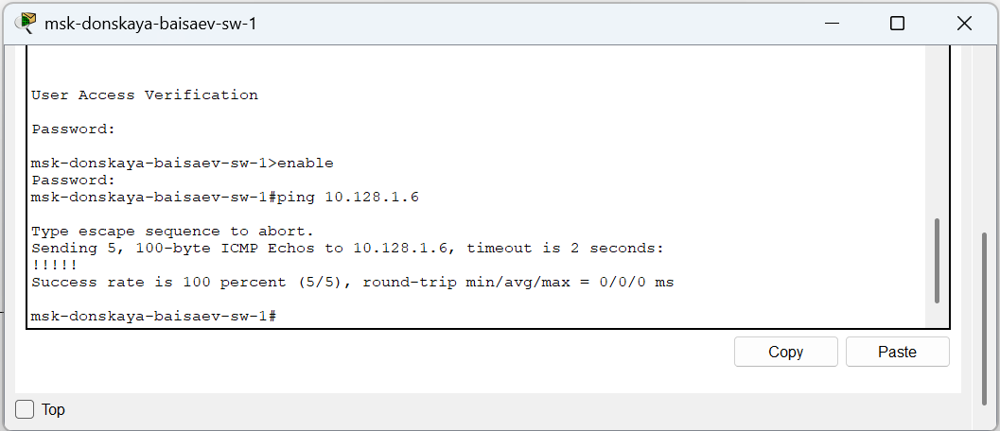
**Рис. 1.7.** Пинг с коммутатора msk-donskaya-baisaev-sw-1 коммутатора msk-pavlovskaya-baisaev-sw-1 (проверка работоспособности соединения).

Далее в меню “Options”, “Preferences” во вкладке “Interface” активируем разрешение на учёт физических характеристик среды передачи (Enable Cable Length Effects) (Рис. 1.8):

**Рис. 1.8.** Активация разрешения на учёт физических характеристик среды передачи.

Теперь в физической рабочей области Packet Tracer разместим две территории на расстоянии более 100 м друг от друга (Рис. 1.9):

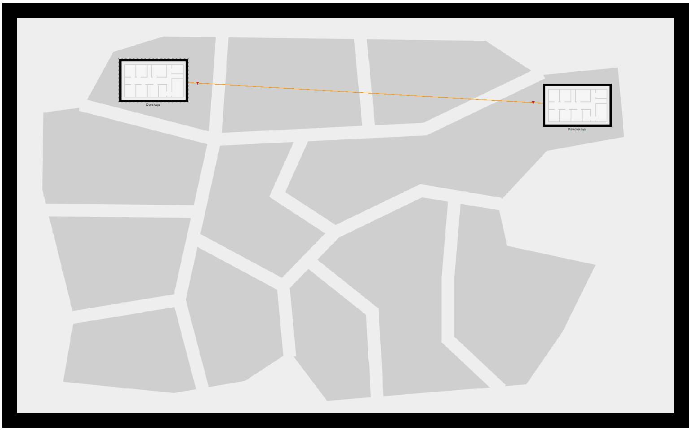
**Рис. 1.9.** Размещение двух территорий на расстоянии более 100м друг от друга.

Вернувшись в логическую рабочую область Packet Tracer, пропингуем с коммутатора msk-donskaya-baisaev-sw-1 коммутатор msk-pavlovskaya-baisaev-sw-1 и убедимся в неработоспособности соединения (Рис. 1.10):

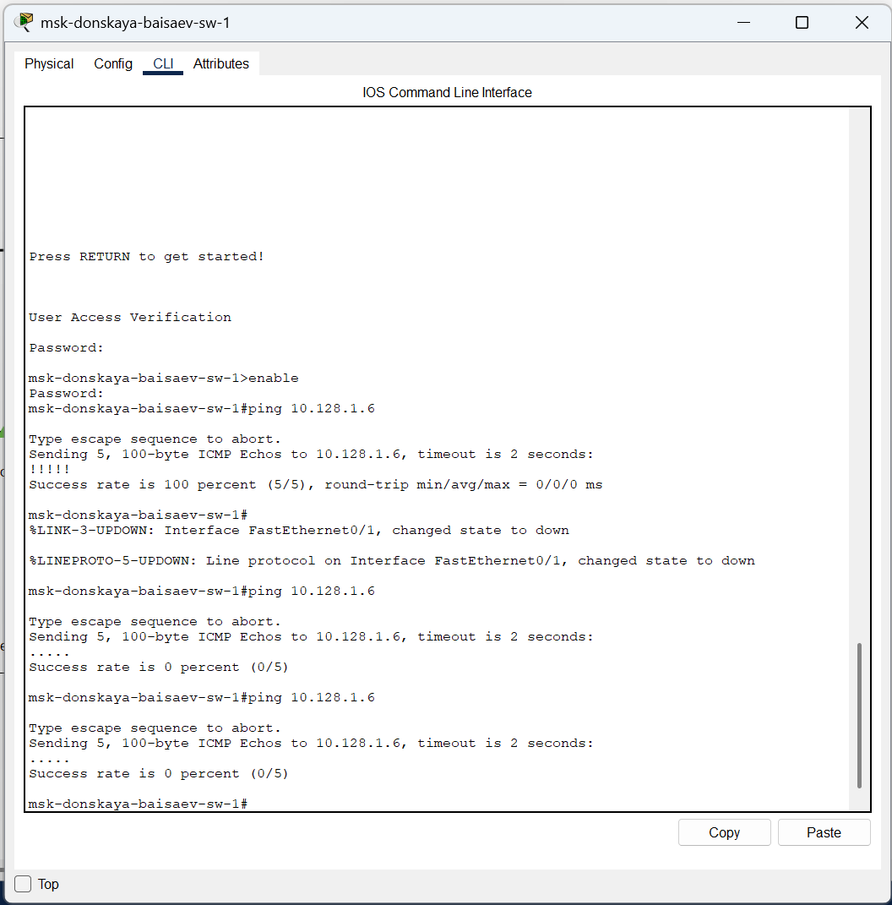
**Рис. 1.10.** Пинг с коммутатора msk-donskaya-baisaev-sw-1 коммутатора msk-pavlovskaya-baisaev-sw-1 (проверка неработоспособности соединения).

Далее удалим соединение между msk-donskaya-baisaev-sw-1 и msk-pavlovskaya-baisaev-sw-1 и добавим в логическую рабочую область два повторителя (Repeater-PT). Присвоим им соответствующие названия msk-donskaya-baisaev-mc-1 и msk-pavlovskaya-baisaev-mc-1 (Рис. 1.11). Внутри повторителей заменим имеющиеся модули на PT-REPEATERNM-1FFE и PT-REPEATER-NM-1CFE для подключения оптоволокна и витой пары по технологии Fast Ethernet (Рис. 1.12):

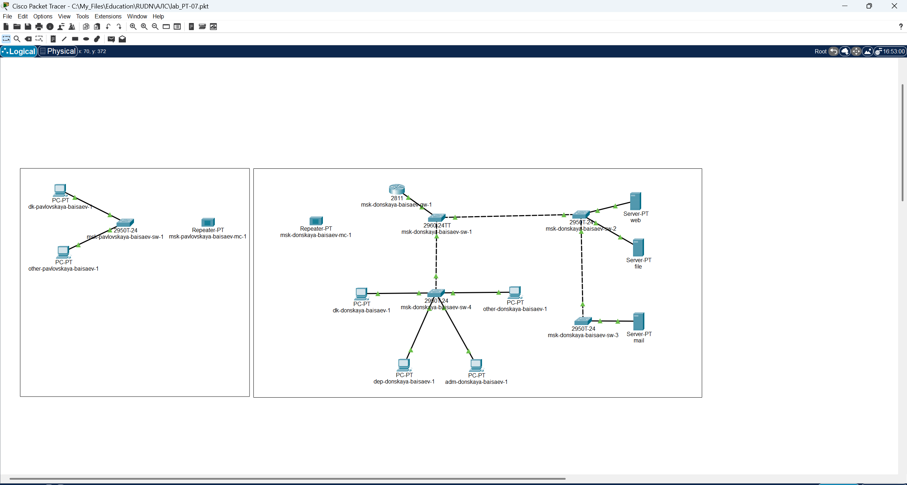
**Рис. 1.11.** Удаление соединения между msk-donskaya-baisaev-sw-1 и msk-pavlovskaya-baisaev-sw-1, добавление в логическую рабочую область двух повторителей и присвоение им названий (msk-donskaya-baisaev-mc-1 и msk-pavlovskaya-baisaev-mc-1).

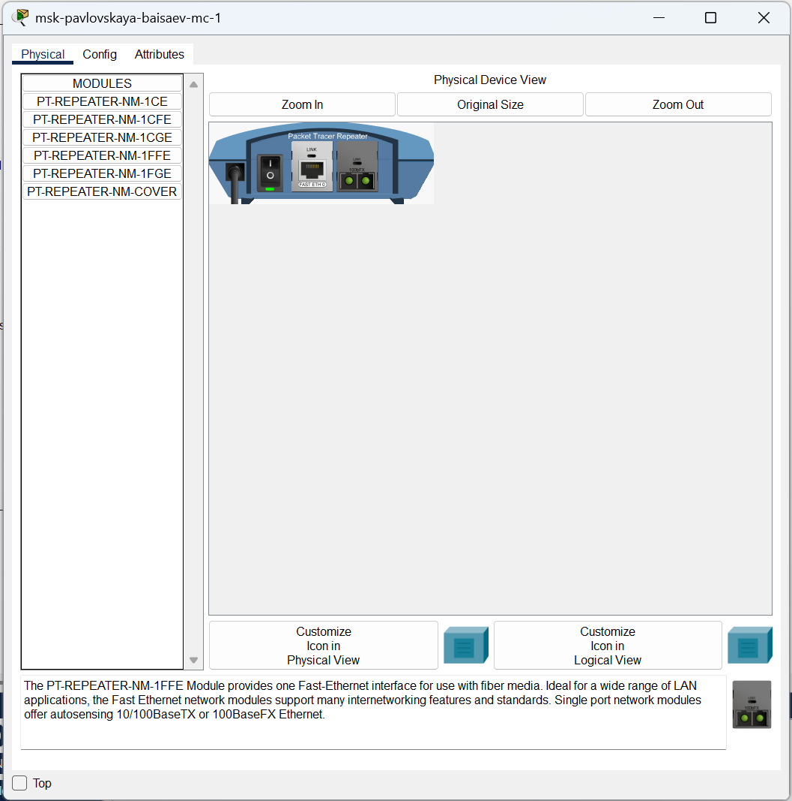
**Рис. 1.12.** Замена имеющихся модулей на PT-REPEATERNM-1FFE и PT-REPEATER-NM-1CFE для подключения оптоволокна и витой пары по технологии Fast Ethernet.

Переместим msk-pavlovskaya-baisaev-mc-1 на территорию Pavlovskaya (в физической рабочей области Packet Tracer) (Рис. 1.13):

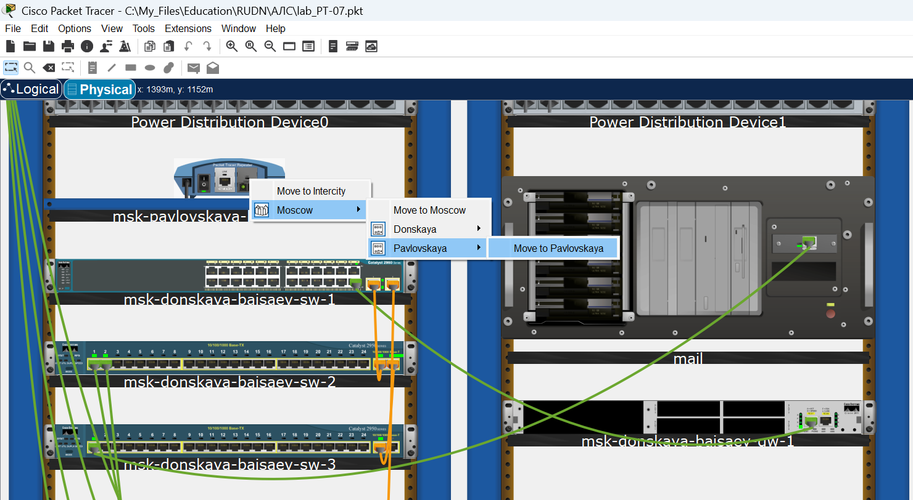
**Рис. 1.13.** Перемещение msk-pavlovskaya-baisaev-mc-1 на территорию Pavlovskaya.

Теперь подключим коммутатор msk-donskaya-baisaev-sw-1 к msk-donskaya-baisaev-mc-1 по витой паре, msk-donskaya-baisaev-mc-1 и msk-pavlovskaya-baisaev-mc-1 — по оптоволокну, msk-pavlovskaya-baisaev-sw-1 к msk-pavlovskaya-baisaev-mc-1 — по витой паре (Рис. 1.14):

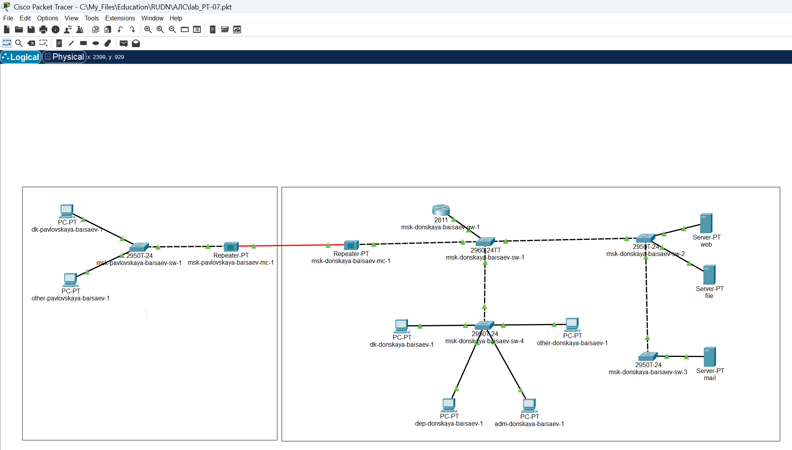
**Рис. 1.14.** Подключение: коммутатора msk-donskaya-baisaev-sw-1 к msk-donskaya-baisaev-mc-1 по витой паре, msk-donskaya-baisaev-mc-1 и msk-pavlovskaya-baisaev-mc-1 — по оптоволокну, msk-pavlovskaya-baisaev-sw-1 к msk-pavlovskaya-baisaev-mc-1 — по витой паре.

Убедимся в работоспособности соединения между msk-donskaya-baisaev-sw-1 и msk-pavlovskaya-baisaev-sw-1 (Рис. 1.15):

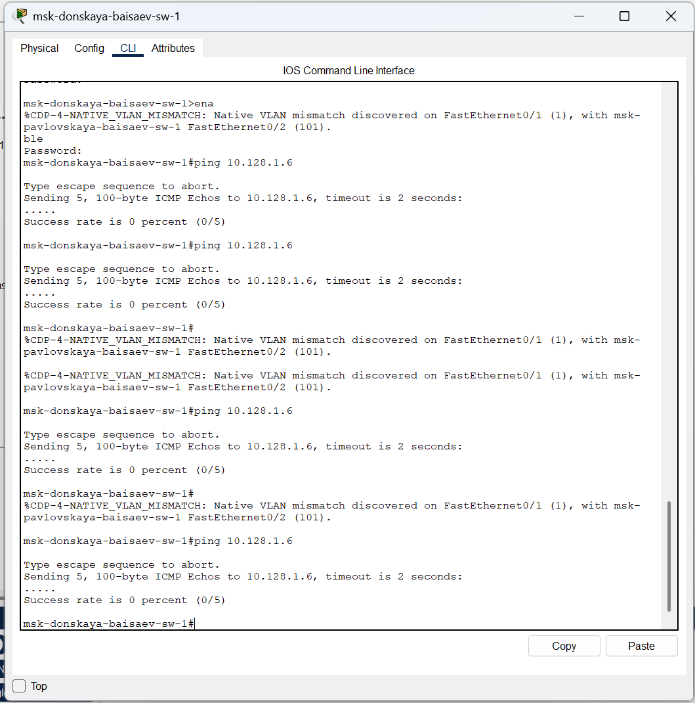
**Рис. 1.15.** Проверка работоспособности соединения между msk-donskaya-baisaev-sw-1 и msk-pavlovskaya-baisaev-sw-1.

**Вывод:** 
В ходе выполнения лабораторной работы мы получили навыки работы с физической рабочей областью Packet Tracer, а также научились учитывать физические параметры сети.

**Ответы на контрольные вопросы:** 

1.	Перечислите возможные среды передачи данных. На какие характеристики среды передачи данных следует обращать внимание при планировании сети?  - **Коаксиал, витая пара, оптоволокно, беспроводные. Допустимое расстояние, скорость передачи, реальные физические факторы для беспроводных сетей** 

2.	Перечислите категории витой пары. Чем они отличаются? Какая категория в каких условиях может применяться?  - **Существует несколько категорий кабеля «витая пара», которые нумеруются от 1 до 8 и определяют эффективный пропускаемый частотный диапазон Категории отличаются диапазоном частот, строением кабелей, скоростью передачи. Применяются в зависимости от требуемой скорости передачи/века.** 

3.	В чем отличие одномодового и многомодового оптоволокна? Какой тип кабеля в каких условиях может применяться?  - **- В количестве проходящих лучей. Одномодовые — дороже, многомодовые — охватывают меньшее расстояние.** 

4.	Какие разъёмы встречаются на патчах оптоволокна? Чем они отличаются?  - **SC — высокая скорость и плотность коммутации, ненадежный корпус. ST — меньшая плотность коммутации, надежный корпус. FC — большая сложность коммутации** 
