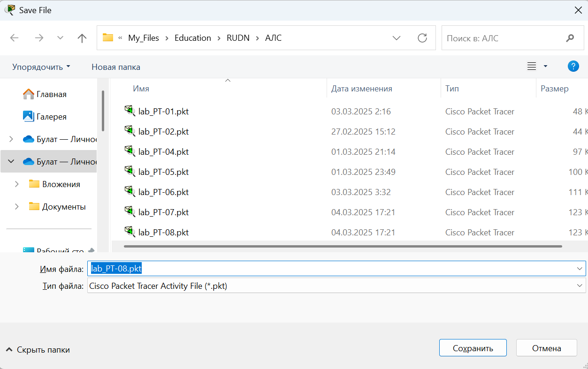
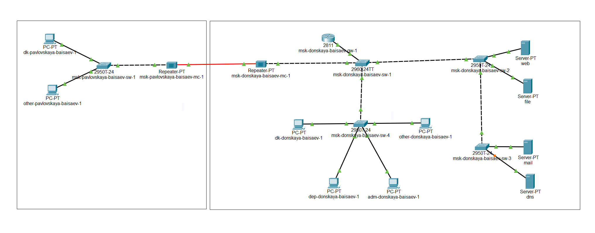
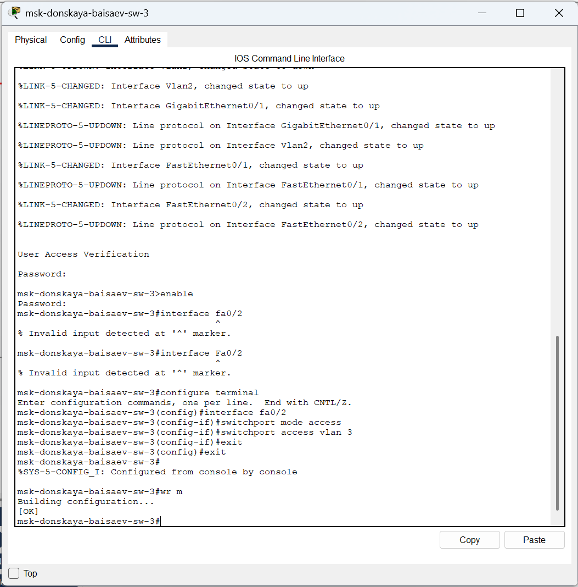
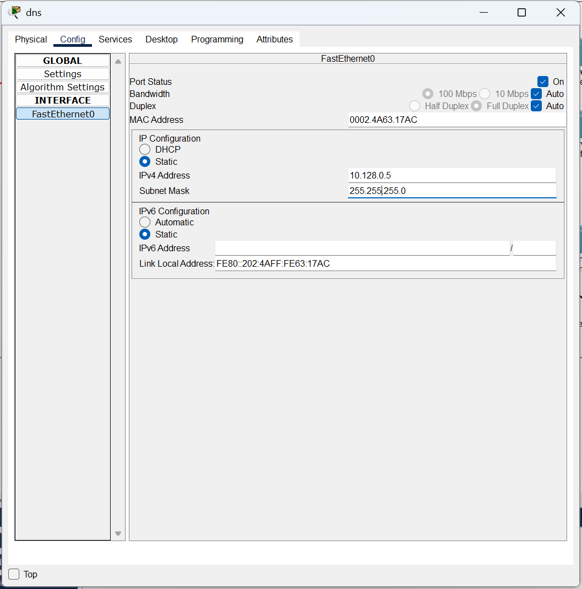
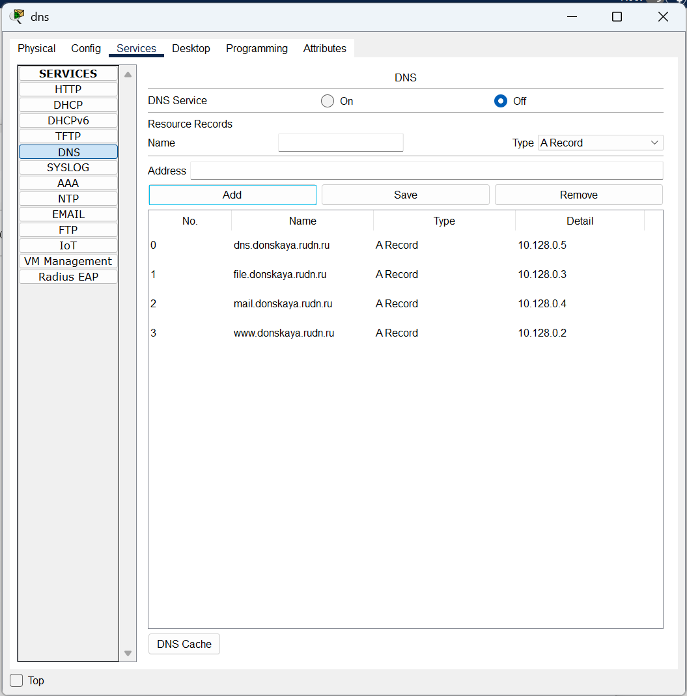
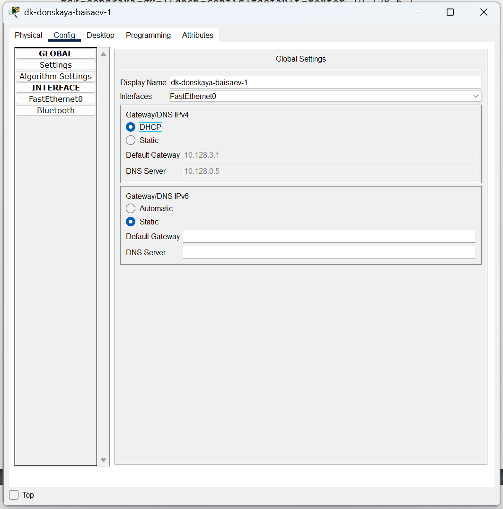
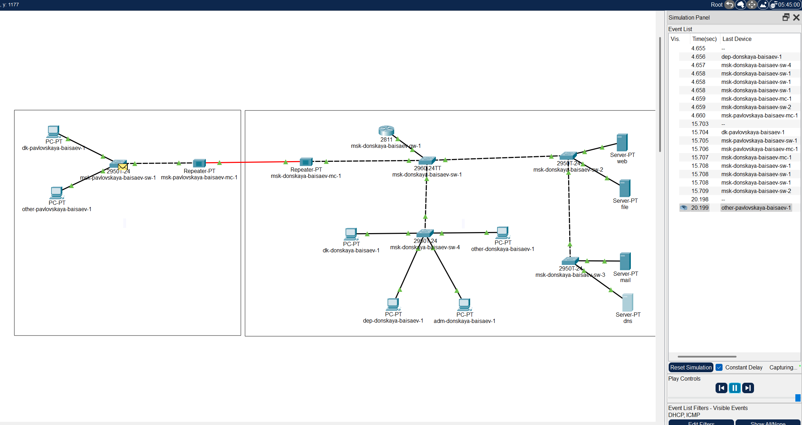

---
## Front matter
lang: ru-RU
title: Лабораторная Работа №8. Настройка сетевых сервисов. DHCP.
subtitle: Администрирование локальных сетей
author:
  - Исаев Б.А.
institute:
  - Российский университет дружбы народов им. Патриса Лумумбы, Москва, Россия

## i18n babel
babel-lang: russian
babel-otherlangs: english

## Formatting pdf
toc: false
toc-title: Содержание
slide_level: 2
aspectratio: 169
section-titles: true
theme: metropolis
header-includes:
 - \metroset{progressbar=frametitle,sectionpage=progressbar,numbering=fraction}
 - '\makeatletter'
 - '\beamer@ignorenonframefalse'
 - '\makeatother'

## Fonts
mainfont: Arial
romanfont: Arial
sansfont: Arial
monofont: Arial
---

## Докладчик

  * Исаев Булат Абубакарович
  * НПИбд-01-22
  * Российский университет дружбы народов
  * [1132227131@pfur.ru]

## Новый проект
{#fig:001 width=70%}
**Рис. 1.1.** Открытие проекта lab_PT-08.pkt.

## Добавление сервера dns
{#fig:001 width=70%}
**Рис. 1.2.** Добавление сервера dns в логическую рабочую область проекта и подключение его к коммутатору msk-donskaya-baisaev-sw-3.

## Активация порта
{#fig:001 width=70%}
**Рис. 1.3.** Активация порта на коммутаторе.

## Настройка конфигурации сервера
{#fig:001 width=70%}
**Рис. 1.4.** Настройка конфигурации сервера (адрес шлюза - 10.128.0.1, адрес сервера — 10.128.0.5, маска 255.255.255.0).

## Настройка сервиса DNS
{#fig:001 width=70%}
**Рис. 1.5.** Настройка сервиса DNS (активация службы DNS, выбор типа записи A Record, указание доменного имени и IP-адреса, добавление записи на сервер). 

## Настройка DHCP-сервиса на маршрутизаторе
{#fig:001 width=70%}
**Рис. 1.6.** Настройка DHCP-сервиса на маршрутизаторе (указание IP-адреса DNS-сервера и переход к настройке DHCP. Настройка названия конфигурируемому диапазону адресов, адресу шлюза и DNS-серверу. Настройка пула адресов, исключаемых из динамического распределения).

## Замена статического распределение
{#fig:001 width=70%}
**Рис. 1.7.** Замена статического распределение адресов на динамическое на оконечных устройствах.

## Проверка выделения адресов
{#fig:001 width=70%}
**Рис. 1.8.** Проверка выделения адресов оконечным устройствам.

## Изучение запроса
{#fig:001 width=70%}
**Рис. 1.9.** Изучение запроса адреса по протоколу DHCP в режиме симуляции.

## Вывод
В ходе выполнения лабораторной работы мы приобрели практические навыки по настройке динамического распределения IP-адресов посредством протокола DHCP (Dynamic Host Configuration Protocol) в локальной сети.

## Спасибо за внимание!