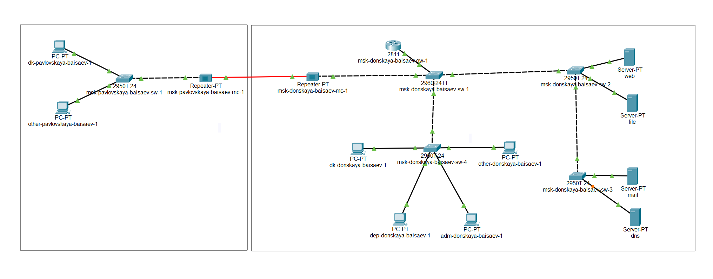
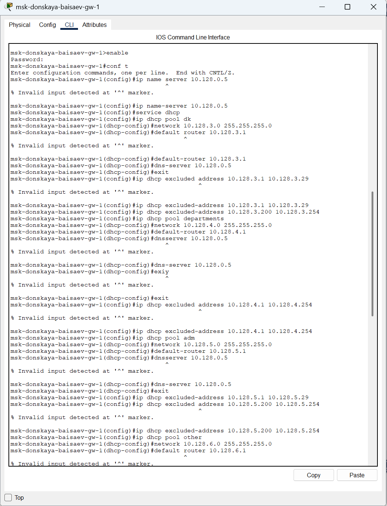

---
## Front matter
lang: ru-RU
title: Лабораторная Работа №8. Настройка сетевых сервисов. DHCP.
subtitle: Администрирование локальных сетей
author:
  - Исаев Б.А.
institute:
  - Российский университет дружбы народов им. Патриса Лумумбы, Москва, Россия

## i18n babel
babel-lang: russian
babel-otherlangs: english

## Formatting pdf
toc: false
toc-title: Содержание
slide_level: 2
aspectratio: 169
section-titles: true
theme: metropolis
header-includes:
 - \metroset{progressbar=frametitle,sectionpage=progressbar,numbering=fraction}
 - '\makeatletter'
 - '\beamer@ignorenonframefalse'
 - '\makeatother'

## Fonts
mainfont: Arial
romanfont: Arial
sansfont: Arial
monofont: Arial
---

## Докладчик

  * Исаев Булат Абубакарович
  * НПИбд-01-22
  * Российский университет дружбы народов
  * [1132227131@pfur.ru]

## Новый проект

{ #fig:001 width=70%}

## Добавление сервера dns

{ #fig:002 width=70% }

## Активация порта

{ #fig:003 width=70% }

## Настройка конфигурации сервера

{ #fig:004 width=70% }

## Настройка сервиса DNS

{ #fig:005 width=70% }

## Настройка DHCP-сервиса на маршрутизаторе

{ #fig:006 width=70% }

## Замена статического распределение

{ #fig:007 width=70% }

## Проверка выделения адресов

{ #fig:008 width=70% }

## Изучение запроса

{ #fig:009 width=70% }

## Вывод
В ходе выполнения лабораторной работы мы получили навыки работы с физической рабочей областью Packet Tracer, а также научились учитывать физические параметры сети.
