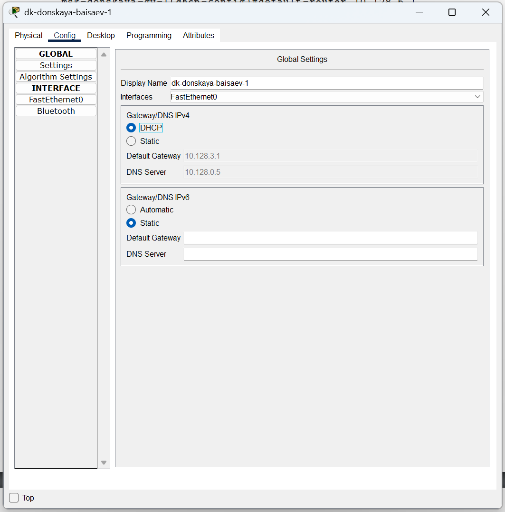
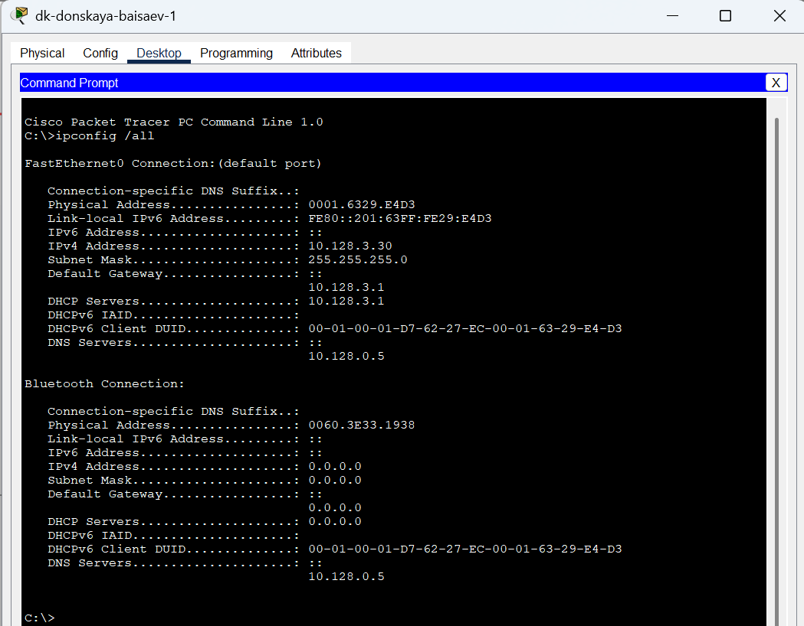

**РОССИЙСКИЙ УНИВЕРСИТЕТ ДРУЖБЫ НАРОДОВ** 

**Факультет физико-математических и естественных наук Кафедра теории вероятностей и кибербезопасности** 

**ОТЧЁТ** 

**ПО ЛАБОРАТОРНОЙ РАБОТЕ №8** 
*дисциплина: Администрирование локальных сетей* 

Студент: Исаев Булат Абубакарович Студ. билет № 1132227131 

Группа: НПИбд-01-22

**МОСКВА** 2025 г.

**Цель работы:** 
Приобрести практические навыки по настройке динамического распределения IP-адресов посредством протокола DHCP (Dynamic Host Configuration Protocol) в локальной сети.

**Выполнение работы:** 
Откроем проект с названием lab_PT-07.pkt и сохраним под названием lab_PT-08.pkt. После чего откроем его для дальнейшего редактирования (Рис. 1.1):

**Рис. 1.1.** Открытие проекта lab_PT-08.pkt.

В логическую рабочую область проекта добавим сервер dns и подключим его к коммутатору msk-donskaya-baisaev-sw-3 через порт Fa0/2 (Рис. 1.2):

**Рис. 1.2.** Добавление сервера dns в логическую рабочую область проекта и подключение его к коммутатору msk-donskaya-baisaev-sw-3.

Далее активируем порт при помощи соответствующих команд на коммутаторе (Рис. 1.3):

**Рис. 1.3.** Активация порта на коммутаторе.

В конфигурации сервера укажем в качестве адреса шлюза 10.128.0.1, а в качестве адреса самого сервера — 10.128.0.5 с соответствующей маской 255.255.255.0 (Рис. 1.4):

**Рис. 1.4.** Настройка конфигурации сервера (адрес шлюза - 10.128.0.1, адрес сервера — 10.128.0.5, маска 255.255.255.0).

Далее настроим сервис DNS (Рис. 1.5): 
•	в конфигурации сервера выберем службу DNS, активируем её (выбрав флаг On); 
•	в поле Type в качестве типа записи DNS выберем записи типа A (A Record); 
•	в поле Name укажием доменное имя, по которому можно обратиться (к web-серверу — www.donskaya.rudn.ru), затем укажем его IP-адрес в соответствующем поле (10.128.0.2); 
•	нажав на кнопку Add, добавим DNS-запись на сервер; 
•	аналогичным образом добавим DNS-записи для серверов mail, file, dns; 
•	сохраним конфигурацию сервера.

**Рис. 1.5.** Настройка сервиса DNS (активация службы DNS, выбор типа записи A Record, указание доменного имени и IP-адреса, добавление записи на сервер).

Настроим DHCP-сервис на маршрутизаторе, используя команды из лабораторной работы для каждой выделенной сети (Рис. 1.6): 
•	укажем IP-адрес DNS-сервера; 
•	перейдём к настройке DHCP; 
•	зададим название конфигурируемому диапазону адресов (пулу адресов), укажем адрес сети, а также адреса шлюза и DNS-сервера; 
•	зададим пулы адресов, исключаемых из динамического распределения.

**Рис. 1.6.** Настройка DHCP-сервиса на маршрутизаторе (указание IP-адреса DNS-сервера и переход к настройке DHCP. Настройка названия конфигурируемому диапазону адресов, адресу шлюза и DNS-серверу. Настройка пула адресов, исключаемых из динамического распределения). 

На оконечных устройствах заменим в настройках статическое распределение адресов на динамическое (Рис. 1.7):

**Рис. 1.7.** Замена статического распределение адресов на динамическое на оконечных устройствах.

Затем проверим, какие адреса выделяются оконечным устройствам (Рис. 1.8):

**Рис. 1.8.** Проверка выделения адресов оконечным устройствам.

Не забываем также проверить доступность устройств из разных подсетей (Рис. 1.9):

**Рис. 1.9.** Изучение запроса адреса по протоколу DHCP в режиме симуляции.

**Вывод:** 
В ходе выполнения лабораторной работы мы приобрели практические навыки по настройке динамического распределения IP-адресов посредством протокола DHCP (Dynamic Host Configuration Protocol) в локальной сети.

**Ответы на контрольные вопросы:** 

1.	За что отвечает протокол DHCP? - **За автоматическое получение IP и других параметров.** 

2.	Какие типы DHCP-сообщений передаются по сети? - **•	DHCPDISCOVER (клиент - сервер) — начальное сообщение.**
**•	DHCPOFFER (сервер - клиент) — ответ на начальное сообщение с сетевыми настройками.**
**•	DHCPREQUEST (клиент - сервер) — настройки приняты.**
**•	DHCPACK (сервер - клиент) — авторизация клиента, настройки приняты.**
**•	DHCPNAK (сервер - клиент) — авторизация невозможна.**
**•	DHCPDECLINE (клиент - сервер) — IP уже используется.**
**•	DHCPINFORM (клиент - сервер) — присвоен статический IP, а нужен динамический.**
**•	DHCPRELEASE (клиент - сервер) — завершение использования IP.**

3.	Какие параметры могут быть переданы в сообщениях DHCP?  -  **По умолчанию запросы от клиента делаются к серверу на порт 67, сервер в свою очередь отвечает клиенту на порт 68, выдавая адрес IP и другую необходимую информацию, такую, как сетевую маску, маршрутизатор и серверы DNS.** 

4.	Что такое DNS? - **Система, ставящая в соответствие доменному имени хоста IP и наоборот** 

5.	Какие типы записи описания ресурсов есть в DNS и для чего они используются? –  **•	RR-записи описывают все узлы сети в зоне и помечают делегирование поддоменов.**
**•	SOA-запись — указывает на авторитативность для зоны.**
**•	NS-запись — перечисляет DNS-серверы зоны.**
**•	А — задаёт отображение имени узла в IP.**
**•	PTR — задаёт отображение IP в имя узла.** 