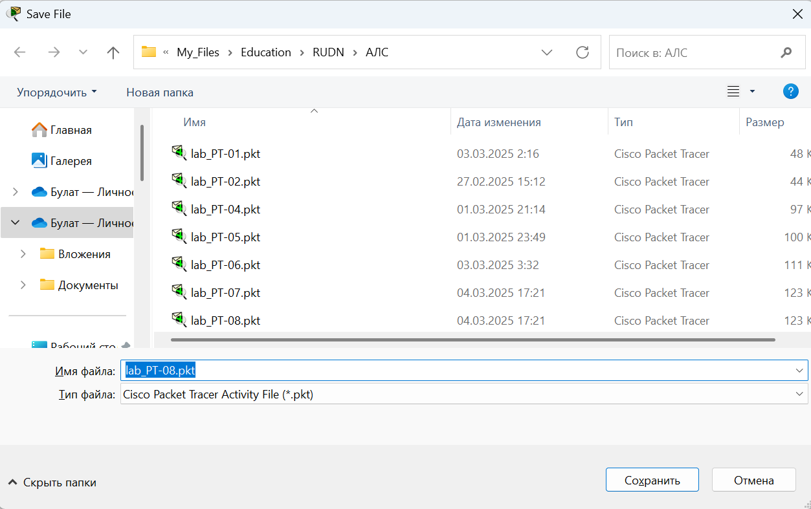
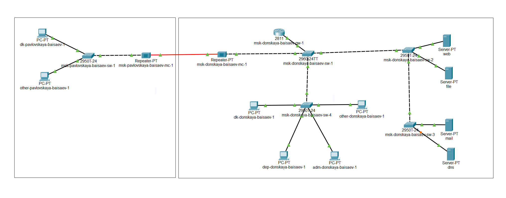
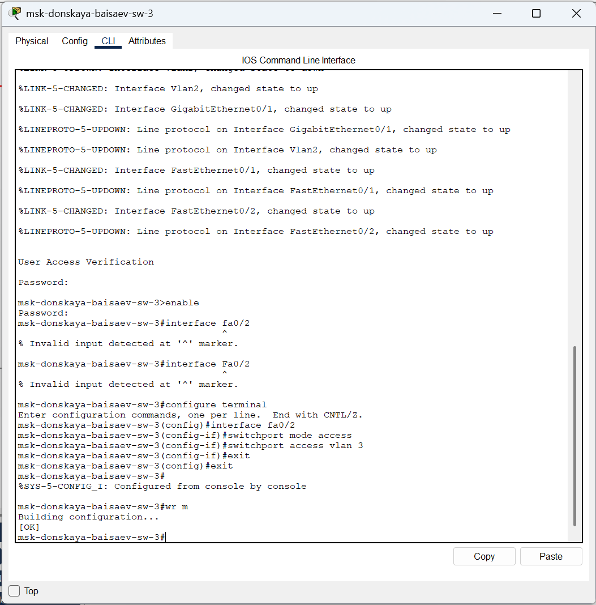
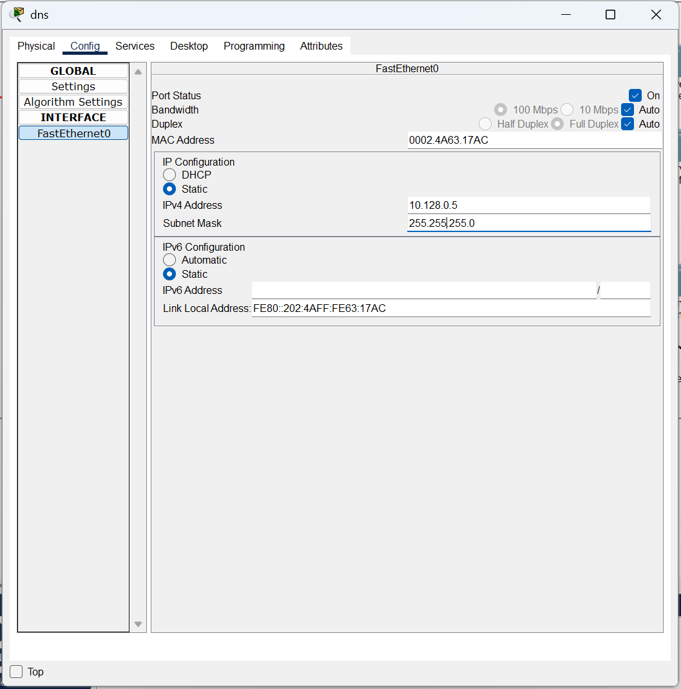
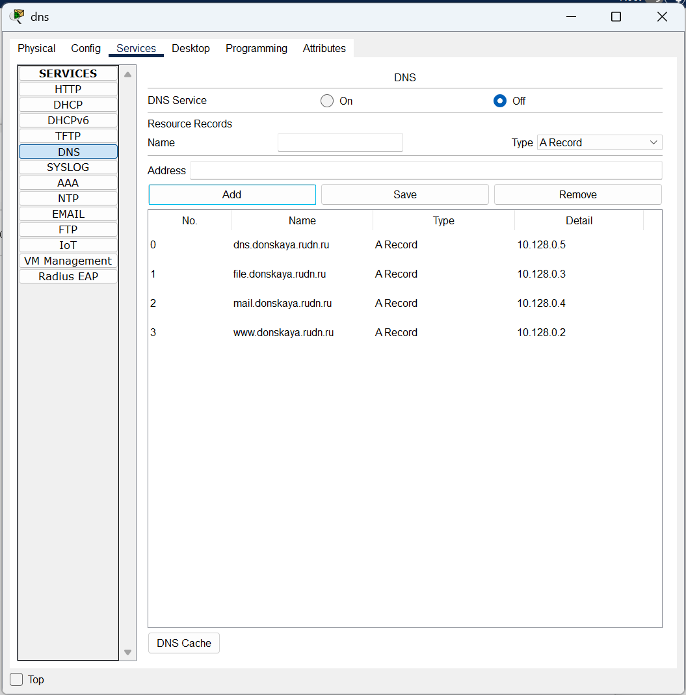
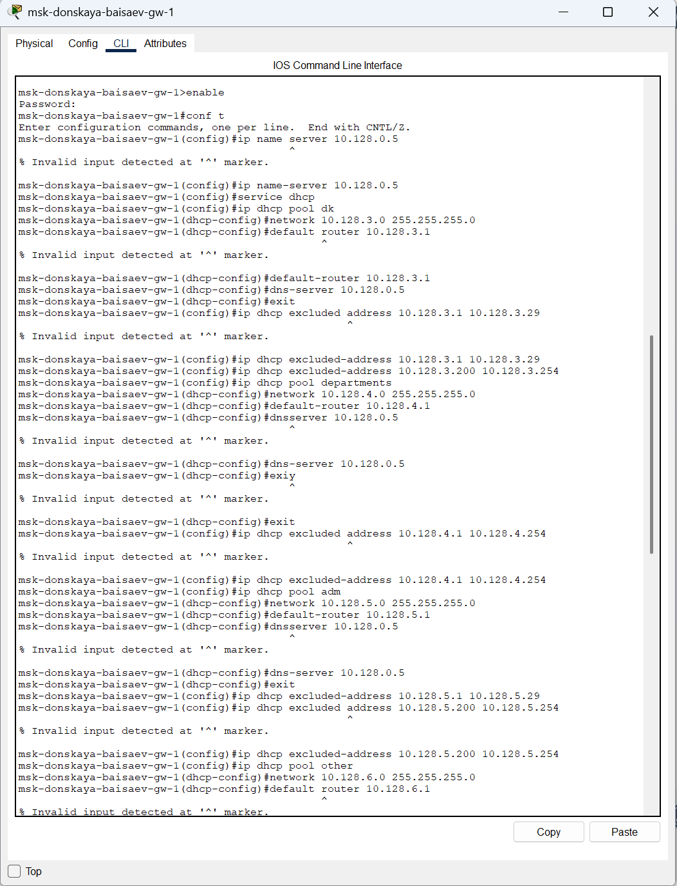
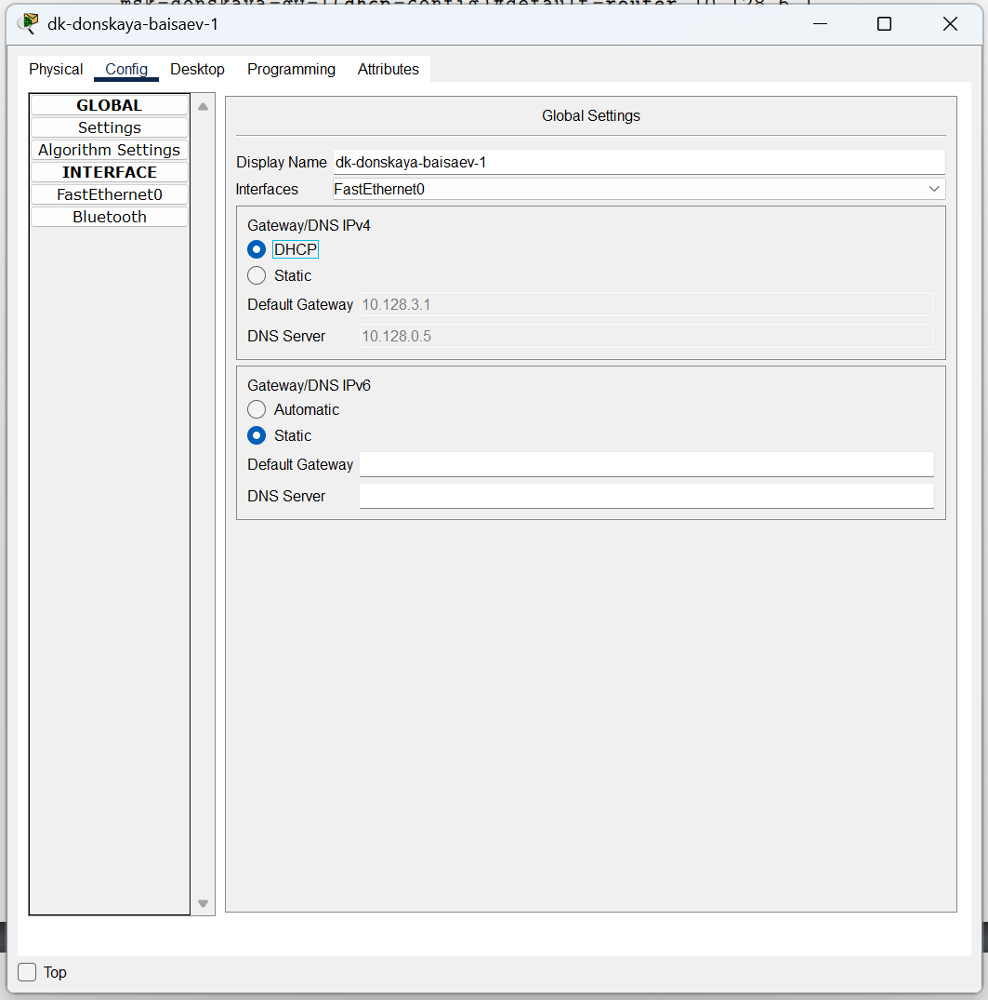
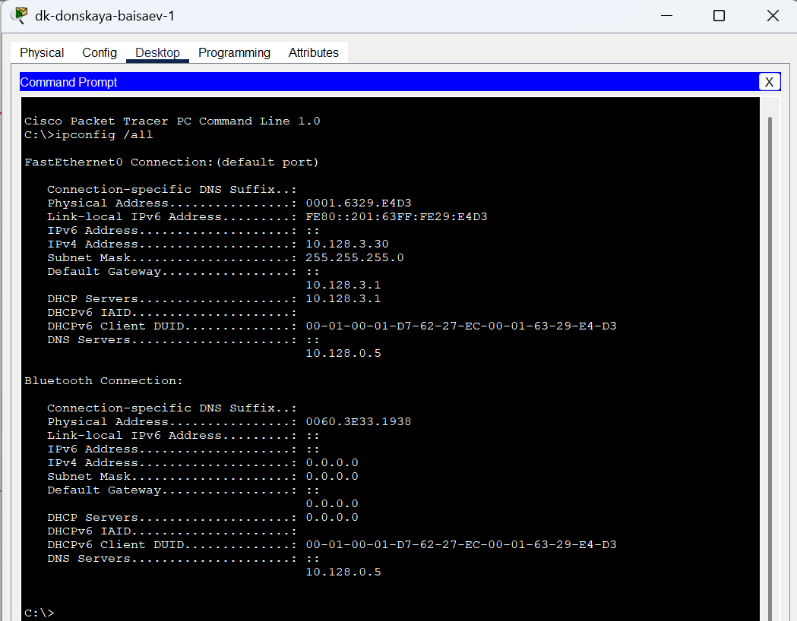
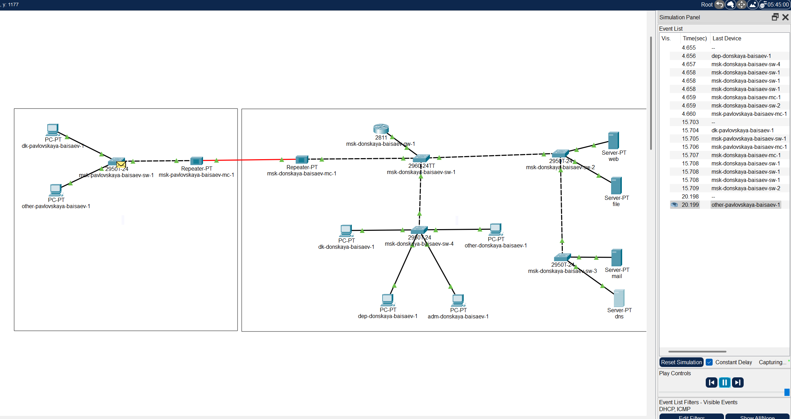

---
## Front matter
title: "Отчёт по лабораторной работе №8"
subtitle: "Дисциплина: Администрирование локальных сетей"
author: "Исаев Булат Абубакарович НПИбд-01-22"

## Generic otions
lang: ru-RU
toc-title: "Содержание"

## Bibliography
bibliography: bib/cite.bib
csl: pandoc/csl/gost-r-7-0-5-2008-numeric.csl

## Pdf output format
toc: true # Table of contents
toc-depth: 2
lof: true # List of figures
lot: true # List of tables
fontsize: 12pt
linestretch: 1.5
papersize: a4
documentclass: scrreprt
## I18n polyglossia
polyglossia-lang:
  name: russian
polyglossia-otherlangs:
  name: english
## I18n babel
babel-lang: russian
babel-otherlangs: english
## Fonts
mainfont: Arial
romanfont: Arial
sansfont: Arial
monofont: Arial
mainfontoptions: Ligatures=TeX
romanfontoptions: Ligatures=TeX
sansfontoptions: Ligatures=TeX,Scale=MatchLowercase
monofontoptions: Scale=MatchLowercase,Scale=0.9
## Biblatex
biblatex: true
biblio-style: "gost-numeric"
biblatexoptions:
  - parentracker=true
  - backend=biber
  - hyperref=auto
  - language=auto
  - autolang=other*
  - citestyle=gost-numeric
## Pandoc-crossref LaTeX customization
figureTitle: "Рис."
tableTitle: "Таблица"
listingTitle: "Листинг"
lofTitle: "Список иллюстраций"
lotTitle: "Список таблиц"
lolTitle: "Листинги"
## Misc options
indent: true
header-includes:
  - \usepackage{indentfirst}
  - \usepackage{float} # keep figures where there are in the text
  - \floatplacement{figure}{H} # keep figures where there are in the text
---

# Цель работы
Приобрести практические навыки по настройке динамического распределения IP-адресов посредством протокола DHCP (Dynamic Host Configuration Protocol) в локальной сети. (рис. [-@fig:001]) 

# Выполнение лабораторной работы
Откроем проект с названием lab_PT-07.pkt и сохраним под названием lab_PT-08.pkt. После чего откроем его для дальнейшего редактирования

{ #fig:001 width=70% }

В логическую рабочую область проекта добавим сервер dns и подключим его к коммутатору msk-donskaya-baisaev-sw-3 через порт Fa0/2  (рис. [-@fig:002]) 

{ #fig:002 width=70% }

Далее активируем порт при помощи соответствующих команд на коммутаторе  (рис. [-@fig:003]) 

{ #fig:003 width=70% }

В конфигурации сервера укажем в качестве адреса шлюза 10.128.0.1, а в качестве адреса самого сервера — 10.128.0.5 с соответствующей маской 255.255.255.0  (рис. [-@fig:004]) 

{ #fig:004 width=70% }

Далее настроим сервис DNS  (рис. [-@fig:005])
•	в конфигурации сервера выберем службу DNS, активируем её (выбрав флаг On); 
•	в поле Type в качестве типа записи DNS выберем записи типа A (A Record); 
•	в поле Name укажием доменное имя, по которому можно обратиться (к web-серверу — www.donskaya.rudn.ru), затем укажем его IP-адрес в соответствующем поле (10.128.0.2); 
•	нажав на кнопку Add, добавим DNS-запись на сервер; 
•	аналогичным образом добавим DNS-записи для серверов mail, file, dns; 
•	сохраним конфигурацию сервера. 

{ #fig:005 width=70% }

Настроим DHCP-сервис на маршрутизаторе, используя команды из лабораторной работы для каждой выделенной сети  (рис. [-@fig:006]) 
•	укажем IP-адрес DNS-сервера; 
•	перейдём к настройке DHCP; 
•	зададим название конфигурируемому диапазону адресов (пулу адресов), укажем адрес сети, а также адреса шлюза и DNS-сервера; 
•	зададим пулы адресов, исключаемых из динамического распределения.

{ #fig:006 width=70% }

На оконечных устройствах заменим в настройках статическое распределение адресов на динамическое  (рис. [-@fig:007]) 

{ #fig:007 width=70% }

Затем проверим, какие адреса выделяются оконечным устройствам  (рис. [-@fig:008]) 

{ #fig:008 width=70% }

Не забываем также проверить доступность устройств из разных подсетей  (рис. [-@fig:009]) 

{ #fig:009 width=70% }

# Вывод

В ходе выполнения лабораторной работы мы приобрели практические навыки по настройке динамического распределения IP-адресов посредством протокола DHCP (Dynamic Host Configuration Protocol) в локальной сети.

##  Контрольные вопросы

1. За что отвечает протокол DHCP?
  
   **За автоматическое получение IP и других параметров.** 

2. Какие типы DHCP-сообщений передаются по сети?
  
    **•	DHCPDISCOVER (клиент - сервер) — начальное сообщение.**
    **•	DHCPOFFER (сервер - клиент) — ответ на начальное сообщение с сетевыми настройками.**
    **•	DHCPREQUEST (клиент - сервер) — настройки приняты.**
    **•	DHCPACK (сервер - клиент) — авторизация клиента, настройки приняты.**
    **•	DHCPNAK (сервер - клиент) — авторизация невозможна.**
    **•	DHCPDECLINE (клиент - сервер) — IP уже используется.**
    **•	DHCPINFORM (клиент - сервер) — присвоен статический IP, а нужен динамический.**
    **•	DHCPRELEASE (клиент - сервер) — завершение использования IP.**

3. Какие параметры могут быть переданы в сообщениях DHCP?
  
    **По умолчанию запросы от клиента делаются к серверу на порт 67, сервер в свою очередь отвечает клиенту на порт 68, выдавая адрес IP и другую необходимую информацию, такую, как сетевую маску, маршрутизатор и серверы DNS.** 

4. Что такое DNS?
  
    **Система, ставящая в соответствие доменному имени хоста IP и наоборот** 

5. Какие типы записи описания ресурсов есть в DNS и для чего они используются? 
  
    **•	RR-записи описывают все узлы сети в зоне и помечают делегирование поддоменов.**
    **•	SOA-запись — указывает на авторитативность для зоны.**
    **•	NS-запись — перечисляет DNS-серверы зоны.**
    **•	А — задаёт отображение имени узла в IP.**
    **•	PTR — задаёт отображение IP в имя узла.** 

