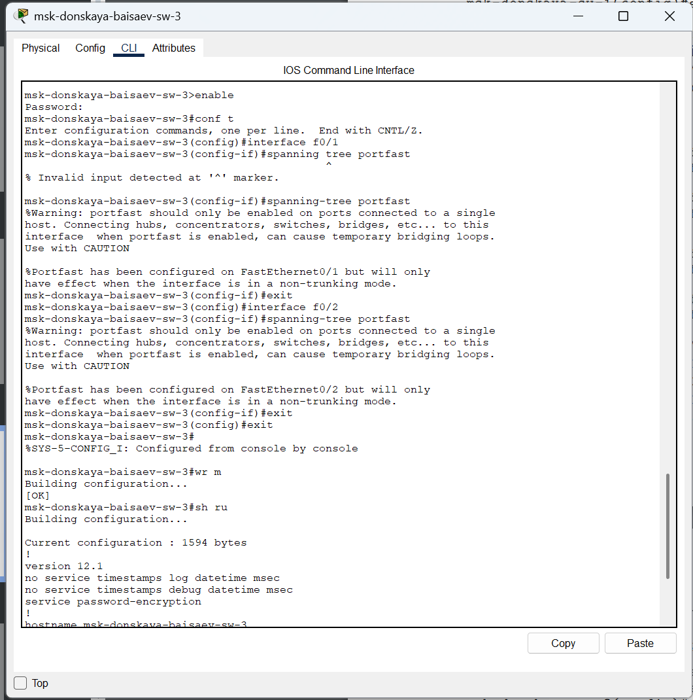

---
## Front matter
title: "Отчёт по лабораторной работе №9"
subtitle: "Дисциплина: Администрирование локальных сетей"
author: "Исаев Булат Абубакарович НПИбд-01-22"

## Generic otions
lang: ru-RU
toc-title: "Содержание"

## Bibliography
bibliography: bib/cite.bib
csl: pandoc/csl/gost-r-7-0-5-2008-numeric.csl

## Pdf output format
toc: true # Table of contents
toc-depth: 2
lof: true # List of figures
lot: true # List of tables
fontsize: 12pt
linestretch: 1.5
papersize: a4
documentclass: scrreprt
## I18n polyglossia
polyglossia-lang:
  name: russian
polyglossia-otherlangs:
  name: english
## I18n babel
babel-lang: russian
babel-otherlangs: english
## Fonts
mainfont: Arial
romanfont: Arial
sansfont: Arial
monofont: Arial
mainfontoptions: Ligatures=TeX
romanfontoptions: Ligatures=TeX
sansfontoptions: Ligatures=TeX,Scale=MatchLowercase
monofontoptions: Scale=MatchLowercase,Scale=0.9
## Biblatex
biblatex: true
biblio-style: "gost-numeric"
biblatexoptions:
  - parentracker=true
  - backend=biber
  - hyperref=auto
  - language=auto
  - autolang=other*
  - citestyle=gost-numeric
## Pandoc-crossref LaTeX customization
figureTitle: "Рис."
tableTitle: "Таблица"
listingTitle: "Листинг"
lofTitle: "Список иллюстраций"
lotTitle: "Список таблиц"
lolTitle: "Листинги"
## Misc options
indent: true
header-includes:
  - \usepackage{indentfirst}
  - \usepackage{float} # keep figures where there are in the text
  - \floatplacement{figure}{H} # keep figures where there are in the text
---

# Цель работы
Изучить возможности протокола STP и его модификаций по обеспечению отказоустойчивости сети, агрегированию интерфейсов и перераспределению нагрузки между ними.

# Выполнение лабораторной работы
Откроем проект с названием lab_PT-08.pkt и сохраним под названием lab_PT-09.pkt. После чего откроем его для дальнейшего редактирования (рис. [-@fig:001]) 

{ #fig:001 width=70% }

Теперь сформируем резервное соединение между коммутаторами msk-donskaya-baisaev-sw-1 и msk-donskaya-baisaev-sw-3. Для этого заменим соединение между коммутаторами msk-donskaya-baisaev-sw-1 (Gig0/2) и msk-donskaya-baisaev-sw-4 (Gig0/1) на соединение между коммутаторами msk-donskaya-baisaev-sw-1 (Gig0/2) и msk-donskaya-baisaev-sw-3 (Gig0/2)  (рис. [-@fig:002]) 

{ #fig:002 width=70% }

После чего сделаем порт на интерфейсе Gig0/2 коммутатора msk-donskaya-baisaev-sw-3 транковым  (рис. [-@fig:003]) 

{ #fig:003 width=70% }

Теперь соединение между коммутаторами msk-donskaya-baisaev-sw-1 и msk-donskaya-baisaev-sw-4 сделаем через интерфейсы Fa0/23 (Рис. 1.4), не забыв активировать их в транковом режиме (рис. [-@fig:005]), (рис. [-@fig:006]) 

{ #fig:004 width=70% }

{ #fig:005 width=70% }

{ #fig:006 width=70% }

С оконечного устройства dk-donskaya-1 пропингуем серверы mail и web  (рис. [-@fig:007]). В режиме симуляции проследим движение пакетов ICMP и убедимся, что движение пакетов происходит через коммутатор msk-donskaya-baisaev-sw-2 (рис. [-@fig:008]), (рис. [-@fig:009]) 

{ #fig:007 width=70% }

{ #fig:008 width=70% }

{ #fig:009 width=70% }

На коммутаторе msk-donskaya-baisaev-sw-2 посмотрим состояние протокола STP для vlan 3 (указывается, что данное устройство является корневым (строка This bridge is the root))  (рис. [-@fig:010]) 

{ #fig:010 width=70% }

В качестве корневого коммутатора STP настроим коммутатор msk-donskaya-baisaev-sw-1  (рис. [-@fig:011]) 

{ #fig:011 width=70% }

Настроим режим Portfast на тех интерфейсах коммутаторов, к которым подключены сервера  (рис. [-@fig:012]), (рис. [-@fig:013]) 

{ #fig:012 width=70% }

{ #fig:013 width=70% }

Теперь изучим отказоустойчивость протокола STP и время восстановления соединения при переключении на резервное соединение. Для этого используем команду ping -n 1000 mail.donskaya.rudn.ru на хосте dk-donskaya-1, а разрыв соединения обеспечим переводом соответствующего интерфейса коммутатора в состояние shutdown  (рис. [-@fig:014]), (рис. [-@fig:015])

{ #fig:014 width=70% }

{ #fig:015 width=70% }

Далее переключим коммутаторы в режим работы по протоколу Rapid PVST+  (рис. [-@fig:016])

{ #fig:016 width=70% }

Изучим отказоустойчивость протокола Rapid PVST+ и время восстановления соединения при переключении на резервное соединение  (рис. [-@fig:017]), (рис. [-@fig:018])

{ #fig:017 width=70% }

{ #fig:018 width=70% }

Сформируем агрегированное соединение интерфейсов Fa0/20 – Fa0/23 между коммутаторами msk-donskaya-baisaev-sw-1 и msk-donskaya-baisaev-sw-4  (рис. [-@fig:019]), (рис. [-@fig:020]), (рис. [-@fig:021])

{ #fig:019 width=70% }

{ #fig:020 width=70% }

{ #fig:021 width=70% }

# Вывод

В ходе выполнения лабораторной работы мы изучили возможности протокола STP и его модификаций по обеспечению отказоустойчивости сети, агрегированию интерфейсов и перераспределению нагрузки между ними.

##  Контрольные вопросы

1. Какую информацию можно получить, воспользовавшись командой определения состояния протокола STP для VLAN (на корневом и не на корневом устройстве)? Приведите примеры вывода подобной информации на устройствах –
  
    **VLAN… // Номер VLAN** 
    **STP … // Тип протокола** 
    **Root ID/Bridge ID // Ближайший коммутатор/Текущий коммутатор** 
    **Priority … // Приоритет** 
    **Address … // MAC-адрес** 
    **Cost … // «Затраты» до этого коммутатора**
    **Port … // Порт**
    **Hello Time … Max Age … Forward Delay … Aging Time … // Время работы STP // Свойства портов**

2. При помощи какой команды можно узнать, в каком режиме, STP или Rapid PVST+, работает устройство? Приведите примеры вывода подобной информации на устройствах
  
   **sh ru**

3. Для чего и в каких случаях нужно настраивать режим Portfast?  -
  
    **Он позволяет сразу включать выделенные порты, поскольку они не подключены к коммутаторам и не участвуют во включении STP.**

4. В чем состоит принцип работы агрегированного интерфейса? Для чего он используется?  -
  
    **Он объединяет параллельные каналы для увеличения пропускной способности, а также не теряет соединение при обрыве одного из каналов, перенаправляя трафик.**

5. В чём принципиальные отличия при использовании протоколов LACP (Link Aggregation Control Protocol), PAgP (Port Aggregation Protocol) и статического агрегирования без использования протоколов?  - 
  
    **LACP общий стандарт IEEE, PAgP — локальный протокол Cisco. Для них обязательна настройка сторон (активная, пассивная, авто). При статическом агрегировании коммутатор обрабатывает данные как с магистрали, даже если она не настроена на другой стороне.**

6. При помощи каких команд можно узнать состояние агрегированного канала EtherChannel?  - 
  
    **show etherchannel**
